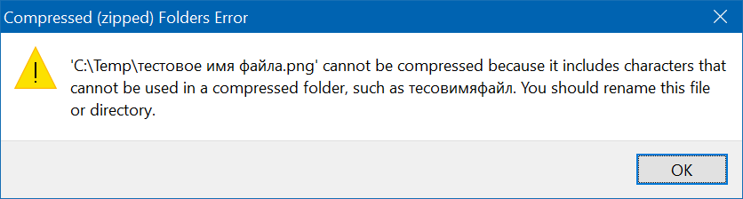
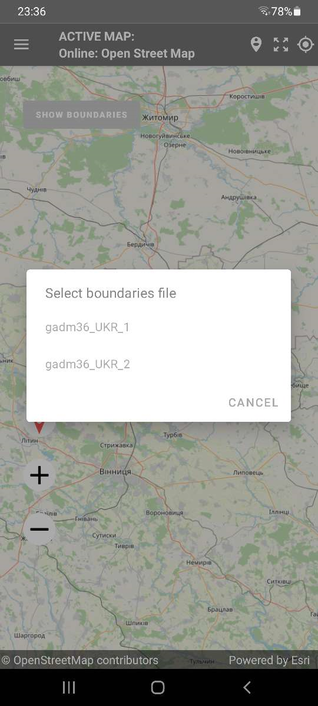
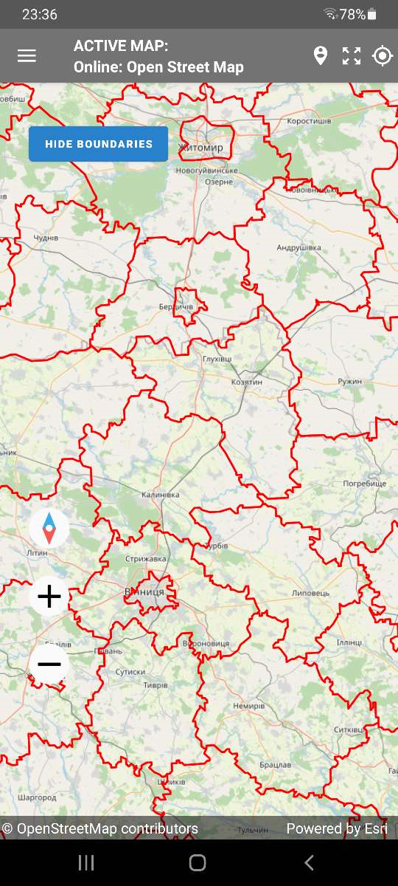

+++
title = "Shapefile maps"
date = 2022-06-14T00:00:00Z
lastmod = 2022-06-14T00:00:00Z
+++

Survey Solutions Interviewer App displays maps for two purposes:

- The dashboard depicts the assignments and interviews on the map by placing markers that correspond to the coordinates of an identifying question.
- Geography questions (single- and multiple points, polyline and polygon) allow capturing geographical information by marking it on the map layer, typically a satellite or aero-photography.

Survey Solutions has been employing this functionality for several years already using the ESRI ArcGIS Android SDK components. A common problem for the interviewers is understanding the boundaries of their area of responsibility when using the above mentioned capabilities, because satellite and aero photography typically lacks the labels that help identify streets, blocks or landmarks.

An interviewer without a visual clue on what is his area of responsibility may cross into the area of responsibility of another interviewer or out of the sampled area resulting in enumeration of duplicate or ineligible dwellings/households.

This is particularly important in case of spatial sampling, where the area of responsibility doesn’t have boundaries defined by natural or man-made features easily observable (for example, river banks, or streets), but rather defined conceptually as limits on the coordinates (for example, the latitude between LS and LN, and the longitude between LW and LE).

Ensuring that the interviewers remain in the valid area can be done by supplying the boundaries of such areas as an additional layer to be combined with the base layer map. A number of map file formats exist for this purpose of which shapefiles stands out:

- It is a well established and supported format developed by ESRI and documented in ESRI White Paper: [ESRI Shapefile Technical Description](https://www.esri.com/content/dam/esrisites/sitecore-archive/Files/Pdfs/library/whitepapers/pdfs/shapefile.pdf).
- Digital maps in shapefile format can be produced in ESRI-developed tools as well as in a number of other alternatives, including free and open source ones.
- National Statistical Offices commonly have access to very detailed maps indicating not only provinces/district levels, but going all the way to enumeration areas and the blocks that comprise them.
- Shapefiles may be generated programmatically, which is required for e.g. grid sampling techniques.
- Being a vector format, shapefiles are quite space-efficient, the data consists of the coordinates of the vertices that make the boundaries.

For the last couple of years Survey Solutions had a possibility of supporting a single shapefile that could have been loaded manually by the interviewer to the tablet, but this was not satisfactory for many scenarios of practical data collection. The [version 22.06](/release-notes/version-22-06/) of Survey Solutions allows the survey coordinator to centrally deploy one or multiple shapefiles to individual interviewers. The process closely replicates the deployment of the baseline maps and consists of:

1. Packing the shapefile components into a zip-archive with maps;
1. Uploading the archive with maps to the Survey Solutions headquarters server;
1. Assigning shapefiles to the interviewer accounts;
1. Synchronizing the maps on the tablet devices with the server;
1. Selecting an appropriate shapefile while working with maps.

Below we discuss each of these steps in more detail.

### 1. Packing the shapefile components into a zip-archive with maps

Each shapefile is represented as multiple files on a disk, most importantly the *.shp, *.shx, *.dbf, and *.prj files. All of them must be packed and uploaded to the server for the shapefile to be usable.

Packing can be done with any zip-packer, including the [zip-packer that is built into Windows OS](https://support.microsoft.com/en-us/windows/zip-and-unzip-files-8d28fa72-f2f9-712f-67df-f80cf89fd4e5).

The zip-archive should contain no sub-folders. All content should be placed directly to the root of the archive. The zip-archive may contain other types of maps though, such as base layer maps if this is convenient for the uploader. There are limits on the total size of the archive (compressed) and each file that is contained in the archive (decompressed). Consult the [Survey Solutions limits](/questionnaire-designer/limits/survey-solutions-limits/) page for specific values (which may change in the future versions). Survey Solutions server will refuse to accept uploads of larger files.

The shapefile type may be any of the existing shapefile types defined in the [specification](https://www.esri.com/content/dam/esrisites/sitecore-archive/Files/Pdfs/library/whitepapers/pdfs/shapefile.pdf), but most useful are the polygon-type shapefiles, which determine polygonal areas that can be interpreted as areas of interest or responsibility.

If any of the files in the maps archive contains non-Latin characters, the archive must be storing them in Unicode UTF-8. If you are using a Windows OS built-in tool, it will suggest renaming the files to contain only Latin characters:

but other software may be creating incompatible files. Please check your archiver documentation.

### 2. Uploading the archive with maps to the Survey Solutions headquarters server.

Uploading of maps to the Survey Solutions server can be done by users in headquarters or administrator roles and is done from the `Survey Setup` → `Maps` dialog. The `Maps` dialog shows the list of the maps currently uploaded to the server and available for the distribution to the users.

NB: Maps are stored separately by workspaces. If the same map is needed in multiple workspaces it must be uploaded to each such workspace.

The Maps dialog is using two icons to denote types of the uploaded maps:

  for raster maps (tiff, tpk, and mmpk map files);

  for vector maps (shapefiles).

Shapefile maps uploaded to the server are referred to by their main file name: `filename.shp`. If a this map is assigned or deleted, the same action is automatically applied to all other files constituting that shapefile (to the *.dbf, *shx, and *prj files). The file size displayed for the shapefiles is the sum of individual sizes of all of its constituent files.

To upload a new maps file clicking the green `UPLOAD ZIP-FILE` button. If there are any problems detected with the uploaded archive, they will be reported to the user. For example, the program may respond that a necessary file may be missing, is too large, has invalid content, or may indicate some other problem. If no problems are detected with the uploaded map files they will become available for assignments at the server.

Once a shapefile is uploaded to the server, it is possible to see a preview of it in the maps list by clicking the map file name and selecting the `Open` menu item.

### 3. Assigning shapefiles to the interviewer accounts.

Any map file (including shapefiles) needs to be assigned to the interviewer to be usable by him. Such an assignment is done by a user in the role headquarters or administrator.

Such assignments are done by uploading a file that establishes the correspondence between the maps and a comma-delimited list of the user accounts that are assigned access to those maps. The structure of this file is described [here](/headquarters/svymanage/assign-maps-to-interviewers/).

Any such uploaded file completely supersedes any previously made assignments (including any assignments done through the API calls).

### 4. Synchronizing the maps on the tablet devices with the server.

Synchronization and usage of the maps is available only in the version of the Survey Solutions Interviewer App with maps. (There is also a version of the Interviewer App without support of the mapping features).

This action is initiated by an interviewer by switching to the `Maps` dialog in the Interviewer’s App menu and pressing the `Synchronize` button. During the maps synchronization process:

- Any maps that are found on this device that the interviewer is not assigned to are removed;
- Any maps that are assigned to this interviewer on the server and which are currently absent on the device are downloaded from the server and stored.



For existing maps the size and content of the file are **not checked**. This specifically means that if the map was refreshed on the server (map file deleted on the server and a new file uploaded with the same name) it will not be refreshed on the tablet. To make sure the new map is available on the tablet, upload it with a unique name that you are sure is free of naming collisions with any previously used maps.
{}


If you are upgrading from an earlier version of the Survey Solutions, your interviewers may have already been using shapefiles that they have copied manually to their mobile devices. These shapefiles were placed in the folder as was recommended on our website. These files will be retained during synchronization of maps to avoid losing them during an update. If a new shape file is received from the server with the same filename in the new version they will both be available to the user. To avoid any confusion, it is strongly recommended to switch to the new way of delivering shapefiles to the interviewers from the HQ as soon as possible, and avoid manually copying them to the tablet as it used to be in the earlier versions. Once the legacy files are uploaded to the server and assignments are done for the interviewers, the legacy folders on the tablets should be deleted by the interviewers manually, reversing the manual changes that they have done earlier.
{}

Synchronization of maps is performed for maps of all types, whether raster or vector. No specific action is needed from the interviewer for obtaining the shapefiles/boundaries after maps synchronization.

### 5. Selecting an appropriate shapefile while working with maps.

Once the maps are synchronized they can be utilized in the following dialogs of the Survey Solutions Interviewer App:

- when viewing the `Map Dashboard`;
- when answering a geography question.

The interviewer should click `SHOW BOUNDARIES` and select a desired shapefile.

NB: If there is only a single shapefile available to the interviewer it will be displayed automatically, without the selection dialog. To avoid interviewers’ mistakes of selecting an incorrect shapefile, assign them only a single shapefile that they will need if your survey allows this.

Boundaries that are shown can be removed by clicking the `HIDE BOUNDARIES` button.

## API Changes

As part of the development work to improve the The API of Survey Solutions has been extended with an endpoint to upload maps to the Survey Solutions data server. This is a new GraphQL query `.uploadMap()`. This allows integration with external tools that are capable of generating digital maps, for example selecting them from a library of satellite imagery covering the area or indicating the bounds of the sampled area by generating a corresponding shapefile.

The `.uploadMap()` mutation facilitates uploading a zip archive file with one or multiple maps in a single or in different formats (for example, one can upload a base layer in the tpk format and a corresponding boundary as a shapefile, all packed into the same archive). There is a limit on the size of this maps archive, which is the same for the API and for the manual maps upload as mentioned above.

See more details on the API in the [interactive GraphQL documentation](https://demo.mysurvey.solutions/graphql/).
