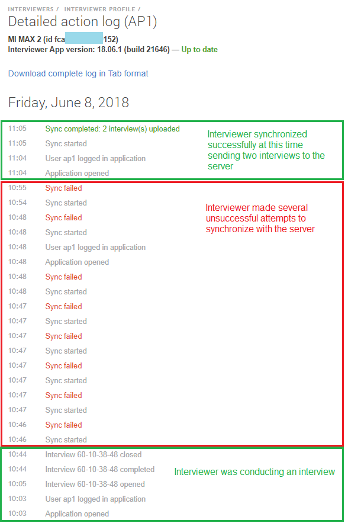

+++
title = "Detailed action log"
keywords = [""]
date = 2018-06-08T15:28:22Z
lastmod = 2018-06-08T15:28:22Z
aliases = ["/customer/portal/articles/2943093-detailed-action-log","/customer/en/portal/articles/2943093-detailed-action-log","/customer/portal/articles/2943093","/customer/en/portal/articles/2943093","/headquarters/detailed-action-log"]

+++

The detailed action log allows the headquarters users view important
actions undertaken by the interviewers on the tablets, such as
application start and login activities, starting or discarding an
interview, synchronization attempts, and other actions undertaken in the
last 7 days. The actions log is updated with any synchronization of the
tablet. (But if the tablet does not synchronize, there is no way for the
HQ personnel to know what actions were undertaken, since this
information won't be sent).  
  
The report is accessible from the interviewer profile, following the
link "***Show actions log***". Here is an example of the actions log
reflecting the work of the interviewer *AP1* on Friday, June 8, 2018:  
  
  
  
We can see that the interviewer was working on the interview at the
beginning of the day, then had a series of failed synchronization
attempts, and then after a pause of about 10 minutes, a successful
synchronization attempt.  
  
The log may be downloaded in the form of a tab-delimited file with two
columns: ***Timestamp*** and ***Action***. The timestamps in the report
on the screen and in the downloadable version are reported using the
tablet's clock in the tablet's current time zone. Here is an example:

    Timestamp Action
    06/08/2018 11:05:46 Sync completed: 2 interview(s) uploaded
    06/08/2018 11:05:04 Sync started
    06/08/2018 11:04:53 User ap1 logged in application
    06/08/2018 11:04:38 Application opened
    06/08/2018 10:55:00 Sync failed
    06/08/2018 10:54:58 Sync started
    06/08/2018 10:48:50 Sync failed
    06/08/2018 10:48:48 Sync started
    06/08/2018 10:48:43 User ap1 logged in application
    06/08/2018 10:48:28 Application opened
    06/08/2018 10:48:05 Sync failed
    06/08/2018 10:48:05 Sync started
    06/08/2018 10:47:41 Sync failed
    06/08/2018 10:47:40 Sync started
    06/08/2018 10:47:33 Sync failed
    06/08/2018 10:47:33 Sync started
    06/08/2018 10:47:30 Sync failed
    06/08/2018 10:47:30 Sync started
    06/08/2018 10:47:17 Sync failed
    06/08/2018 10:47:15 Sync started
    06/08/2018 10:46:35 Sync failed
    06/08/2018 10:46:15 Sync started
    06/08/2018 10:44:34 Interview 60-10-38-48 closed
    06/08/2018 10:44:34 Interview 60-10-38-48 completed
    06/08/2018 10:05:07 Interview 60-10-38-48 opened
    06/08/2018 10:03:41 User ap1 logged in application
    06/08/2018 10:03:22 Application opened

  
The HQ-users may utilize this report as an additional source of
information to confirm or reject interviewers' claims. For example, the
above shown report corroborates the claim of the interviewer that he was
attempting to synchronize the collected data, but was experiencing
communication difficulties.  
  
Answers to individual questions in the interviews are not recorded in
this log, but may be found in the paradata file.
