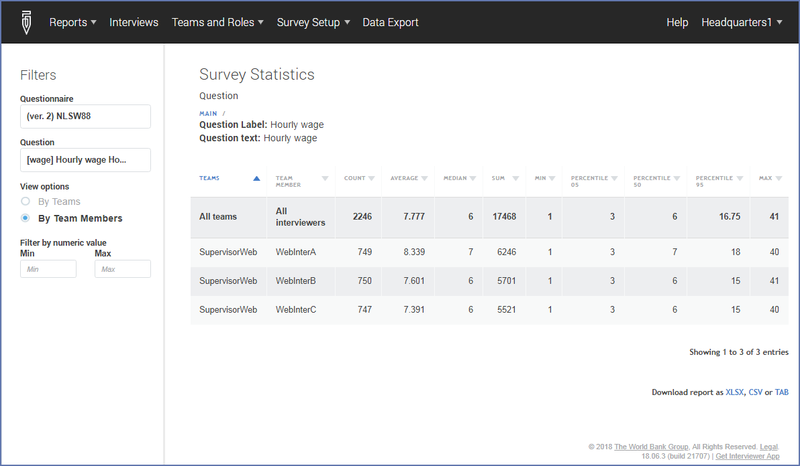
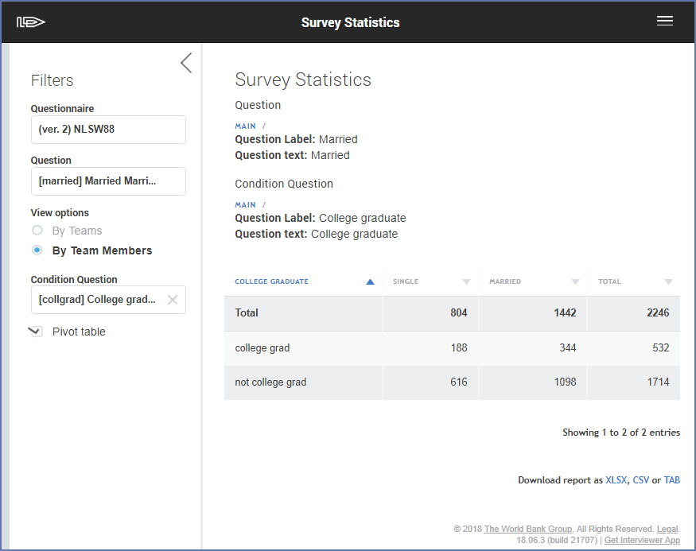

+++
title = "Report: Survey Statistics"
keywords = [""]
date = 2018-06-26T15:56:43Z
lastmod = 2018-06-26T15:56:43Z
aliases = ["/customer/portal/articles/2945778-report-survey-statistics","/customer/en/portal/articles/2945778-report-survey-statistics","/customer/portal/articles/2945778","/customer/en/portal/articles/2945778","/headquarters/report-survey-statistics"]

+++

Survey Statistics report is accessible to supervisors and headquarter
users, observers, and administrators.  
  
The report presents basic statistics calculated on survey data currently
on the server and eliminates (in some cases) the need to export the data
for calculation of these statistics.  
  
The report is always built within a single survey and is built for one
of the questions in that survey.  
  
The report may be presented in one of the two modes: tabulation or
summary statistics. Summary statistics mode is always applied for the
numeric questions, tabulation mode is always applied for categorical
(single-select or multi-select questions).

For questions of numeric type
-----------------------------

  
The report presents the following descriptive statistics in the columns:
count, average, sum, minimum, maximum, and percentiles: 5th, 50th and
95th. The rows of the report correspond to teams or individual
interviewers (selectable). The values may be restricted by specifying
the minimum and maximum. Specifying a minimum of zero is commonly used
to exclude the special values in numeric questions, often denoted with
-999, -997, or similar values.

For questions of categorical type 
----------------------------------

  
The report presents a frequency tabulation of the selected question by
its categories in the columns and teams or individual interviewers
(selectable) in the rows. A second categorical question may be specified
as a condition question. Then the report may be filtered by categories
of this question. For example, the tabulation of occupation may be
reported separately for male and for female workers. If a two-way
tabulation is of interest, it can be produced by checking the “pivot
table” checkbox. In this case the second question selected for
conditioning will be used as a second dimension of the two-way
tabulation. The selection of teams or interviewers is ignored in this
case. Totals by rows and columns are included.  
  
The report can be downloaded in XLSX, CSV, or TAB delimited format.
