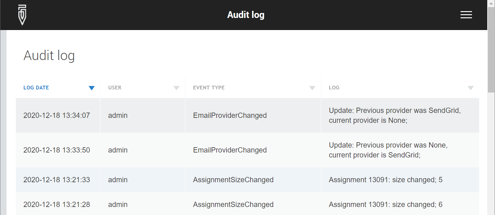

+++
title = "Server Audit Log"
keywords = ["admin", "Audit Log"]
date = 2019-08-04T22:22:22Z
lastmod = 2023-08-20T22:22:22Z

+++

Survey Solutions server [administrator](/headquarters/accounts/survey-solutions-server-administrator/)
may inspect the server audit log. The audit log lists important events that were initiated by the users on the server, identifying who made that action, and when.

For actions of interviewers, see the [detailed actions log](/headquarters/reporting/detailed-action-log/).

The server actually provides two kinds of audit logs: per workspace and server-wide.

- To view the server audit log, the admin user should proceed to `Menu` &#x2192; `Administration` &#x2192; `Audit log`.
- To view the audit log for a particular workspace, the admin user should proceed to `Menu`&#x2192; `Administration`&#x2192; click on a workspace name in the list of workspaces &#x2192; `Audit log`.

The audit log presents its records as a table with the following attributes:

- `LOG DATE` - indicates date and time when the event occurred;
- `USER` - name of the user account that performed the action that was logged;
- `EVENT TYPE` - classification of the type of the logged event (see codes below);
- `LOG` - records details about the logged event.

    

The log data can be exported in a form of a downloadable file in any of the following formats:

* XLSX (Excel or compatible),
* TAB (TAB-delimited values),
* CSV (comma separated values).

The following actions/events are recorded in the audit log on the server (`S` denotes the event appears in the server-wide audit log, `W` denotes the event appears in the workspace-specific audit log):

<TABLE class="table table-striped table-hover">
  <TR><TH>#</TH><TH>Log Type</TH><TH>Event Type</TH><TH>Logged when</TH><TH>Details</TH><TH><I>Example</I></TH></TR>

  <TR><TD>1</TD><TD>W</TD><TD>QuestionnaireImported</TD><TD>a questionnaire is imported from the Designer</TD>
  <TD>Mentions name and version of the questionnaire being imported to the HQ server from the Designer</TD><TD><I>
(ver. 2) CENSUS_INDIA_2030: imported;</I></TD>
  </TR>

  <TR><TD>2</TD><TD>W</TD><TD>QuestionnaireDeleted</TD><TD>a questionnaire and associated data are deleted</TD><TD>Mentions name and version of the questionnaire being deleted.</TD><TD><I>(ver. 2) CENSUS_INDIA_2030: deleted;</I></TD></TR>

  <TR><TD>3</TD><TD>W</TD><TD>ExportStared</TD><TD>a new export job is started</TD><TD>Mentions name and version of the exported survey questionnaire and the data export format.</TD><TD><I>CENSUS_INDIA_2030 v2 : exported; STATA</I></TD></TR>

  <TR><TD>4</TD><TD>W</TD><TD>AssignmentsUpgradeStarted</TD><TD>an upgrade of assignments between different questionnaire versions has been started</TD><TD>Mentions questionnaire name, source version and destination version for assignment migration.</TD><TD><I>Assignments: Upgrade; From (ver. 2) to (ver. 3) CENSUS_INDIA_2030</I></TD></TR>

  <TR><TD>5</TD><TD>S</TD><TD>UserCreated</TD><TD>a user account is created</TD><TD>Mentions the role and login of the new user account that has been created.</TD><TD><I>Headquarter user 'Headquarters1': created;</I></TD></TR>

  <TR><TD>6</TD><TD>W</TD><TD>AssignmentSizeChanged</TD><TD>an assignment size has been revised</TD><TD>Mentions assignment number and new size value.</TD><TD><I>Assignment 13091: size changed; 5</I></TD></TR>

  <TR><TD>7</TD><TD>W</TD><TD>ExportEncryptionChanged</TD><TD>encryption setting (password protection) has changed (set on or off)</TD><TD>Mentions whether the encryption was set to enabled or disabled state. Does not mention the password.</TD><TD><I>Export encryption: changed; enabled'</I> <I>Export encryption: changed; disabled'</I></TD></TR>

  <TR><TD>8</TD><TD>W</TD><TD>UserMovedToAnotherTeam</TD><TD>interviewer is moved from one team to another</TD><TD>Mentions which user was moved from which team to which team</TD><TD><I>User Natalia: moved; From team SupJohnson' to SupJackson</I></TD></TR>

  <TR><TD>9</TD><TD>W</TD><TD>EmailProviderWasChanged</TD><TD>change in configuration of the bulk email provider</TD>
  <TD>Mentions the previous and current provider.</TD><TD><I>Update: Previous provider was None, current provider is SendGrid;</I></TD></TR>

  <TR><TD>10</TD><TD>W</TD><TD>UsersImported</TD><TD>user accounts were created in batch mode</TD><TD>Mentions how many accounts were created in batch mode in total, and by role.</TD><TD><I>Users: Import; User Headquarters1 created 8 users in batch mode, of which 7 are interviewers and 1 supervisors</I></TD></TR>

  <TR><TD>11</TD><TD>W</TD><TD>AssignmentsImported</TD><TD>new assignments were done by uploading a preloading file</TD><TD>Mentions questionnaire name and version for the imported questionnaire</TD><TD><I>(ver. 2) CENSUS_INDIA_2030: imported;</I></TD></TR>

  <TR><TD>12</TD><TD>S</TD><TD>InterviewerArchived</TD><TD>an interviewer account gets archived</TD><TD>Mentions admin account name and interviewer account name that was archived.</TD><TD><I>Interviewer: Archive; User admin has archived interviewer account Natalia</I></TD></TR>

  <TR><TD>13</TD><TD>S</TD><TD>InterviewerUnArchived</TD><TD>an interviewer account is restored from the archived state</TD><TD>Mentions admin account name and interviewer account name that was unarchived.</TD><TD><I>Interviewer: Unarchive; User admin has unarchived interviewer account Natalia</I></TD></TR>

  <TR><TD>14</TD><TD>S</TD><TD>SupervisorArchived</TD><TD>a supervisor account gets archived</TD><TD>Mentions admin account name and supervisor account name that was archived.</TD><TD><I>Supervisor: Archive; User admin has archived supervisor account Natalia</I></TD></TR>

  <TR><TD>15</TD><TD>S</TD><TD>SupervisorUnArchived</TD><TD>a supervisor account gets restored from the archived state</TD><TD>Mentions admin account name and supervisor account name that was unarchived.</TD><TD><I>Supervisor: Unarchive; User admin has unarchived supervisor account Natalia</I></TD></TR>

  <TR><TD>16</TD><TD>S</TD><TD>WorkspaceCreated</TD><TD>A new workspace is created on the server.</TD><TD>Mentions the name and display name of the created workspace.</TD><TD><I>workspace: wspace1; Workspace 1</I></TD></TR>

  <TR><TD>17</TD><TD>S</TD><TD>WorkspaceDeleted</TD><TD>A workspace is deleted on the server.</TD><TD>Mentions the name of the workspace.</TD><TD><I>workspace: wspace1;</I></TD></TR>

  <TR><TD>18</TD><TD>S</TD><TD>WorkspaceDisabled</TD><TD>A workspace is disabled on the server.</TD><TD>Mentions the name of the disabled workspace.</TD><TD><I>workspace: wspace1;</I></TD></TR>

  <TR><TD>19</TD><TD>S</TD><TD>WorkspaceEnabled</TD><TD>A workspace is enabled on the server.</TD><TD>Mentions the name of the enabled workspace.</TD><TD><I>workspace: wspace1;</I></TD></TR>

  <TR><TD>20</TD><TD>S</TD><TD>WorkspaceUserAssigned</TD><TD>A user is given access to a workspace on the server.</TD><TD>Mentions the name of the user and one or more workspace names.</TD><TD><I>SergiyInt: primary, wspace1, wspace2;</I></TD></TR>

  <TR><TD>21</TD><TD>S</TD><TD>WorkspaceUserUnassigned</TD><TD>A user access to a workspace on the server is revoked.</TD><TD>Mentions the name of the user and one or more workspace names.</TD><TD><I>SergiyInt: primary, wspace1, wspace2;</I></TD></TR>

  <TR><TD>22</TD><TD>S</TD><TD>WorkspaceUpdated</TD><TD>Display name of a workspace has been changed.</TD><TD>Mentions the name of the workspace followed by the old and the new workspace display names.</TD><TD><I>wspace1: Workspace 1; Workspace 2;</I></TD></TR>

  <TR><TD>23</TD><TD>S,W</TD><TD>UserPasswordChanged</TD><TD>A user password has been successfully changed.</TD><TD>Mentions the name of the user.</TD><TD><I>user 'SergiyInt':password changed;</I></TD></TR>

  <TR><TD>24</TD><TD>S,W</TD><TD>UserPasswordChangeFailed</TD><TD>An attempt to change the user password was not successful (for example, the new password does not satisfy the effective minimum length requirement).</TD><TD>Mentions the name of the user.</TD><TD><I>user 'SergiyInt': password change failed;</I></TD></TR>

  <TR><TD>0</TD><TD>S,W</TD><TD>Unknown</TD><TD>Reserved: This value should not be observed in practice by the end-users of the application.</TD><TD></TD><TD><I></I></TD></TR>

</TABLE>

**Note on the timestamp**: when a user reads the audit log online, the timestamps are automatically converted to the time zone of this user. But if the user opts to download the audit log as a file, all timestamps are saved in the UTC time zone,
thus the same event may have different timestamps when the audit log is viewed
online on the server and offline from a downloaded file.
  
