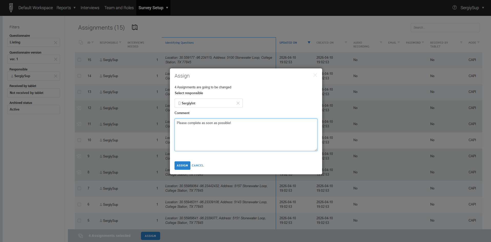

+++
title = "Distributing Assignments to Interviewers"
keywords = ["assign case ","supervisor","designate responsible"]
date = 2016-06-28T16:59:07Z
lastmod = 2026-04-13T00:00:00Z
aliases = ["/customer/portal/articles/2479498-distributing-assignments-to-interviewers","/customer/en/portal/articles/2479498-distributing-assignments-to-interviewers","/customer/portal/articles/2479498","/customer/en/portal/articles/2479498","/getting-started/distributing-assignments-to-interviewers","/supervisor/distribute-an-assignment/"]

+++

To distribute assignments to interviewers the supervisor (or HQ/administrator)
user can follow these steps:

1. In the main menu select `Survey setup` --> `Assignments`. The list of
assignments can be filtered by questionnaire template, version, person
responsible, and/or archived status. Here it is also possible to filter
by whether the assignment has been already received on a mobile device (tablet).
2. From the list of assignments, select the assignments that need to be assigned
to another responsible and click the `ASSIGN` button that appears.
3. Select the account of the new responsible in the dropdown, and optionally
write any comment to this assignment transaction. To confirm the selection,
click the `ASSIGN` button.

That selected account will now be responsible for these assignments.

**Role‑based behavior**
- HQ or Administrator users:
The dropdown list in step 3 includes all headquarters users, supervisors, and
interviewers in the workspace.
- Supervisors:
The dropdown list includes only the interviewers in their team and their own account.

**Additional notes**

If the new responsible is working on a mobile device, he or she will receive
these assignments at the next synchronization.

Reassigning an assignment from an interviewer back to the supervisor removes
it from the interviewer's tablet at the next synchronization.

