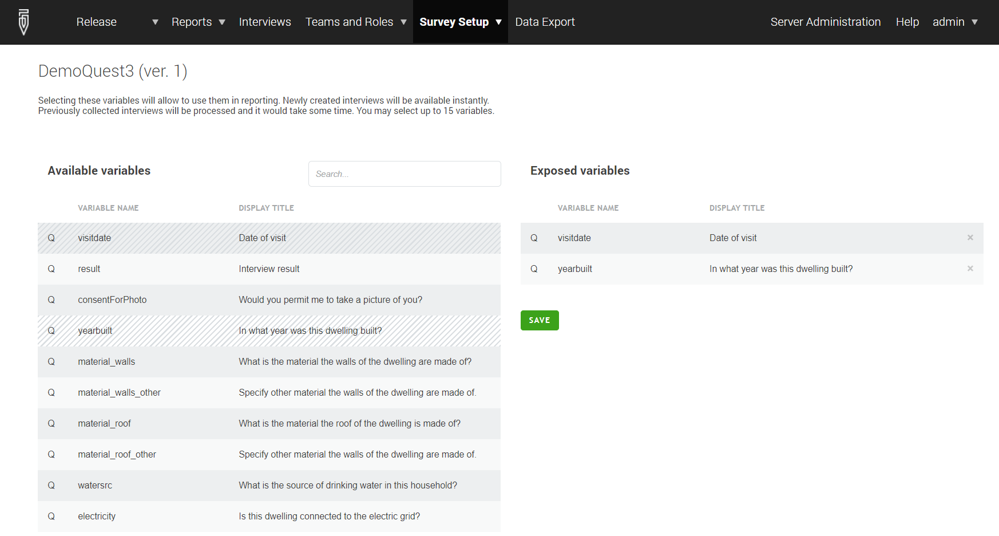

+++
title = "Exposed Variables"
date = 2021-05-11T00:00:00Z
lastmod = 2021-05-11T00:00:00Z
+++

Exposed variables are special variables that are made available by Survey Solutions for speedy access that can be utilized for the [filtering](/headquarters/interviews/interviews-filters) of observations in the interviews lists and map reports.

All questions and variables from the cover page of any questionnaire are automatically considered to be exposed and no action needs to be undertaken by the user to expose them. In addition the user may expose up to 15 questions or variables from the main level of the questionnaire (the interview level). These questions must be of the types that are acceptable for questions at the cover page.

To expose questions/variables the user needs to go to the list of the questionnaires at the server, open the questionnaire details, click on the link `edit` for exposed variables.

  

The user will be presented with a two panel dialog where she can click on the
questions in the  list of available (left panel) and they will be added to the
list of exposed variables (right panel). If the question or variable were added
by mistake or no longer needed, they can be removed by clicking the `X`-button
next to it.

A search box at the top of the total list allows a quick filtering of the list
to entries with specified sequence of characters in the variable name or
question text.

Actualization of the exposed variables begins when the user clicks `SAVE` and
confirms. The process may take considerable time depending on the size of the
survey and server performance.

Exposed variables are a property of a survey. Changing the set of exposed
variables affects all the users making use of the filters based on exposed
variables. It is best to decide early, which variables will be needed for
monitoring and designate them as exposed before a significant amount of
data accumulates.

Until the actualization of the exposed variables is completed, the map report
and interview selection may show incomplete sets of interviews for a filter
making use of the variables that haven’t been processed yet.
