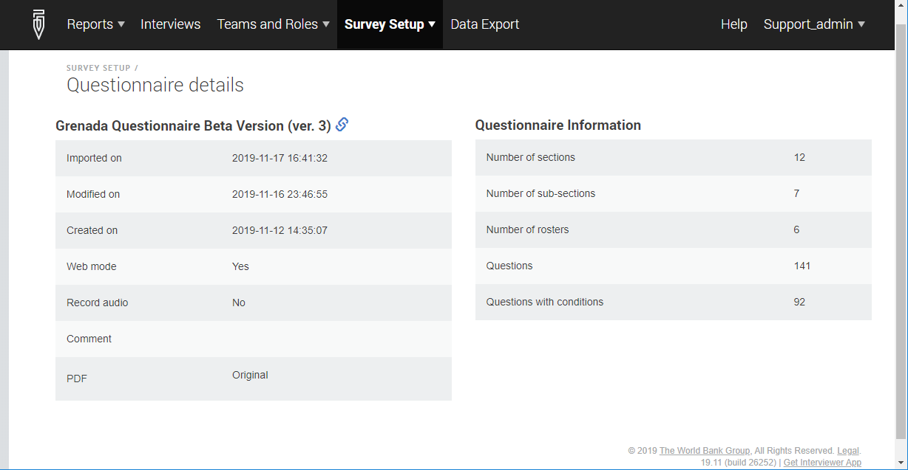

+++
title = "Questionnaire Details Page"
keywords = [""]
date = 2019-11-19T00:00:00Z
lastmod = 2019-11-19T00:00:00Z

+++

Questionnaire details page reflects information about the questionnaire
that has been earlier imported to the Headquarters. You access it by clicking
a questionnaire in the list of imported questionnaires (Survey Setup/Questionnaires)

Notably, the information properties reflect the structure of the
questionnaire as designed (number of sections, rosters, questions, etc)
and the information about how the questionnaire is configured at the Headquarters
(whether the web mode is on, whether the audio recording is turned on for
new assignments, etc).

From the questionnaire information page one may review the PDF rendering
of the questionnaire. This is especially useful for the Headquarters staff
who were not part of the questionnaire development team, but need to understand
exactly e.g. the logic of the questionnaire (skips and validation conditions).

The PDF document reflects a snapshot of how the questionnaire was designed at
the time when it was imported. Later changes to the questionnaire in the Designer
will not affect this rendering.

If the questionnaire is translated to multiple languages, there will be multiple
links for PDF documents corresponding to each translation.

The comment field reflects the comment entered by the person importing the 
questionnaire to the Headquarters (if any comment was provided). Use this field
to reflect the purpose of an update and/or the changes made to this version
relative to the earlier versions.

Examples of good comments:

- *"Added optional module M for households of size 4 and more".*
- *"All interviews in this version are dummy/practice interviews".*
- *"Fieldwork version used in 1st quarter of 2020".*

Examples of bad comments:

- *"New version"*
- *"Updated"*
- *"My version"*

The same comment will be shown in the Questionnaire History page in the Designer
reflecting the event of import of the questionnaire to the Headquarters.

The link icon next to the questionnaire title is a link back to the questionnaire 
document at the Designer site. Note that if you follow the link you will need to sign in 
to the Designer site with your Designer credentials and to see the questionnaire 
it must be shared with your Designer account (or you must be its owner).