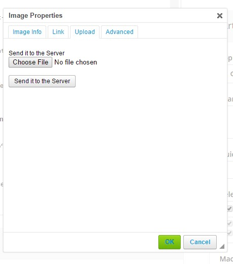
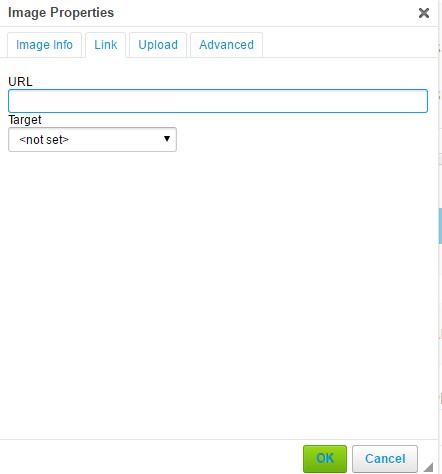
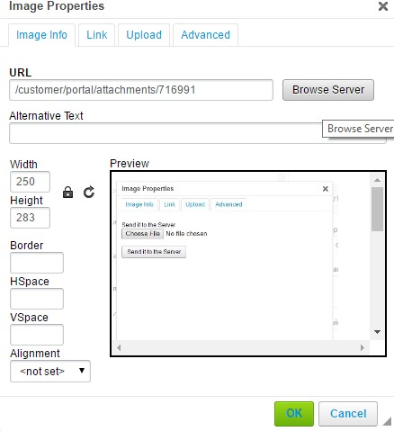
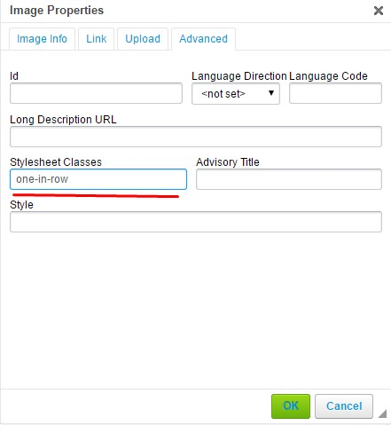
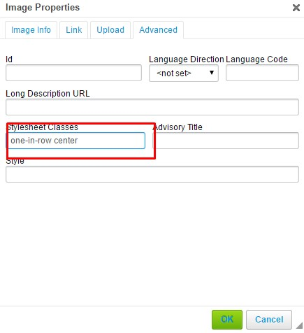
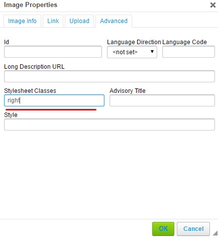
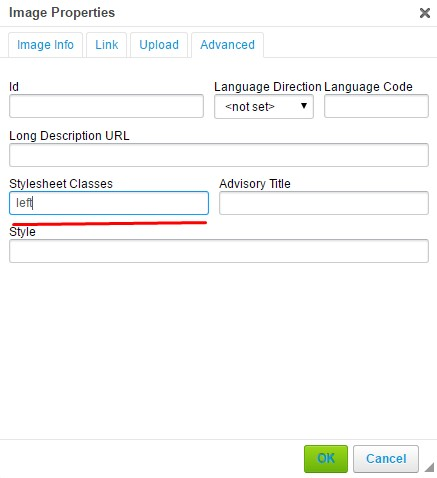

+++
title = "Example Page (Don't delete me, please)"
keywords = [""]
date = 2016-11-18T16:00:49Z
lastmod = 2016-11-18T16:00:49Z
aliases = ["/customer/portal/articles/2647853-example-page-don-t-delete-me-please-"]
draft = true
+++

Attention! A formatting of the article in the editor differs from it's look on the website
==============================================================================================================================

Examples of using classes
=========================

Code
----

### Default **code**

To add a **code** to the page please wrap the text within the tag

    <pre>some codes<⁄pre>

. The information appears without any formatting with saving all spaces
and default styles which were used. The code takes the entire width of a
string. Because our editor doesn't perceive [**Special
Characters**](http://www.degraeve.com/reference/specialcharacters.php),
please replace them on special code.

Example:

    self==enterprises_13g-enterprises_13h && self == (enterprises_13c - enterprises_13f)

### The **code** in the middle of a string

If you would like that your code took less space and was in the middle
of a string you should add special class to your tag **&lt;pre&gt;**

    <pre class=“part-of-row”>some codes<⁄pre>

and place it inside the tag **div** with class **text-center**

    <pre class=“text-center”><pre class=“part-of-row”>some codes<⁄pre><⁄pre>

Example:

    enterprises_13g!=0 && enterprises_13d!=enterprises_13a

### The **code** inside a text

If it necessary to place some piece of code inside the text (example:

    enterprises_13d!=0

) you should wrap the text in tag **div** with class
**contains-element** and assign class **part-of-row** to your **pre**
tag.

    <pre class=“contains-element”><pre class=“part-of-row”>some codes<⁄pre><⁄pre>

Images
------

### A few images together

You can align the image on the left, right edge or center. By default
all images will align in line if they go one after another and placed in
size. You can add link to your images and resize it after sending the
image to the server.

Example:

### One image in row

If it necessary to place only one image in row, add to the image class
**one-in-raw** on special sheet

Example:

### The image on the middle

By the way, you can also align it on the middle by adding second class
**center**

Example:

### The image on right side

If you need to align the image by right side you should place it inside
tag **div** with class **clear** after that add class **right** to the
image.

Example:

Each image with class **right** Example:

Each image with class **left** Example:

Image with class **left** and **right**. Example:

### Floating images

If you have a lot of text and need that the text floats around the image
you should place whole this text and image inside tag **div** with class
**clear**, and place only text in tag **p**, and after add class to the
image, which depends on the side you need. **left** or **right**. The
image should be before text.

Example:

Lorem ipsum dolor sit amet, consectetur adipiscing elit. Proin dapibus
dolor quis felis condimentum gravida. Suspendisse condimentum, ligula a
pretium sollicitudin, nunc urna commodo felis, quis mattis felis tortor
sit amet nisi. Morbi dolor lorem, accumsan id nibh vitae, dapibus
dignissim magna. Suspendisse malesuada placerat lobortis. Vivamus augue
lacus, sodales nec sagittis a, dictum eu felis. Phasellus tincidunt
viverra risus et viverra. Donec euismod ligula a dictum pellentesque.
Aenean vel lorem sodales, viverra nisi ut, posuere nunc. Aenean lobortis
vitae ligula non laoreet. Nullam placerat diam id felis tempus
venenatis.

Curabitur laoreet sollicitudin libero non efficitur. Proin et nunc quis
elit sollicitudin fringilla ut vel ex. Donec sit amet leo sit amet nibh
fermentum suscipit interdum non nibh. Cum sociis natoque penatibus et
magnis dis parturient montes, nascetur ridiculus mus. Donec eros quam,
pretium ut sapien at, ultrices pretium risus. Fusce pellentesque nibh
non enim rhoncus rutrum. Lorem ipsum dolor sit amet, consectetur
adipiscing elit. Quisque condimentum enim quam, vel pulvinar tellus
ullamcorper id. Phasellus sagittis leo sollicitudin feugiat iaculis.
Vestibulum nec hendrerit nunc, molestie porta augue. Mauris vulplaceate
purus ut tempor auctor. Nunc imperdiet nisi vel dolor facilisis, non
consectetur neque cursus. Sed lacinia blandit pharetra. Curabitur
imperdiet quis justo eget ultrices. Sed bibendum, purus ac tristique
fringilla, metus elit ullamcorper tellus, vulplaceate tempus turpis nibh
at magna. Vestibulum ornare lacus eu vulplaceate finibus. Ut faucibus
diam pharetra lacus pulvinar convallis. Suspendisse convallis lectus
tempus commodo auctor. Pellentesque lacinia lorem in purus placerat
varius.

Example:

Lorem ipsum dolor sit amet, consectetur adipiscing elit. Proin dapibus
dolor quis felis condimentum gravida. Suspendisse condimentum, ligula a
pretium sollicitudin, nunc urna commodo felis, quis mattis felis tortor
sit amet nisi. Morbi dolor lorem, accumsan id nibh vitae, dapibus
dignissim magna. Suspendisse malesuada placerat lobortis. Vivamus augue
lacus, sodales nec sagittis a, dictum eu felis. Phasellus tincidunt
viverra risus et viverra. Donec euismod ligula a dictum pellentesque.
Aenean vel lorem sodales, viverra nisi ut, posuere nunc. Aenean lobortis
vitae ligula non laoreet. Nullam placerat diam id felis tempus
venenatis.

Curabitur laoreet sollicitudin libero non efficitur. Proin et nunc quis
elit sollicitudin fringilla ut vel ex. Donec sit amet leo sit amet nibh
fermentum suscipit interdum non nibh. Cum sociis natoque penatibus et
magnis dis parturient montes, nascetur ridiculus mus. Donec eros quam,
pretium ut sapien at, ultrices pretium risus. Fusce pellentesque nibh
non enim rhoncus rutrum. Lorem ipsum dolor sit amet, consectetur
adipiscing elit. Quisque condimentum enim quam, vel pulvinar tellus
ullamcorper id. Phasellus sagittis leo sollicitudin feugiat iaculis.
Vestibulum nec hendrerit nunc, molestie porta augue. Mauris vulplaceate
purus ut tempor auctor. Nunc imperdiet nisi vel dolor facilisis, non
consectetur neque cursus. Sed lacinia blandit pharetra. Curabitur
imperdiet quis justo eget ultrices. Sed bibendum, purus ac tristique
fringilla, metus elit ullamcorper tellus, vulplaceate tempus turpis nibh
at magna. Vestibulum ornare lacus eu vulplaceate finibus. Ut faucibus
diam pharetra lacus pulvinar convallis. Suspendisse convallis lectus
tempus commodo auctor. Pellentesque lacinia lorem in purus placerat
varius.

Example:

Lorem ipsum dolor sit amet, consectetur adipiscing elit. Proin dapibus
dolor quis felis condimentum gravida. Suspendisse condimentum, ligula a
pretium sollicitudin, nunc urna commodo felis, quis mattis felis tortor
sit amet nisi. Morbi dolor lorem, accumsan id nibh vitae, dapibus
dignissim magna. Suspendisse malesuada placerat lobortis. Vivamus augue
lacus, sodales nec sagittis a, dictum eu felis. Phasellus tincidunt
viverra risus et viverra. Donec euismod ligula a dictum pellentesque.
Aenean vel lorem sodales, viverra nisi ut, posuere nunc. Aenean lobortis
vitae ligula non laoreet. Nullam placerat diam id felis tempus
venenatis.

Curabitur laoreet sollicitudin libero non efficitur. Proin et nunc quis
elit sollicitudin fringilla ut vel ex. Donec sit amet leo sit amet nibh
fermentum suscipit interdum non nibh. Cum sociis natoque penatibus et
magnis dis parturient montes, nascetur ridiculus mus. Donec eros quam,
pretium ut sapien at, ultrices pretium risus. Fusce pellentesque nibh
non enim rhoncus rutrum. Lorem ipsum dolor sit amet, consectetur
adipiscing elit. Quisque condimentum enim quam, vel pulvinar tellus
ullamcorper id. Phasellus sagittis leo sollicitudin feugiat iaculis.
Vestibulum nec hendrerit nunc, molestie porta augue. Mauris vulplaceate
purus ut tempor auctor. Nunc imperdiet nisi vel dolor facilisis, non
consectetur neque cursus. Sed lacinia blandit pharetra. Curabitur
imperdiet quis justo eget ultrices. Sed bibendum, purus ac tristique
fringilla, metus elit ullamcorper tellus, vulplaceate tempus turpis nibh
at magna. Vestibulum ornare lacus eu vulplaceate finibus. Ut faucibus
diam pharetra lacus pulvinar convallis. Suspendisse convallis lectus
tempus commodo auctor. Pellentesque lacinia lorem in purus placerat
varius.

Tables
------

### Default tables

When you create table you can choose amount of rows, columns and choose
header. By default table width is 500px

Example:

<table>
<thead>
<tr class="header">
<th>Company</th>
<th>Contact</th>
<th>Country</th>
</tr>
</thead>
<tbody>
<tr class="odd">
<td>Alfreds Futterkiste</td>
<td>Maria Anders</td>
<td>Germany</td>
</tr>
<tr class="even">
<td>Centro comercial Moctezuma</td>
<td>Francisco Chang</td>
<td>Mexico</td>
</tr>
<tr class="odd">
<td>Ernst</td>
<td>Roland</td>
<td>Austria</td>
</tr>
<tr class="even">
<td>island Trading</td>
<td>helen Bennet</td>
<td>UK</td>
</tr>
<tr class="odd">
<td>Laughing Bacchus Winecellars</td>
<td>Yoshi Tannamuri</td>
<td>Canada</td>
</tr>
<tr class="even">
<td>Magazzini </td>
<td>Giovanni Rovelli</td>
<td>Italy</td>
</tr>
</tbody>
</table>

### Table with borders

To add borders and highlight the title add class **table\_with\_border**
to the table

Example:

<table>
<thead>
<tr class="header">
<th>Company</th>
<th>Contact</th>
<th>Country</th>
</tr>
</thead>
<tbody>
<tr class="odd">
<td>Alfreds Futterkiste</td>
<td>Maria Anders</td>
<td>Germany</td>
</tr>
<tr class="even">
<td>Centro comercial Moctezuma</td>
<td>Francisco Chang</td>
<td>Mexico</td>
</tr>
<tr class="odd">
<td>Ernst</td>
<td>Roland</td>
<td>Austria</td>
</tr>
<tr class="even">
<td>island Trading</td>
<td>helen Bennet</td>
<td>UK</td>
</tr>
<tr class="odd">
<td>Laughing Bacchus Winecellars</td>
<td>Yoshi Tannamuri</td>
<td>Canada</td>
</tr>
<tr class="even">
<td>Magazzini </td>
<td>Giovanni Rovelli</td>
<td>Italy</td>
</tr>
</tbody>
</table>

### Table with striped rows and borders

Use class **table-striped** to add zebra-striping to any table row and
class **table\_with\_border** to add borders

Example:

<table>
<thead>
<tr class="header">
<th>Company</th>
<th>Contact</th>
<th>Country</th>
</tr>
</thead>
<tbody>
<tr class="odd">
<td>Alfreds Futterkiste</td>
<td>Maria Anders</td>
<td>Germany</td>
</tr>
<tr class="even">
<td>Centro comercial Moctezuma</td>
<td>Francisco Chang</td>
<td>Mexico</td>
</tr>
<tr class="odd">
<td>Ernst</td>
<td>Roland</td>
<td>Austria</td>
</tr>
<tr class="even">
<td>island Trading</td>
<td>helen Bennet</td>
<td>UK</td>
</tr>
<tr class="odd">
<td>Laughing Bacchus Winecellars</td>
<td>Yoshi Tannamuri</td>
<td>Canada</td>
</tr>
<tr class="even">
<td>Magazzini </td>
<td>Giovanni Rovelli</td>
<td>Italy</td>
</tr>
</tbody>
</table>

### The table on the middle

Use class **center** to place the table on the middle

Example:

<table>
<thead>
<tr class="header">
<th>Company</th>
<th>Contact</th>
<th>Country</th>
</tr>
</thead>
<tbody>
<tr class="odd">
<td>Alfreds Futterkiste</td>
<td>Maria Anders</td>
<td>Germany</td>
</tr>
<tr class="even">
<td>Centro comercial Moctezuma</td>
<td>Francisco Chang</td>
<td>Mexico</td>
</tr>
<tr class="odd">
<td>Ernst</td>
<td>Roland</td>
<td>Austria</td>
</tr>
<tr class="even">
<td>island Trading</td>
<td>helen Bennet</td>
<td>UK</td>
</tr>
<tr class="odd">
<td>Laughing Bacchus Winecellars</td>
<td>Yoshi Tannamuri</td>
<td>Canada</td>
</tr>
<tr class="even">
<td>Magazzini </td>
<td>Giovanni Rovelli</td>
<td>Italy</td>
</tr>
</tbody>
</table>

### The table on right side

The same as with images, if you need to align the table by right side
you should place it inside tag **div** with class **clear** after that
add class **right** to the table.

Example:

<table>
<thead>
<tr class="header">
<th>Company</th>
<th>Contact</th>
<th>Country</th>
</tr>
</thead>
<tbody>
<tr class="odd">
<td>Alfreds Futterkiste</td>
<td>Maria Anders</td>
<td>Germany</td>
</tr>
<tr class="even">
<td>Centro comercial Moctezuma</td>
<td>Francisco Chang</td>
<td>Mexico</td>
</tr>
<tr class="odd">
<td>Ernst</td>
<td>Roland</td>
<td>Austria</td>
</tr>
<tr class="even">
<td>island Trading</td>
<td>helen Bennet</td>
<td>UK</td>
</tr>
<tr class="odd">
<td>Laughing Bacchus Winecellars</td>
<td>Yoshi Tannamuri</td>
<td>Canada</td>
</tr>
<tr class="even">
<td>Magazzini </td>
<td>Giovanni Rovelli</td>
<td>Italy</td>
</tr>
</tbody>
</table>

Each table with class **right** Example:

<table>
<thead>
<tr class="header">
<th>Company</th>
<th>Contact</th>
<th>Country</th>
</tr>
</thead>
<tbody>
<tr class="odd">
<td>Alfreds Futterkiste</td>
<td>Maria Anders</td>
<td>Germany</td>
</tr>
<tr class="even">
<td>Centro comercial Moctezuma</td>
<td>Francisco Chang</td>
<td>Mexico</td>
</tr>
<tr class="odd">
<td>Ernst</td>
<td>Roland</td>
<td>Austria</td>
</tr>
<tr class="even">
<td>island Trading</td>
<td>helen Bennet</td>
<td>UK</td>
</tr>
<tr class="odd">
<td>Laughing Bacchus Winecellars</td>
<td>Yoshi Tannamuri</td>
<td>Canada</td>
</tr>
<tr class="even">
<td>Magazzini </td>
<td>Giovanni Rovelli</td>
<td>Italy</td>
</tr>
</tbody>
</table>

<table>
<thead>
<tr class="header">
<th>Company</th>
<th>Contact</th>
<th>Country</th>
</tr>
</thead>
<tbody>
<tr class="odd">
<td>Alfreds Futterkiste</td>
<td>Maria Anders</td>
<td>Germany</td>
</tr>
<tr class="even">
<td>Centro comercial Moctezuma</td>
<td>Francisco Chang</td>
<td>Mexico</td>
</tr>
<tr class="odd">
<td>Ernst</td>
<td>Roland</td>
<td>Austria</td>
</tr>
<tr class="even">
<td>island Trading</td>
<td>helen Bennet</td>
<td>UK</td>
</tr>
<tr class="odd">
<td>Laughing Bacchus Winecellars</td>
<td>Yoshi Tannamuri</td>
<td>Canada</td>
</tr>
<tr class="even">
<td>Magazzini </td>
<td>Giovanni Rovelli</td>
<td>Italy</td>
</tr>
</tbody>
</table>

Each table with class **left** Example:

<table>
<thead>
<tr class="header">
<th>Company</th>
<th>Contact</th>
<th>Country</th>
</tr>
</thead>
<tbody>
<tr class="odd">
<td>Alfreds Futterkiste</td>
<td>Maria Anders</td>
<td>Germany</td>
</tr>
<tr class="even">
<td>Centro comercial Moctezuma</td>
<td>Francisco Chang</td>
<td>Mexico</td>
</tr>
<tr class="odd">
<td>Ernst</td>
<td>Roland</td>
<td>Austria</td>
</tr>
<tr class="even">
<td>island Trading</td>
<td>helen Bennet</td>
<td>UK</td>
</tr>
<tr class="odd">
<td>Laughing Bacchus Winecellars</td>
<td>Yoshi Tannamuri</td>
<td>Canada</td>
</tr>
<tr class="even">
<td>Magazzini </td>
<td>Giovanni Rovelli</td>
<td>Italy</td>
</tr>
</tbody>
</table>

<table>
<thead>
<tr class="header">
<th>Company</th>
<th>Contact</th>
<th>Country</th>
</tr>
</thead>
<tbody>
<tr class="odd">
<td>Alfreds Futterkiste</td>
<td>Maria Anders</td>
<td>Germany</td>
</tr>
<tr class="even">
<td>Centro comercial Moctezuma</td>
<td>Francisco Chang</td>
<td>Mexico</td>
</tr>
<tr class="odd">
<td>Ernst</td>
<td>Roland</td>
<td>Austria</td>
</tr>
<tr class="even">
<td>island Trading</td>
<td>helen Bennet</td>
<td>UK</td>
</tr>
<tr class="odd">
<td>Laughing Bacchus Winecellars</td>
<td>Yoshi Tannamuri</td>
<td>Canada</td>
</tr>
<tr class="even">
<td>Magazzini </td>
<td>Giovanni Rovelli</td>
<td>Italy</td>
</tr>
</tbody>
</table>

Table with class **left** and **right**. Example:

<table>
<thead>
<tr class="header">
<th>Company</th>
<th>Contact</th>
<th>Country</th>
</tr>
</thead>
<tbody>
<tr class="odd">
<td>Alfreds Futterkiste</td>
<td>Maria Anders</td>
<td>Germany</td>
</tr>
<tr class="even">
<td>Centro comercial Moctezuma</td>
<td>Francisco Chang</td>
<td>Mexico</td>
</tr>
<tr class="odd">
<td>Ernst</td>
<td>Roland</td>
<td>Austria</td>
</tr>
<tr class="even">
<td>island Trading</td>
<td>helen Bennet</td>
<td>UK</td>
</tr>
<tr class="odd">
<td>Laughing Bacchus Winecellars</td>
<td>Yoshi Tannamuri</td>
<td>Canada</td>
</tr>
<tr class="even">
<td>Magazzini </td>
<td>Giovanni Rovelli</td>
<td>Italy</td>
</tr>
</tbody>
</table>

<table>
<thead>
<tr class="header">
<th>Company</th>
<th>Contact</th>
<th>Country</th>
</tr>
</thead>
<tbody>
<tr class="odd">
<td>Alfreds Futterkiste</td>
<td>Maria Anders</td>
<td>Germany</td>
</tr>
<tr class="even">
<td>Centro comercial Moctezuma</td>
<td>Francisco Chang</td>
<td>Mexico</td>
</tr>
<tr class="odd">
<td>Ernst</td>
<td>Roland</td>
<td>Austria</td>
</tr>
<tr class="even">
<td>island Trading</td>
<td>helen Bennet</td>
<td>UK</td>
</tr>
<tr class="odd">
<td>Laughing Bacchus Winecellars</td>
<td>Yoshi Tannamuri</td>
<td>Canada</td>
</tr>
<tr class="even">
<td>Magazzini </td>
<td>Giovanni Rovelli</td>
<td>Italy</td>
</tr>
</tbody>
</table>

### Floating tables

The same as with images, place whole text and table inside tag **div**
with class **clear**, and place only text in tag **p**, and after add
class to the table, which depends on the side you need. **left** or
**right**. The table should be before text.

Example:

<table>
<thead>
<tr class="header">
<th>Company</th>
<th>Contact</th>
<th>Country</th>
</tr>
</thead>
<tbody>
<tr class="odd">
<td>Alfreds Futterkiste</td>
<td>Maria Anders</td>
<td>Germany</td>
</tr>
<tr class="even">
<td>Centro comercial Moctezuma</td>
<td>Francisco Chang</td>
<td>Mexico</td>
</tr>
<tr class="odd">
<td>Ernst</td>
<td>Roland</td>
<td>Austria</td>
</tr>
<tr class="even">
<td>island Trading</td>
<td>helen Bennet</td>
<td>UK</td>
</tr>
<tr class="odd">
<td>Laughing Bacchus Winecellars</td>
<td>Yoshi Tannamuri</td>
<td>Canada</td>
</tr>
<tr class="even">
<td>Magazzini </td>
<td>Giovanni Rovelli</td>
<td>Italy</td>
</tr>
</tbody>
</table>

Lorem ipsum dolor sit amet, consectetur adipiscing elit. Proin dapibus
dolor quis felis condimentum gravida. Suspendisse condimentum, ligula a
pretium sollicitudin, nunc urna commodo felis, quis mattis felis tortor
sit amet nisi. Morbi dolor lorem, accumsan id nibh vitae, dapibus
dignissim magna. Suspendisse malesuada placerat lobortis. Vivamus augue
lacus, sodales nec sagittis a, dictum eu felis. Phasellus tincidunt
viverra risus et viverra. Donec euismod ligula a dictum pellentesque.
Aenean vel lorem sodales, viverra nisi ut, posuere nunc. Aenean lobortis
vitae ligula non laoreet. Nullam placerat diam id felis tempus
venenatis.

Curabitur laoreet sollicitudin libero non efficitur. Proin et nunc quis
elit sollicitudin fringilla ut vel ex. Donec sit amet leo sit amet nibh
fermentum suscipit interdum non nibh. Cum sociis natoque penatibus et
magnis dis parturient montes, nascetur ridiculus mus. Donec eros quam,
pretium ut sapien at, ultrices pretium risus. Fusce pellentesque nibh
non enim rhoncus rutrum. Lorem ipsum dolor sit amet, consectetur
adipiscing elit. Quisque condimentum enim quam, vel pulvinar tellus
ullamcorper id. Phasellus sagittis leo sollicitudin feugiat iaculis.
Vestibulum nec hendrerit nunc, molestie porta augue. Mauris vulplaceate
purus ut tempor auctor. Nunc imperdiet nisi vel dolor facilisis, non
consectetur neque cursus. Sed lacinia blandit pharetra. Curabitur
imperdiet quis justo eget ultrices. Sed bibendum, purus ac tristique
fringilla, metus elit ullamcorper tellus, vulplaceate tempus turpis nibh
at magna. Vestibulum ornare lacus eu vulplaceate finibus. Ut faucibus
diam pharetra lacus pulvinar convallis. Suspendisse convallis lectus
tempus commodo auctor. Pellentesque lacinia lorem in purus placerat
varius.

Example:

<table>
<thead>
<tr class="header">
<th>Company</th>
<th>Contact</th>
<th>Country</th>
</tr>
</thead>
<tbody>
<tr class="odd">
<td>Alfreds Futterkiste</td>
<td>Maria Anders</td>
<td>Germany</td>
</tr>
<tr class="even">
<td>Centro comercial Moctezuma</td>
<td>Francisco Chang</td>
<td>Mexico</td>
</tr>
<tr class="odd">
<td>Ernst</td>
<td>Roland</td>
<td>Austria</td>
</tr>
<tr class="even">
<td>island Trading</td>
<td>helen Bennet</td>
<td>UK</td>
</tr>
<tr class="odd">
<td>Laughing Bacchus Winecellars</td>
<td>Yoshi Tannamuri</td>
<td>Canada</td>
</tr>
<tr class="even">
<td>Magazzini </td>
<td>Giovanni Rovelli</td>
<td>Italy</td>
</tr>
</tbody>
</table>

Lorem ipsum dolor sit amet, consectetur adipiscing elit. Proin dapibus
dolor quis felis condimentum gravida. Suspendisse condimentum, ligula a
pretium sollicitudin, nunc urna commodo felis, quis mattis felis tortor
sit amet nisi. Morbi dolor lorem, accumsan id nibh vitae, dapibus
dignissim magna. Suspendisse malesuada placerat lobortis. Vivamus augue
lacus, sodales nec sagittis a, dictum eu felis. Phasellus tincidunt
viverra risus et viverra. Donec euismod ligula a dictum pellentesque.
Aenean vel lorem sodales, viverra nisi ut, posuere nunc. Aenean lobortis
vitae ligula non laoreet. Nullam placerat diam id felis tempus
venenatis.

Curabitur laoreet sollicitudin libero non efficitur. Proin et nunc quis
elit sollicitudin fringilla ut vel ex. Donec sit amet leo sit amet nibh
fermentum suscipit interdum non nibh. Cum sociis natoque penatibus et
magnis dis parturient montes, nascetur ridiculus mus. Donec eros quam,
pretium ut sapien at, ultrices pretium risus. Fusce pellentesque nibh
non enim rhoncus rutrum. Lorem ipsum dolor sit amet, consectetur
adipiscing elit. Quisque condimentum enim quam, vel pulvinar tellus
ullamcorper id. Phasellus sagittis leo sollicitudin feugiat iaculis.
Vestibulum nec hendrerit nunc, molestie porta augue. Mauris vulplaceate
purus ut tempor auctor. Nunc imperdiet nisi vel dolor facilisis, non
consectetur neque cursus. Sed lacinia blandit pharetra. Curabitur
imperdiet quis justo eget ultrices. Sed bibendum, purus ac tristique
fringilla, metus elit ullamcorper tellus, vulplaceate tempus turpis nibh
at magna. Vestibulum ornare lacus eu vulplaceate finibus. Ut faucibus
diam pharetra lacus pulvinar convallis. Suspendisse convallis lectus
tempus commodo auctor. Pellentesque lacinia lorem in purus placerat
varius.

Example:

<table>
<thead>
<tr class="header">
<th>Company</th>
<th>Contact</th>
<th>Country</th>
</tr>
</thead>
<tbody>
<tr class="odd">
<td>Alfreds Futterkiste</td>
<td>Maria Anders</td>
<td>Germany</td>
</tr>
<tr class="even">
<td>Centro comercial Moctezuma</td>
<td>Francisco Chang</td>
<td>Mexico</td>
</tr>
<tr class="odd">
<td>Ernst</td>
<td>Roland</td>
<td>Austria</td>
</tr>
<tr class="even">
<td>island Trading</td>
<td>helen Bennet</td>
<td>UK</td>
</tr>
<tr class="odd">
<td>Laughing Bacchus Winecellars</td>
<td>Yoshi Tannamuri</td>
<td>Canada</td>
</tr>
<tr class="even">
<td>Magazzini </td>
<td>Giovanni Rovelli</td>
<td>Italy</td>
</tr>
</tbody>
</table>

<table>
<thead>
<tr class="header">
<th>Company</th>
<th>Contact</th>
<th>Country</th>
</tr>
</thead>
<tbody>
<tr class="odd">
<td>Alfreds Futterkiste</td>
<td>Maria Anders</td>
<td>Germany</td>
</tr>
<tr class="even">
<td>Centro comercial Moctezuma</td>
<td>Francisco Chang</td>
<td>Mexico</td>
</tr>
<tr class="odd">
<td>Ernst</td>
<td>Roland</td>
<td>Austria</td>
</tr>
<tr class="even">
<td>island Trading</td>
<td>helen Bennet</td>
<td>UK</td>
</tr>
<tr class="odd">
<td>Laughing Bacchus Winecellars</td>
<td>Yoshi Tannamuri</td>
<td>Canada</td>
</tr>
<tr class="even">
<td>Magazzini </td>
<td>Giovanni Rovelli</td>
<td>Italy</td>
</tr>
</tbody>
</table>

Lorem ipsum dolor sit amet, consectetur adipiscing elit. Proin dapibus
dolor quis felis condimentum gravida. Suspendisse condimentum, ligula a
pretium sollicitudin, nunc urna commodo felis, quis mattis felis tortor
sit amet nisi. Morbi dolor lorem, accumsan id nibh vitae, dapibus
dignissim magna. Suspendisse malesuada placerat lobortis. Vivamus augue
lacus, sodales nec sagittis a, dictum eu felis. Phasellus tincidunt
viverra risus et viverra. Donec euismod ligula a dictum pellentesque.
Aenean vel lorem sodales, viverra nisi ut, posuere nunc. Aenean lobortis
vitae ligula non laoreet. Nullam placerat diam id felis tempus
venenatis.

Curabitur laoreet sollicitudin libero non efficitur. Proin et nunc quis
elit sollicitudin fringilla ut vel ex. Donec sit amet leo sit amet nibh
fermentum suscipit interdum non nibh. Cum sociis natoque penatibus et
magnis dis parturient montes, nascetur ridiculus mus. Donec eros quam,
pretium ut sapien at, ultrices pretium risus. Fusce pellentesque nibh
non enim rhoncus rutrum. Lorem ipsum dolor sit amet, consectetur
adipiscing elit. Quisque condimentum enim quam, vel pulvinar tellus
ullamcorper id. Phasellus sagittis leo sollicitudin feugiat iaculis.
Vestibulum nec hendrerit nunc, molestie porta augue. Mauris vulplaceate
purus ut tempor auctor. Nunc imperdiet nisi vel dolor facilisis, non
consectetur neque cursus. Sed lacinia blandit pharetra. Curabitur
imperdiet quis justo eget ultrices. Sed bibendum, purus ac tristique
fringilla, metus elit ullamcorper tellus, vulplaceate tempus turpis nibh
at magna. Vestibulum ornare lacus eu vulplaceate finibus. Ut faucibus
diam pharetra lacus pulvinar convallis. Suspendisse convallis lectus
tempus commodo auctor. Pellentesque lacinia lorem in purus placerat
varius.
