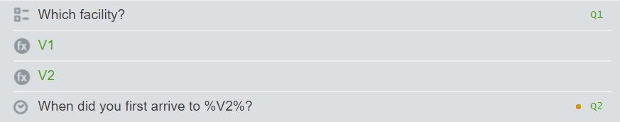
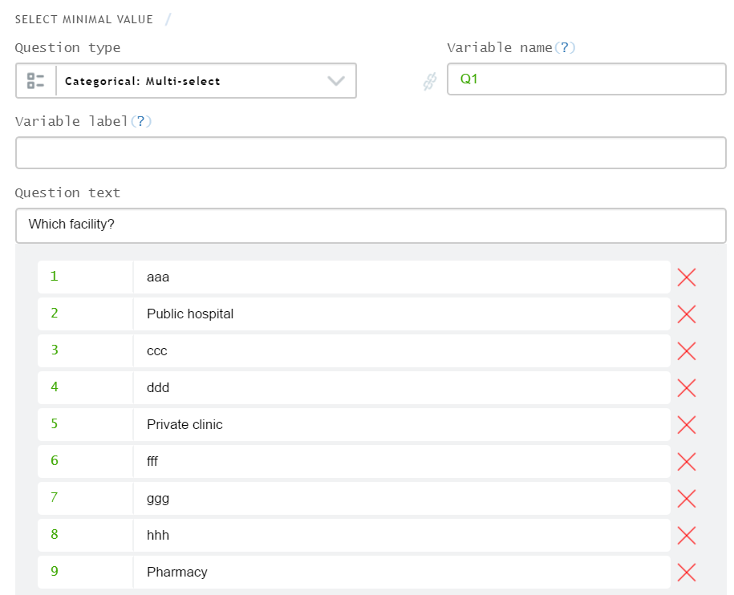
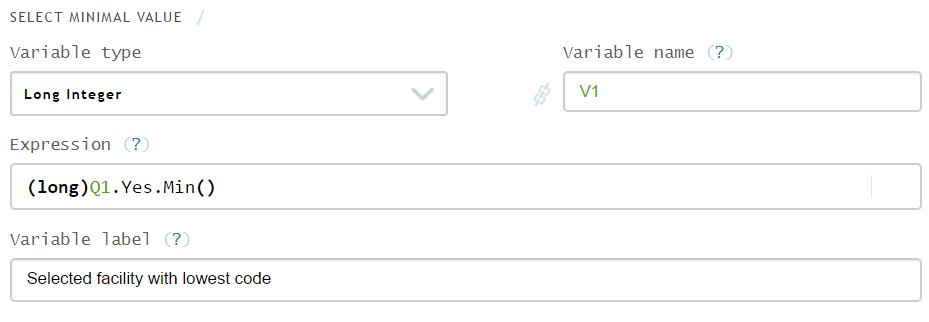
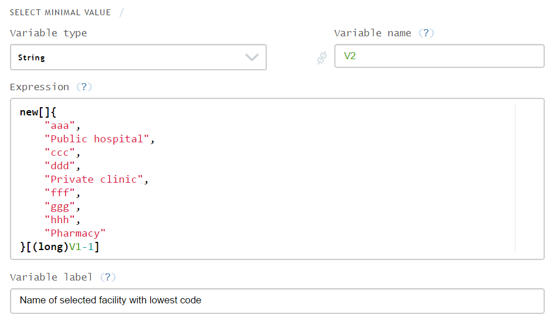
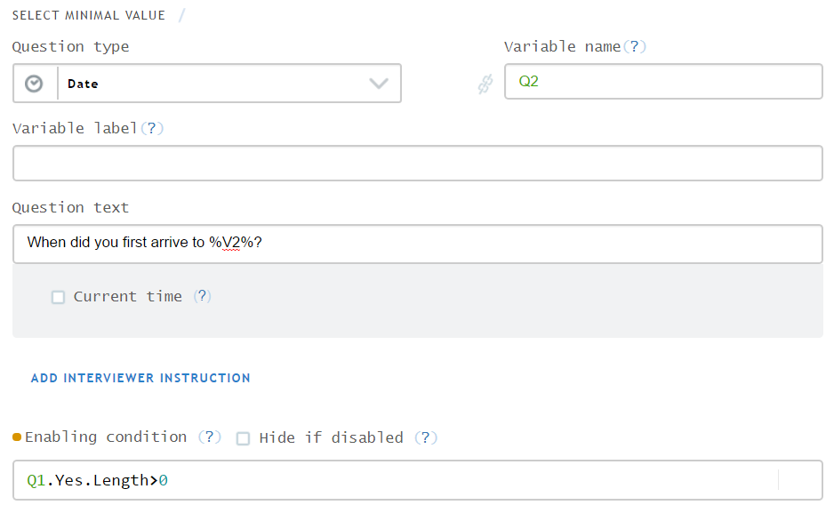

+++
title = "Selecting an option with lowest code"
keywords = [""]
date = 2017-02-23T13:45:09Z
lastmod = 2017-02-23T13:45:09Z
aliases = ["/customer/portal/articles/2751433-selecting-an-option-with-lowest-code"]

+++

This article demonstrates the sequence of steps that solve the
[user-submitted
question](http://support.mysurvey.solutions/customer/portal/questions/16822110):  
  
Step 0:  
  
Step 1:  
  
Step 2:  
  
Step 3:  
  
Step 4:  

