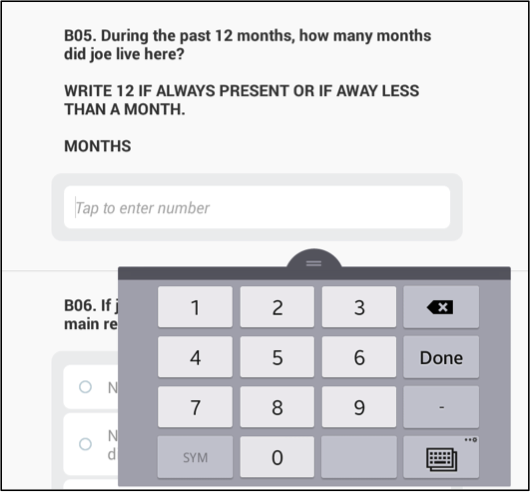

+++
title = "Answering All Question Types"
keywords = ["answer","interviewer","app","application",""]
date = 2016-07-14T18:38:49Z
lastmod = 2016-07-14T18:38:49Z
aliases = ["/customer/portal/articles/2497877-answering-all-question-types"]

+++

The Interviewer application allows several different types of questions:
[numeric](#numeric), [text](#text), [single-select
categorical](#single), [multi-select categorical](#multi),
[list](#list), [date](#date), [GPS](#gps), [barcode](#barcode), and
[picture](#picture). As an interviewer, you must know how to answer each
of them. To help you with that text, each question type is briefly
explained below with visual aids.  
  
  
 

Numeric
---------------------------------

  
Questions that take a numeric response have a field for an open numeric
answer. When that field is tapped, the numeric keyboard appears so that
the interviewer can compose an appropriate numerical response.  
  
  
  
 

Text
---------------------------

  
Text questions have a field for an open text response. When that field
is tapped, the text keyboard appears so that the interviewer can compose
an appropriate text response.  
  
  
  
  
 

Categorical: Single-Select
---------------------------------------------------

  
Single-select categorical questions have answer options with radio
buttons. To answer this type of question, the interviewer taps the radio
button associated with the most appropriate answer.  
  
  
  
  
Categorical: Multi-Select Multi-select
categorical questions have answer options with check boxes. To answer
this type of question, the interviewer taps in all appropriate check
boxes. Selected answers will show a check in the box.  
  
  
  
  
 

Categorical: Multi-Select in Yes/No Mode
-----------------------------------------------------------------------

  
Multi-select categorical questions in yes/no mode have two radio buttons
for each item--one that denotes “yes” and another that denotes “no”. To
answer this type of question, the interviewer taps the radio button
associated with the most appropriate answer for each item.  
  
  
  
  
  
Categorical: Cascading Selections  
When unanswered, cascading selections look similar to text or numeric
questions. Each question has a field where an answer can be composed.
However, to answer these questions, the enumerator first taps in the
field and then selects the most appropriate categorical answer from a
drop-down menu. Selecting an answer option can be done either through
tapping an option directly or through typing to narrow down answer
options and then select the most appropriate.  
 

<table>
<tbody>
<tr class="odd">
<td></td>
<td></td>
</tr>
</tbody>
</table>

  
  
 

List
---------------------------

  
Tap on the empty text box and use the keyboard to input an answer.
Additional, elements can be added to the list until the maximum
allowable number of items is reached.  
  
  
  
To delete elements from the list, click on the X mark. However, be
careful: doing so may result in deleting data, if the elements of a list
question are linked to a roster (e.g., names of household members, each
of which has their own row in the household demographics roster).  
  
  
 

Date
---------------------------

  
First, tap on the *enter date* textbox.  
  
  
  
Then, use the pop-up window to input the correct date. Depending on
which is more convenient, the interviewer may either scroll elements of
the date up and down (i.e., use the left-hand component of the date
input in the image below) or pick the date from the calendar (i.e., use
the right-hand component of the date input dialog).  
  
  
  
After clicking the *Done* button, the date will be recorded. The
recorded answer will be displayed below the question text, as pictured
above.  
  
  
  
  
 

Date: Current Time
----------------------------------------------

  
Tap on the *Tap to record current time* box.  
  
  
  
Then, the current time on the tablet will automatically be recorded.  
  
  
 

GPS
-------------------------

  
First, tap on the textbox. This will open a window informing you that
the tablet is searching for the GPS location. Closing this window will
stop the tablet from searching for GPS.  
  
  
  
Then, the tablet automatically records the GPS coordinates. The GPS
location is displayed immediately below the question text, showing the
longitude, latitude, accuracy, and altitude.  
  
  
  
If GPS reading is not accurate enough, you may tap on the *record
GPS* textbox again. Doing so will replace the old GPS reading with the
new GPS reading. You can continue in this fashion until you obtain and
adequately precise GPS reading.  
  
  
 

Barcode
---------------------------------

  
First, tap on the textbox.  
  
  
  
  
Then, point the tablet’s camera towards the barcode, trying to align the
red bars with the barcode, as above.   
  
  
  
  
Once the tablet can clearly read the barcode, the camera will turn off
and the barcode’s value will appear just below the question text.  
  
  
  
  
 

Picture
---------------------------------

  
First, tap on the *take a photo* textbox. Then, point the tablet’s
camera to compose your picture, pressing the camera icon on screen to
take the picture.  
  
  
  
  
Once the picture has been taken, press the check button to accept the
picture or the *X* button, as pictured above, to reject the picture and
replace it with another picture.  
  
  
  
Then, the picture will appear below the question text. Tap on the *take
a photo* textbox to replace the photo by retaking the picture.  
  

