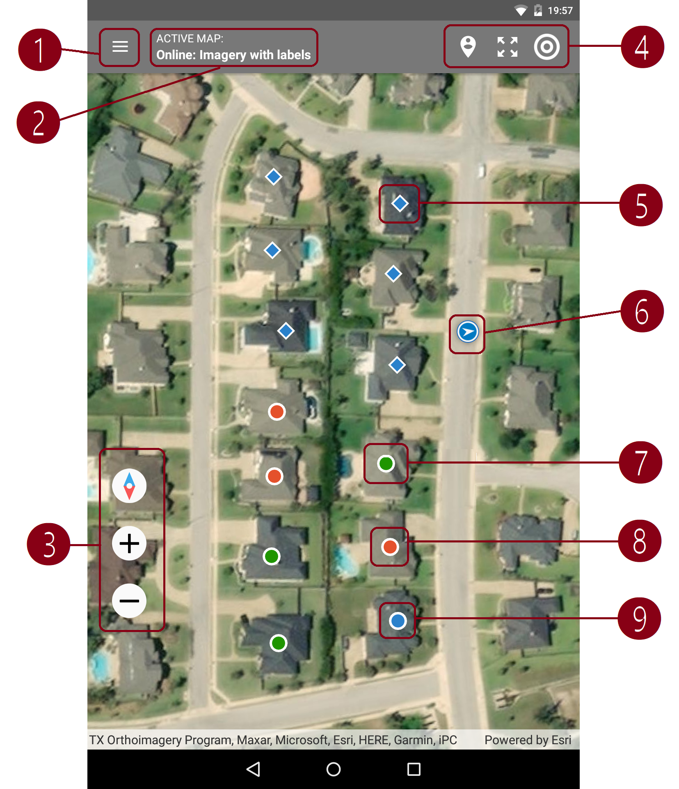
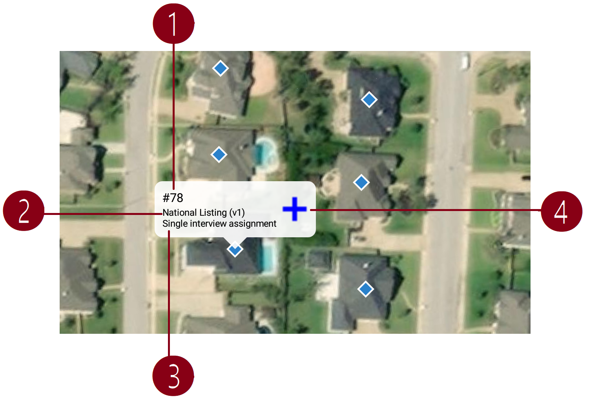

+++
title = "Map Dashboard"
keywords = ["dashboard","map"]
date = 2020-07-20T00:00:00Z
lastmod = 2020-07-20T00:00:00Z
+++

Overview of the map dashboard
-----------------------------------

Survey Solutions map dashboard is an alternative representation of the regular
dashboard where markers on the map indicate location of respondents. An
interviewer switches to this view by pressing the map icon located in the
toolbar next to the synchronization icon on the main dashboard.

Several maps are offered for the Interviewer application (three online
maps) and (1 offline map), and more offline maps can be uploaded by the
headquarters users using the same procedure as the maps are assigned to be used
in the geography-type question. Offline maps usually occupy considerable space
in the tablet's data storage, so only the necessary maps should be assigned to
interviewers.

The interviewer may select the map that is appropriate for the enumeration zone
that she is working from a list of loaded maps.

ESRI mapping components are utilized to visualize the map. The online maps are
provided by various copyright holders, depending on the territory and may vary
in recency and level of detail.

The map dashboard indicates location based on the value of a single GPS-location
question in the cover page (only one GPS-location question may be designated as)
identifying. This means also, that this question may be called differently in
different survey questionnaires, and Survey Solutions would still find it and
plot on the map.


There may be assignments/interviews on the interviewer's dashboard without
geographical position for any of the following reasons:

- there is no GPS question in the questionnaire, or
- location information hasn't been preloaded into assignments, or
- location information hasn't been recorded yet, or
- location of the interview is off the current visible map.

Interviewers should double-check with the regular dashboard to conclusively
establish the presence and status of a certain interview.


Map dashboard explained
-----------------------------

1. Menu to apply filter by questionnaire and select what to plot: assignments, interviews, or both. When a questionnaire is selected all versions of this questionnaire are treated as if they are the same version.

2. Active map selector. Interviewers may select any one of the:
- online: imagery;
- online: imagery with labels;
- online: open street map;
- map of the world;
- user uploaded offline maps.

3. Controls to:
- align (rotate) the map to point in the North direction at the top of the screen;
- zoom in;
- zoom out.

4. Controls to:
- zoom to extent of the data;
- zoom to extent of the map;
- show current location marker (may take time to determine position).

5. Assignment marker - blue diamond.

6. Current location marker - blue circle with arrow.

7. Completed interview marker - green circle.

8. Rejected interview marker - red circle.

9. Started interview marker - blue circle.

Map balloon
------------

1. Assignment number (interview key for interviews).

2. Questionnaire title and version.

3. Number of interviews to be collected (for assignments only).

4. Button to start a new interview from assignment (assignments only) or open the interview (for interviews in any status).
