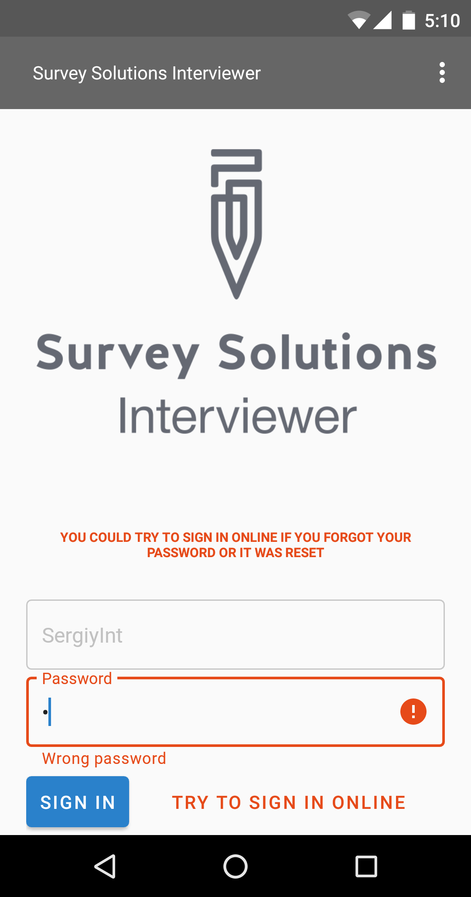
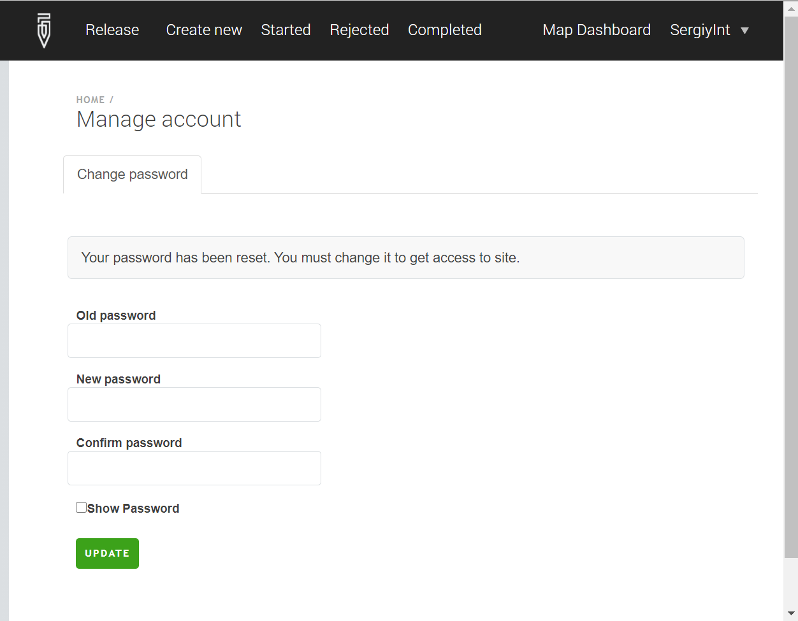

+++
title = "Interviewer Password Reset"
keywords = ["interviewer","password","reset"]
date = 2019-04-05T07:07:07Z
lastmod = 2021-08-24T07:07:07Z

+++

This article describes the actions in case an interviewer forgets the password
that was assigned to him/her. If you are a PDS administrator and forgot your
password, refer to another article:
[PDS password reset](/headquarters/config/pds-password-reset/).

<U>Important</U>:

* Survey Solutions doesn't store the passwords of interviewers in the clear
text. So if it is forgotten, no user may look it up inside Survey Solutions,
neither the Supervisors, nor the Headquarters, nor the Administrator users.

* The interviewer may not recover his forgotten password himself (even if an
optional phone number or email were specified for his account). This requires
cooperation of the [administrator](/headquarters/accounts/survey-solutions-server-administrator/) user.

The practical sequence of actions is the following:

1. Interviewer realizes he has forgotten the password and can't login to the application.
2. Interviewer contacts the supervisor and asks to assign a new password. This is only if the interviewer doesn't have a direct contact to the server administrator, which is typically the case. For operations where the interviewers do have a direct contact of the server administrator, they should contact the administrator directly (steps #2,3).
3. Supervisor passes the request of the interviewer for a change of the password to the administrator user.
4. The administrator makes sure that he has confirmed the identity of the person requesting the password change as a legitimate interviewer (using organization's ID/passport/or other similar identification documents), then assigns a new password, and communicates it back to the interviewer. This is a temporary password, which must be changed, before the interviewer may continue working.
5. Interviewer enters any text to the password box at the login screen 5 times. After that
the system will suggest to login online with the message
"*YOU COULD TRY TO SIGN IN ONLINE IF YOU FORGOT YOUR PASSWORD OR IT WAS RESET*".

6. Interviewer enters the newly communicated password and presses the "*Try to sign in
online*" button. This step requires connection to the server, so the tablet must be online.
7. If the password was entered incorrectly, the interviewer will receive the message
"*AUTHENTICATION PROBLEM ON THE REMOTE SERVER. PLEASE CONTACT YOUR SUPERVISOR*".
8. If the password was entered correctly, the interviewer will be asked to
change the temporary password issued by the administrator in step #4 above
to a new password, that is known only to him/her. The new password should
be utilized from this moment on by this interviewer for all logins (online
to the server and offline to the tablet's Interviewer app).

If repetitive correct entries (in step #6) of the temporary password
(communicated in step #4) are denied, then it may be the case that:

- there is a problem with the internet connectivity, which prevents reaching
the server from the tablet for verification of the temporary password, or
- the account is being abused by someone who became aware of the temporary
password, has already used it to log in and has changed it to something else.
These cases are rare, but could take place if, for example, a supervisor,
becomes aware of the password when it was communicated by the administrator
to the interviewer in step #4 (if the communication was not direct, but
involving the supervisor) or by the mailbox administrator, who has access to
the mail of the members of the organization.



All interviewers accounts are made either by headquarters or administrator
users. Any account created by them will initially be created with a temporary
password that must be changed before the interviewer can continue working. The
same applies if the account's password was subsequently reset by the
administrator. See also: [own-passwords enforcement](/release-notes/version-21-05#own-passwords-enforcement).

If a new password was issued to an interviewer and the first login with that
password is not followed by a prompt for it to be changed then it is evidence
that that password has been compromised. Even if the interviewer can log in
and work with that password he/she should not and should insist on a new
password reset.



Note: If for any reason an interviewer's password is changed while he is
logged in, he will not be able to synchronize: once he tries to synchronize
a message will pop up requesting him to enter the new password (password is
validated for every synchronization session even if the interviewer has
already logged in to the Interviewer app).



If the interviewer is working both with an online account on the server and
with the tablet's Interviewer App, the interviewer account password is the
same for both tools. Correspondingly, if it has been reset, the temporary
password assigned by the server administrator will be anticipated in both
tools for authentication.

If the first login after the password change was to the   Interviewer App on
the tablet, then for subsequent logins online the interviewer should enter
the password he/she has selected.

If the first login after the password change was to the server online, then
the App on the tablet is still not aware of the change that took place
online, and hence the interviewer must provoke the online sign-on as
described in step #5 above.


See also:

* [password best practices](/interviewer/app/password-best-practices/)
* [own-passwords enforcement](/release-notes/version-21-05#own-passwords-enforcement)
* [PDS password reset](/headquarters/config/pds-password-reset/)
