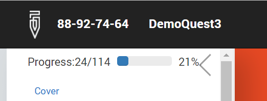

+++
title = "Interview Progress Indicator"
keywords = ["interview","progress","progress bar","percent complete"]
date = 2020-05-11T00:00:00Z
lastmod = 2020-05-11T00:00:00Z

+++

Survey Solutions works with surveys that may contain thousands of questions, with whole sections being turned on and off dynamically, number of repetitions responding to answers in the interview and other complexities, which present a challenge for estimation of the progress. Yet at any moment of time a certain number of questions are answered (NA), and certain number of questions are not answered (NU). (These numbers were always reported at the interview completions screen.)

With the total number of questions calculated as N=NA+NU one could report a simple estimate of the progress of interview P=NA/N * 100%. This would be a rather accurate indicator in case of no conditions or repetitions in the questionnaire, but gets less accurate in the presence of these elements.

The progress indicator is reported in the interview table of contents and is recalculated after any change in the interview:

  

One should expect the progress to move both up or down with more answers given. The progress will increase (e.g. from 21% to 22%) if the given answer didn’t increase the total number of questions, and it will decrease if the total number of questions did increase as a result of the answer (for example, if answering the employment question opens up a whole section of questions regarding employment).
