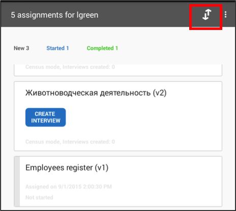
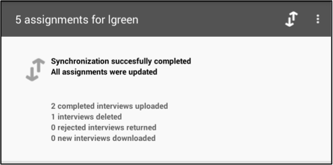

+++
title = "Synchronization"
keywords = ["sync","synchronize","interviewer","app","application"]
date = 2016-07-15T17:48:51Z
lastmod = 2016-07-15T17:48:51Z
aliases = ["/customer/portal/articles/2498915-synchronization","/customer/en/portal/articles/2498915-synchronization","/customer/portal/articles/2498915","/customer/en/portal/articles/2498915","/interviewer/synchronization"]

+++

Sending completed interviews and receiving new ones
---------------------------------------------------

  
The synchronization button is how the interviewer initiates an
information exchange between their tablet and their supervisor’s laptop.
Synchronization performs two tasks. First, it automatically pushes any
completed assignment to the supervisor for review. Second, it
automatically pulls all new assignments and data collection instruments
onto the interviewer’s tablet. After synchronization is complete, the
number of new assignments received, number of completed interviews sent,
and so on are clearly displayed.  
 

<table>
<tbody>
<tr class="odd">
<td></td>
<td style="text-align: center;"></td>
</tr>
</tbody>
</table>

 

Why is my data not syncing?
---------------------------

  
1. **Error:** No network. Check your network settings.  
  
  
  
To resolve:

-   Check your Wifi connection through network connections section of
    the settings menu on your device.

-   Make sure Wifi is enabled. Make sure you are connected to a network.

  
  
2. **Error:** No connection to the Survey Solutions Supervisor. Please
make sure that the website is available.  
  
  
  
To resolve:

-   Check the URL of the server. Tap on the application menu button on
    the right hand corner. Click on Settings and check the server URL
    under the Supervisor URL heading. If you find an error, tap on the
    field to make changes.
-   If the server URL is correct, please inform your
    Supervisor/Headquarters about the error.

  
  
3. **Error:** Timeout when connecting to the Survey Solutions Supervisor
website. Check your internet connection.  
  
  
  
To resolve:

-   Check the Server Response timeout settings. Tap on the application
    menu button on the right hand corner. Click on Settings and tap on
    the Server Response timeout field. In the pop up window, you can
    increase the number of seconds allowed.
