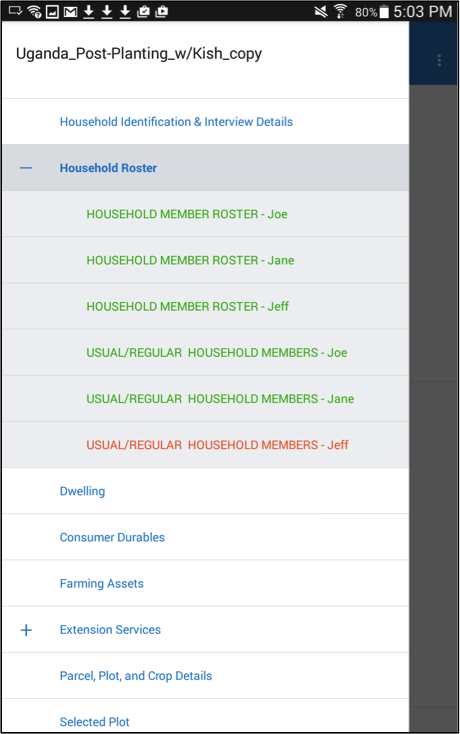
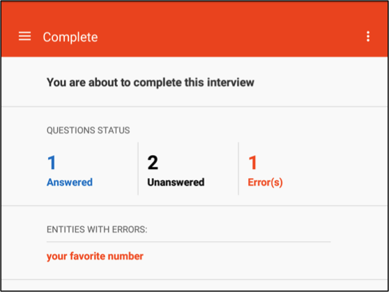
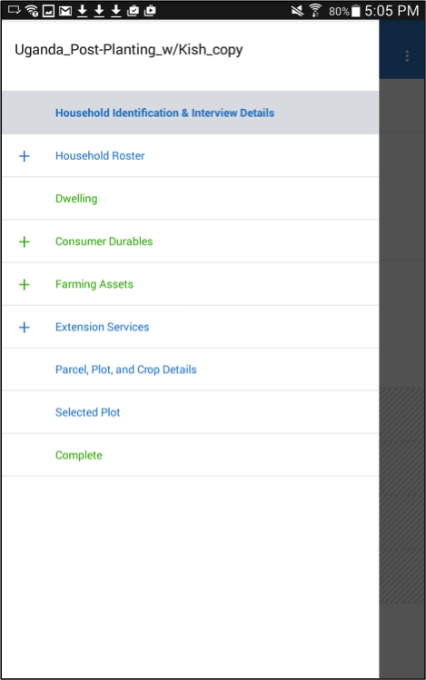
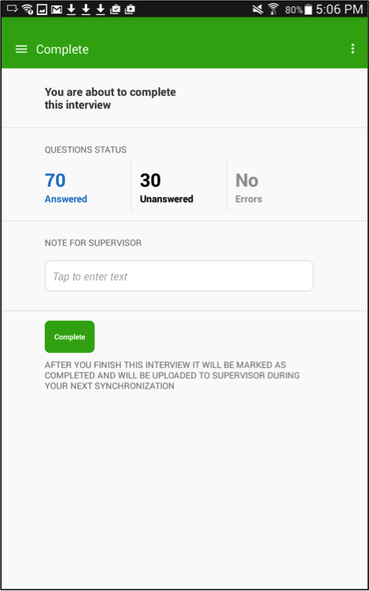

+++
title = "Quality Control & Marking Interviews as Complete "
keywords = ["check","review","complete","interviewer","app","application"]
date = 2016-07-14T22:15:45Z
lastmod = 2016-07-14T22:15:45Z
aliases = ["/customer/portal/articles/2498212-quality-control-marking-interviews-as-complete-"]

+++

Checking whether all questions have been answered
-------------------------------------------------

  
Quality control starts with the interviewer. The interviewer should thus
do everything within their power to ensure that all questions are
answered.  
  
The interviewer application offers three ways to do this. The first is
the classic method that one might use with a paper questionnaire. The
interviewer simply flips the questionnaire looking for unanswered
questions or answers that have triggered red error messages.  
  
The second, which concerns completeness, is to use the navigation panel
as a gauge of whether any questions still need to be answered. Each
element in the navigation panel is color-coded.  Green indicates that a
section is complete—that is, that all questions have been answered and
none have invalid answers. Blue denotes incomplete—that is, that some
question are unanswered. Red indicates that one or more questions in the
answer have an invalid answer—that is, an answer that violates the
validation condition.  
  
  
  
  
The third method is to navigate to the module on the navigation pane
named Complete. Once on that screen, the number of unanswered and
invalid questions are displayed. The interviewer can identify the
unanswered questions by opening the navigation pane (as described
above), and navigate to errors flagged by pressing on each one on the
*Complete* screen.  
  
  
 

Checking that all answers are valid
-----------------------------------

  
In addition to confirming that a questionnaire is completely answered,
the interviewer must also make sure that all answers make sense. There
are two complementary ways of doing this.  
  
While completing the questionnaire, the interviewer will see error
messages whenever the answers provided are invalid. An invalid answer
may be one that is outside of some expected range (e.g., age should be
between 0 and 100) or one that conflicts with an answer provided
elsewhere (e.g., age conflicts with date of birth). The interviewer
should, to the extent possible, correct any errors as soon as they
arise.  
  
After completing the questionnaire, the interviewer should check that no
errors have escaped his/her attention. To do this, the interviewer can
follow the same protocol as in the third method above for confirming
that all questions have been answered.  
  
  
 

Marking an interview as complete
--------------------------------

  
An interview is not automatically complete once all of the answers have
been answered. To mark a questionnaire as complete, the interviewer must
use the navigation pane to navigate to the module named Complete. Once
on that screen, the interviewer then needs to click on the Complete
button. This will mark the questionnaire as complete and be reflected in
the status of that assignment on the interviewer’s Dashboard.

<table>
<tbody>
<tr class="odd">
<td></td>
<td></td>
</tr>
</tbody>
</table>
