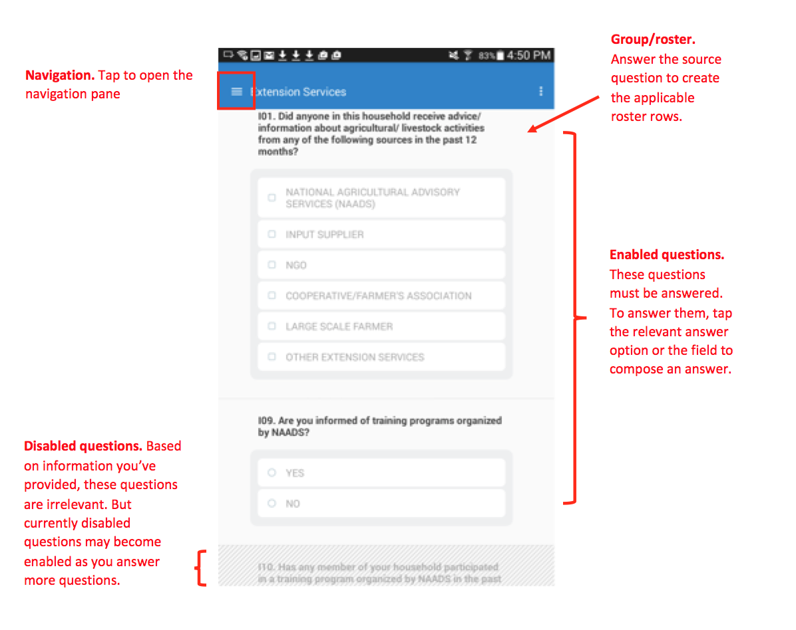
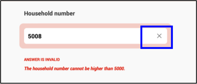
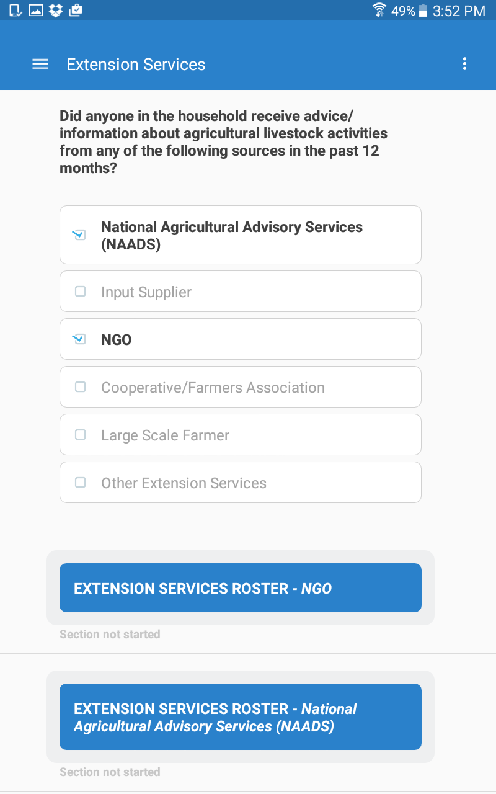
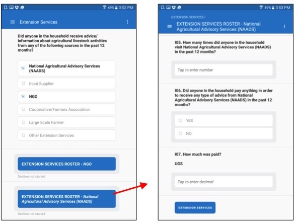

+++
title = "Questionnaire Interface & Answering Questions"
keywords = ["interviewer","app","application","answer","navigate","roster navigation","group navigation"]
date = 2016-07-14T03:04:44Z
lastmod = 2016-07-14T03:04:44Z
aliases = ["/customer/portal/articles/2497110-questionnaire-interface-answering-questions"]

+++

Overview of Questionnaire Interface 
------------------------------------

  
  
  
 

Answering questions
-------------------

### How to know when you have answered a question

 

<table>
<tbody>
<tr class="odd">
<td></td>
<td></td>
</tr>
</tbody>
</table>

  
  
There are a few ways that interviewers can know that they have
successfully answered a question. First, the question shows some answer.
Second, the tablet vibrates and the questions are surrounded by a red
outline, if the recorded answer is not valid. Vibration can be disabled
by navigating to Interviewer’s settings and removing the checkbox next
to *Vibrate when invalid answer is given*.  
  
  
  
  
However, even after a question is answered, an interviewer may want to
wait before moving to the next question. When the interviewer needs to
pause, the Interviewer application will display the following message:  
  
  
  
An interviewer can recall an answer in any question by clicking on the X
next to their response.  
  
  
  
 

### How to know if you have made a mistake

  
After an answer is recorded, the Interviewer application automatically
assesses whether the answer is consistent with other answers in the
questionnaire or plausible based on what is known about the survey
population. If an answer is inconsistent or implausible, that answer is
considered invalid.  
  
Questions with invalid answers are outlined in red (The tablet will also
vibrate if the feature is enabled), and accompanied by an error message
will appear describing the problem (as shown above).  
  
  
 

Understanding groups and rosters
--------------------------------

  
Groups and rosters are special grouping of questions. On the tablet,
both first appear as a button.  
  
  
  
  
When the button is tapped, the interviewers see the questions or roster
row associated with that button.  
  
  

                         
  
To exit the roster row, the interviewer must select the button
containing the name of the roster group or section at the bottom of the
screen.  
  
  
To complete a group or roster, the interviewer simply answers all
relevant questions. For a group, this is simple. For a roster, the
process merits some explanation.  
  
  
  
  
  
An interviewer must complete a roster row by row. By tapping on the
button associated with any given row, the interviewer will see all
questions for that item in the roster. To move back to the roster view,
click on the button at the bottom of the screen (e.g., Extension
Services).
