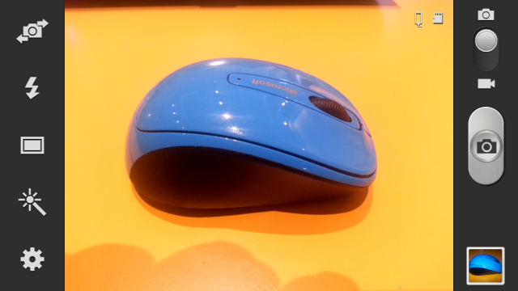
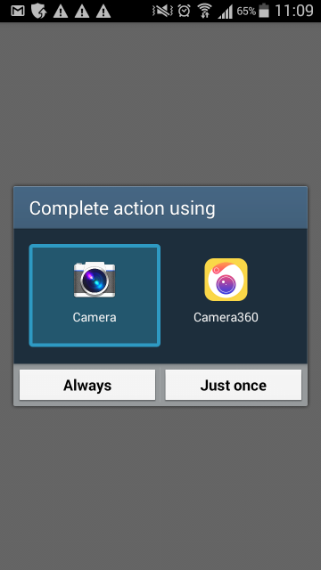
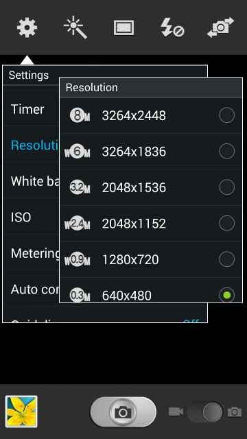
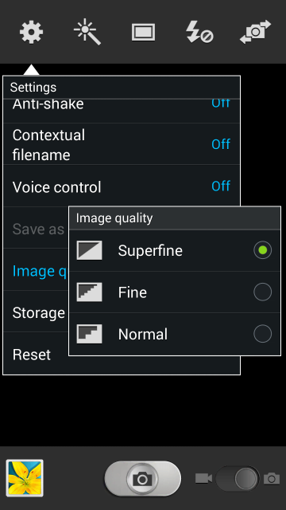

+++
title = "Setting photo size and quality"
keywords = [""]
date = 2017-03-16T13:07:44Z
lastmod = 2017-03-16T13:07:44Z
aliases = ["/customer/portal/articles/2767819-setting-photo-size-and-quality"]

+++

  
***Survey Solutions v5.22 automatically
restricts the size of the images captured by the Interviewer App (see
[limits](http://support.mysurvey.solutions/customer/en/portal/articles/2733269-survey-solutions-limits)).  
The information below is applicable only if you wish to produce files
even smaller than those automatically produced.***  
  
Survey Solutions image (picture) question does not specify any
particular size or quality of the photo to be captured with the tablet's
camera. Instead Survey Solutions captures the image supplied by a
standard picture provider (typically the Camera application) installed
in the OS Android. This allows Survey Solutions to benefit from controls
and effects present in such a provider.

  
  
  
Depending on the purpose of the image capture, the settings may need to
be adjusted. The higher is the resolution and quality of the image, the
more details it contains, but at the expense of larger picture size (in
bytes). Larger images may take longer to upload from the tablet to the
server, and download during export. Transferring larger images over
cellular networks will generally cost more, or consume your volume quota
faster. Smaller images are circulated more quickly in the system, but
they may lack the image quality that is necessary for some purposes.  
  
Different image provider applications have different settings, and when
several such apps are installed, the interviewer is generally asked,
which one she would like to utilize:  
  
  
The two crucial settings most such applications provide are the
**resolution** and **compression level** (also sometimes simply referred
to as "quality"):  
  

Tentative recommendations
-------------------------

Every survey is different, and may require different recommendations.

-   Select a smaller resolution (such as 640x480 or 0.3MP) when taking
    images of e.g. houses, vehicles and other large items, where small
    details are of no significance.
-   Select higher resolution (such as 2.3MP) when taking images of
    persons, families, crop fields.
-   Select even higher resolution (3 and more MP) when capturing
    documents (IDs, pages of text, etc) or plant leaves (plant disease
    detection).

Other settings
--------------

In addition, other controls may be available, such as:

-   scene (document, portrait, architecture, landscape, etc.),
-   exposure control,
-   flash control,
-   image stabilization and other.

The exact scope and number of such settings depend on the tablet
manufacturer, OS version and application type. Some applications provide
additional image processing or special effects capabilities, such as
increasing sharpness, changing colors to black and white or picking
existing images from the device photo gallery.

Ensuring the data quality
-------------------------

A questionnaire designer may provide multiple image type questions to
capture "backup" photos, such as Photo of the house (1st attempt), Photo
of the house (2nd attempt), Photo of the house (3rd attempt).
Subsequently a supervisor's question may be introduced for the
supervisor to select which image is better corresponding to the
guidelines of the survey. After the data is exported, an automatic
script may be written to leave only one image selected by the
supervisor, and removing the rest.

Training implications
---------------------

Specific training on image taking is recommended for the enumerators if
the photo collection constitutes an essential part of the survey. The
interviewers must explore their devices, understand their capabilities
and limitations. Such a training must cover:

-   composition: understanding which essential details must be included
    into the photo (for example, take picture of the house from the side
    with front door, do not leave out antennae on the roof, do not cover
    the number on the ID with a finger, do not have more than one person
    in the frame, etc.)
-   light conditions: taking images under bright/sunny or dusk/dark
    conditions, or with artificial lighting or a flash;
-   focus: taking sharp photos of small and large objects, documents
    closeups;
-   movement: taking photos when the object is moving, not standing (for
    example, livestock);
-   stabilization: importance of holding the tablet steadily to capture
    sharp images.

Implications for tablet requirements
------------------------------------

In addition to the training of the enumerators, the survey administrator
must be cautious in selecting appropriate tablets for such a survey, and
pay attention to:

-   camera resolution/quality;
-   presence of autofocus;
-   presence of a flash, its effective range, and power consumption.

Consent
-------

Depending on the particular circumstances a consent from the respondent
must be acquired prior to capturing images, especially photos of persons
and documents.
