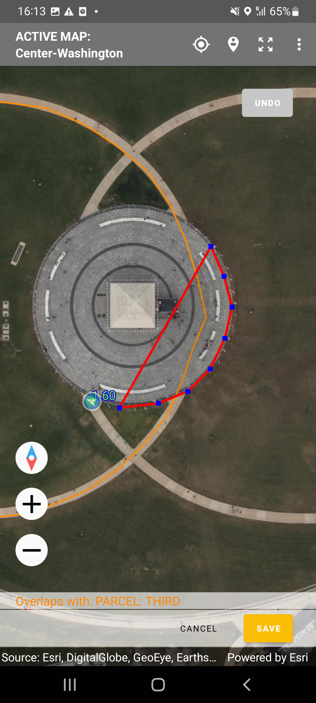
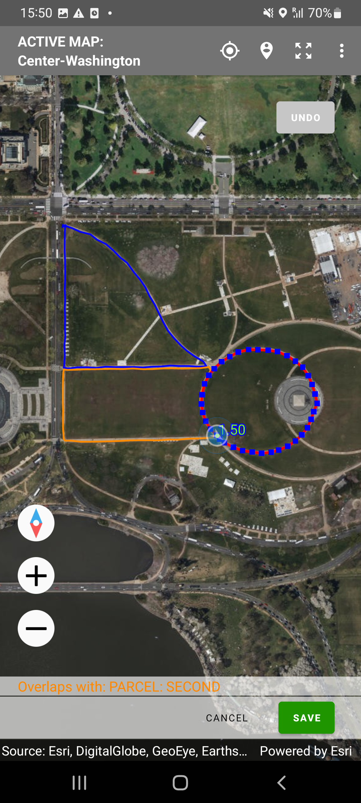
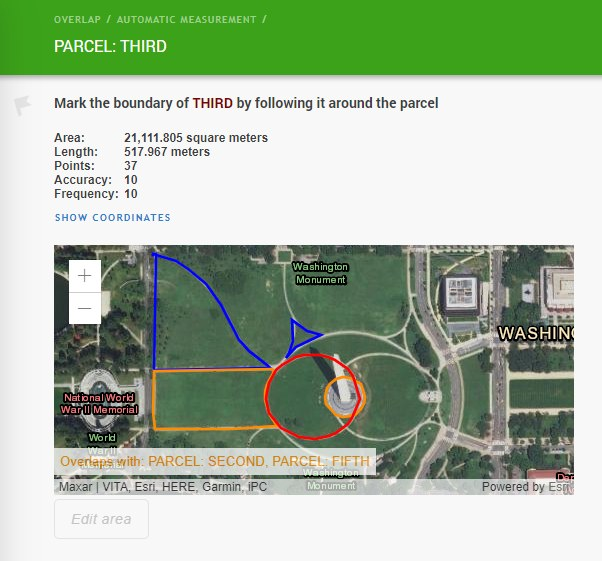

+++
title = "Overlap Detection"
keywords = [""]
date = 2022-12-15T00:00:01Z
lastmod = 2022-12-15T00:00:01Z
aliases = [""]

+++

Overlap detection is feature in Survey Solutions’ [geography
question](/questionnaire-designer/questions/geography-question/).
It is applicable only to the geography questions
placed in a roster. When activated by the questionnaire
designer, it will assist the interviewers in marking the
areas in such a way that there is no overlap between
multiple marked plots/parcels. This is important to avoid
double-counting of any area in calculation of the total
area.

If an overlap is detected, the program signals about it at
the bottom of the map, mentioning the other roster items
with which an overlap was detected. Overlap detection works
instantaneously, even if the answer to the question has not
been saved yet.

  

Note that the overlap applies to all variants of the
geography question: polygon, polyline, multipoint and
single point, though most common use is with marking
the areas (polygons). An overlap is signaled when there
is at least one common point of the current answer with
the answer to the same geography question in any other
items of the roster. Thus:

- for polygons: when they overlap with at least one
common point;
- for polylines: when they intersect in at least one
point;
- for multipoints: when there is at least one point
common to the current answer and the answer to the
same question in a different roster item.
- for single points: when the two points are exactly
the same.

In practice, due to noise in measurement no two points
in the single and multiple point geography questions
will be exactly the same when measured with a sensor
(even if the tablet is not moving at all). And if they
happened to be the same, it is likely they are sourced
not from a location sensor then.

The overlap detection serves a warning purpose only.
It doesn’t prevent such data from being recorded and
submitted by the interviewer.

The overlap detection applies to all modes of
measurement: manual, automatic, and semi-automatic.

When overlap detection is switched on, the answers to the
same question for other roster items are displayed on the same
map, albeit in a different color:

  

**Legend for colors:**

- <B>RED</B> - answer to the current
geography question (e.g. current parcel);
- <B>BLUE</B> - answers to the same
geography question for other roster items (e.g. other parcels),
which do not overlap with the current one;
- <B>ORANGE</B> - answers to the
same geography question for other roster items (e.g. other
parcels) which do overlap with the current one.

The overlap detection does not affect the export
of the data, and whether the answer overlaps with
another or not is not accessible from the syntax
in writing expressions.

To activate overlap detection, tick the corresponding
checkbox for those geography questions, where this is
desirable.

The supervisors and headquarters users reviewing incoming
interviews also have a view of the neighboring parcels and
an overlap warning:

  

In this example the overlap of the *THIRD PARCEL* (red circle) with the
*SECOND PARCEL* (orange shape to its left) is detected, but this overlap is
marginal and probably due to the noise in the location acquisition. Yet the
overlap between the *THIRD PARCEL* and the *FIFTH PARCEL* is significant
and is clearly double-counting the same area, and thus is likely a mistake.
