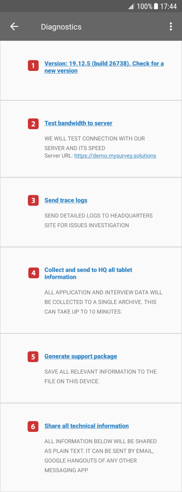
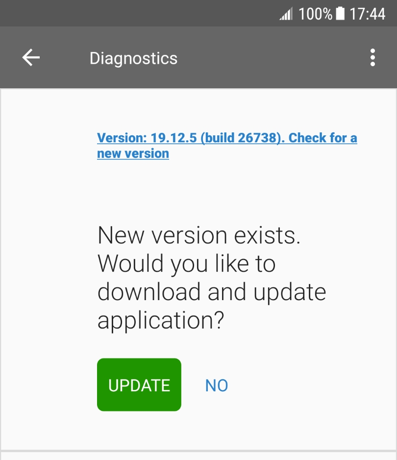
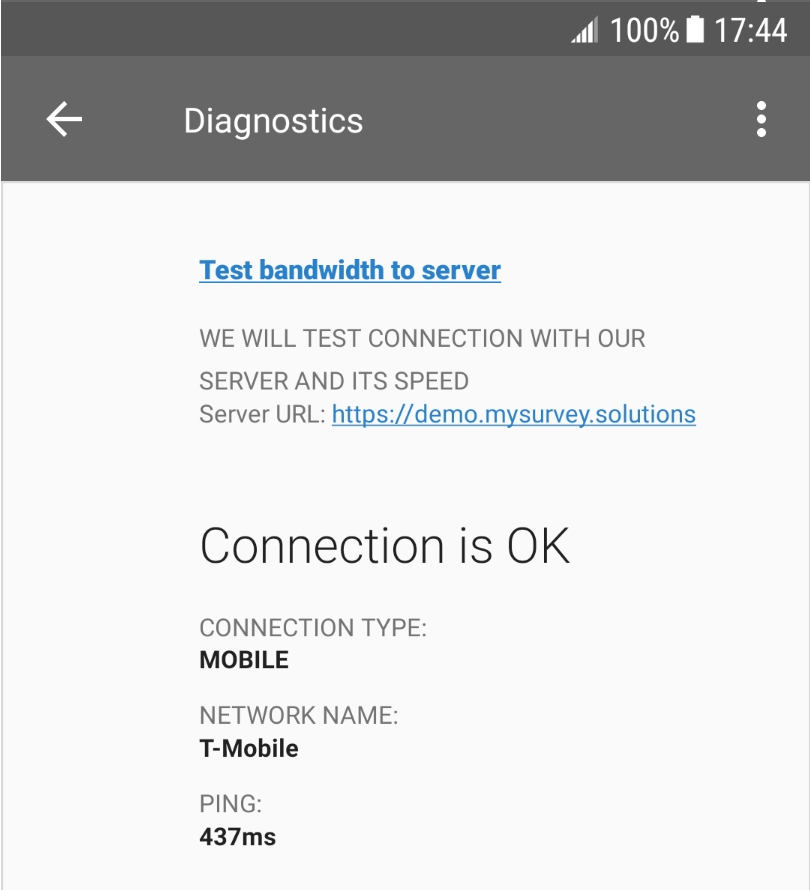
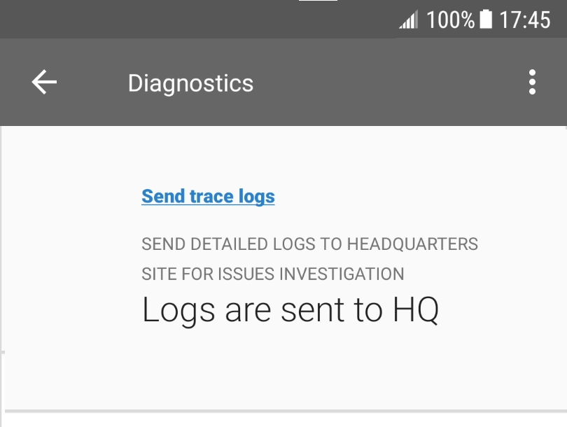
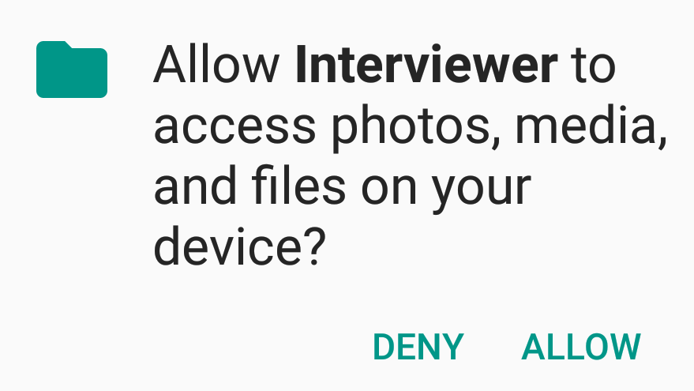
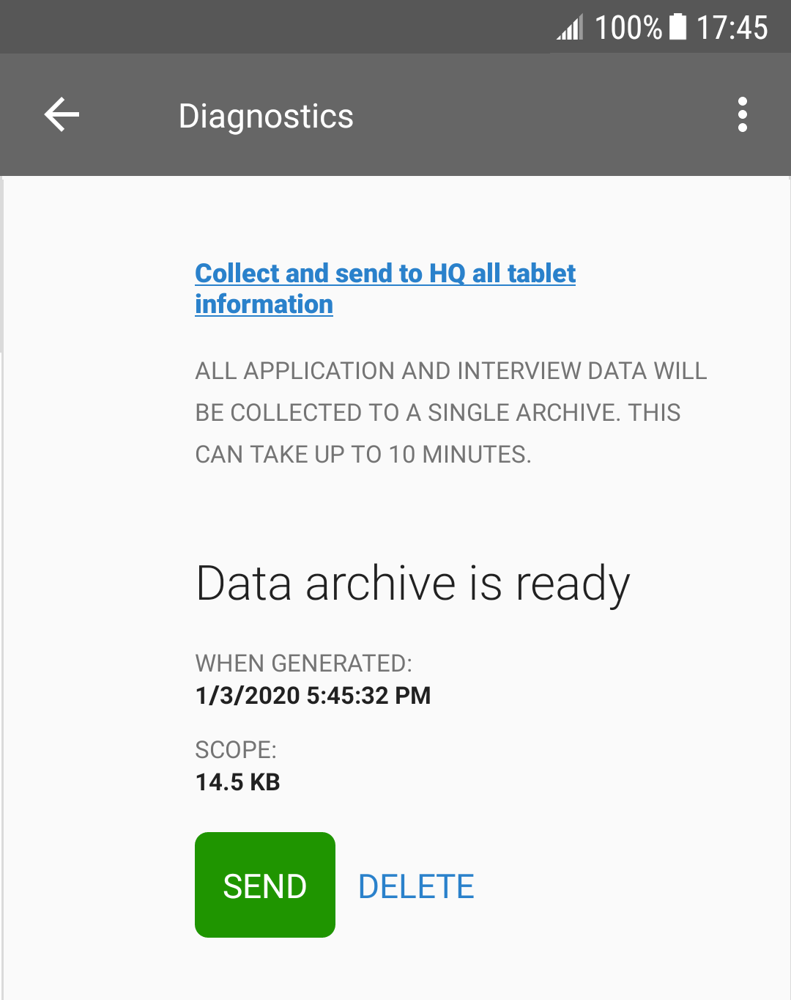
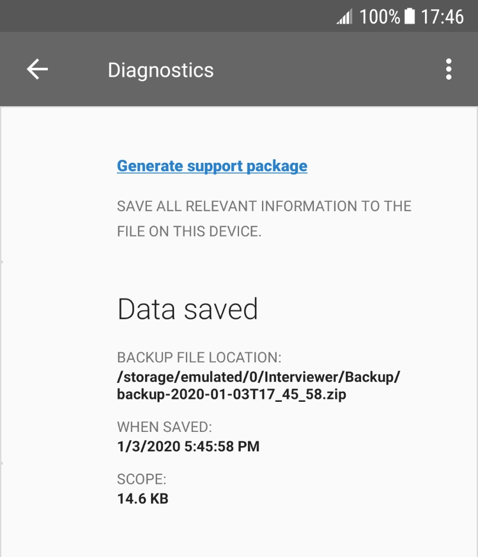
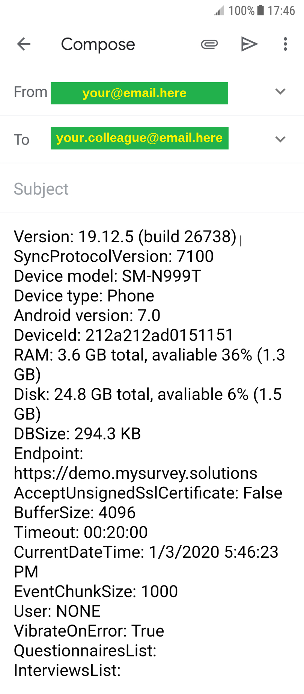

+++
title = "Interviewer App Diagnostics Dialog"
keywords = ["diagnostics","interviewer","application","app"]
date = 2020-01-08T00:00:00Z
lastmod = 2025-09-18T00:00:00Z
+++

The Diagnostics dialog provides tools for troubleshooting. Most of these tools require the tablet to be online (connected to the Internet). The Survey Solutions support may instruct you to use one or the other tool from the below toolset.

  <A href="img/interviewer_app_diagnostics.png">
     <!-- Image Map Generated by http://www.image-map.net/ -->
     
  </A>

<map name="image-map">
    <area target="" alt="Check for new version" title="Check for new version" href="#bullet1" coords="61,133,85,158" shape="rect">
    <area target="" alt="Test bandwidth to the server" title="Test bandwidth to the server" href="#bullet2" coords="61,260,88,288" shape="rect">
    <area target="" alt="Send trace logs" title="Send trace logs" href="#bullet3" coords="61,430,89,459" shape="rect">
    <area target="" alt="Collect and sent to HQ all tablet information" title="Collect and sent to HQ all tablet information" href="#bullet4" coords="63,592,88,618" shape="rect">
    <area target="" alt="Generate support package" title="Generate support package" href="#bullet5" coords="59,777,87,803" shape="rect">
    <area target="" alt="Share all technical information" title="Share all technical information" href="#bullet6" coords="61,930,87,958" shape="rect">
</map>

Below is the explanation of these tools with some example illustrations (click on the items to expand the explanation).

 <A name="bullet1"> <STRONG>1. Version NNN. Check for a new version</STRONG>

The Interviewer App will try to connect to the synchronization point
(server) and check for the availability of a new version of the App.

Normally the updates are received and installed during the
synchronization. Use this item when the synchronization doesn't succeed
for any reason. The tablet must be online for this feature to succeed.

 

<A name="bullet2"> <STRONG>2. Test bandwidth to server</STRONG>

The Interviewer App will try to connect to the
synchronization point (server) and measure the response timing.

Use this to diagnose the connectivity to the server issues, and quality
of connection. The tablet must be online for this feature to succeed.

 

<A name="bullet3"> <STRONG>3. Send trace logs</STRONG>

This will collect on the tablet device and send
to the synchronization point (server) the detailed logs of the
interviewer's work.

The device logs (introduced in v19.11) are available
for <A href="/headquarters/config/device-logs/">review at the server by the ADMIN user</A>
only. The tablet must be online for this feature to succeed.

 

<A name="bullet4"> <STRONG>4. Collect and send to HQ all tablet information</STRONG>

This will collect, pack, and send to the
synchronization point (server) all the content stored on the tablet.


This facility is intended for troubleshooting only. Specifically,
this is NOT a backup feature and not a data transfer feature, and should
not be used or attempted to be used as such. You will not be able to
restore the interviews data from this file.


This may take a significant time to prepare and to send. User's
confirmation is required to access the storage files:

User's confirmation is also required after the package is prepared
before it will be sent to the server (confirm size of the package
if you are concerned about the traffic use).

Make sure you confirm sending and wait for the sending to succeed,
otherwise the your data will not reach the synchronization point.

The tablet must be online for this feature to succeed.

 

<A name="bullet5"> <STRONG>5. Generate support package</STRONG>

This will save all the information stored on the tablet to a file
that can be transferred to the support team when requested.


This facility is intended for troubleshooting only. Specifically,
this is NOT a backup feature and not a data transfer feature, and should
not be used or attempted to be used as such. You will not be able to
restore the interviews data from this file.


The tablet doesn't need to be online for this feature to succeed. The
resulting file may be shared using any means (saved to SD card, USB-stick,
etc).

 

<A name="bullet6"> <STRONG>6. Share all technical information</STRONG>

This will collect the descriptive information about the device and the
Interviewer App installation and generate a textual description that can
be shared with the support team or a colleague/consultant providing
technical support. Here is an example of such a description

The tablet must doesn't need to be online for this feature to succeed.
The resulting textual description may be shared using any means (saved to
a file, sent by email, etc).

