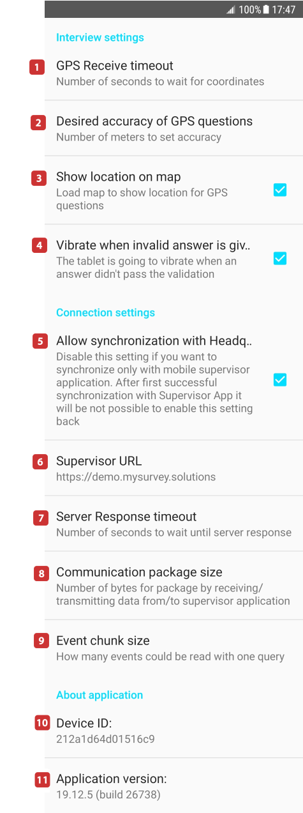

+++
title = "Interviewer App Settings Dialog"
keywords = ["diagnostics","interviewer","settings","application","app"]
date = 2020-01-08T00:00:00Z
lastmod = 2020-01-08T00:00:00Z
+++

Interviewers normally should not change any of the settings on this page,
but may be required to do so based on the instructions of their supervisors
or technical support.

Some combinations or values of these settings may cause errors in
operation/synchronization. Change these settings only if you know what you
are doing.

If you do make any changes compared to the default values, and you are
requesting support from the development team, you must mention in your 
question, issue description, or the support request, which settings you've 
changed and which values you've specified.

<!-- Image Map Generated by http://www.image-map.net/ -->

  

<map name="image-map">
    <area target="" alt="GPS receive timeout" title="GPS receive timeout" href="#bullet1" coords="70,117,45,93" shape="rect">
    <area target="" alt="Desired accuracy of GPS questions" title="Desired accuracy of GPS questions" href="#bullet2" coords="48,180,72,204" shape="rect">
    <area target="" alt="Show location on map" title="Show location on map" href="#bullet3" coords="48,267,73,292" shape="rect">
    <area target="" alt="Vibrate when invalid answer is given" title="Vibrate when invalid answer is given" href="#bullet4" coords="50,372,74,397" shape="rect">
    <area target="" alt="Allow synchronization with Headquarters" title="Allow synchronization with Headquarters" href="#bullet5" coords="49,520,76,548" shape="rect">
    <area target="" alt="Supervisor URL" title="Supervisor URL" href="#bullet6" coords="50,710,75,735" shape="rect">
    <area target="" alt="Server response timeout" title="Server response timeout" href="#bullet7" coords="50,800,77,823" shape="rect">
    <area target="" alt="Communication package size" title="Communication package size" href="#bullet8" coords="50,886,78,913" shape="rect">
    <area target="" alt="Event chunk size" title="Event chunk size" href="#bullet9" coords="52,989,79,1017" shape="rect">
    <area target="" alt="Device ID" title="Device ID" href="#bullet10" coords="54,1119,79,1146" shape="rect">
    <area target="" alt="Application version" title="Application version" href="#bullet11" coords="54,1208,79,1234" shape="rect">
</map>

Below is a brief description of these settings.

1. <A name="bullet1"> The default value is reasonable for most circumstances. If the
interviewer is constantly receiving errors when trying to capture the 
location, this value may be increased to give the GPS-location sensor more 
time to determine the position of the device.

2. <A name="bullet2"> The default value is reasonable for most circumstances. Increasing the
value may result in faster, but less accurate measurements of the location. 
Decreasing the value will cause the device to attempt to determine the 
position more accurately at the expense of longer wait time and higher 
chance of an error. Each GPS sensor has its own physical limit of accuracy. 
Specifying too low of a number here will cause constant or frequent errors 
in determining the position.

3. <A name="bullet3"> The default behavior is to show the captured location on the map if the
tablet is online at that time. To save the traffic, this may be switched 
off and the map will not be rendered in the GPS location question, even 
when the tablet is online. This does not affect the capturing of the 
coordinates.

4. <A name="bullet4"> The default behavior is to indicate a new error during an interview with
vibration (if supported by the device). This can be switched off and 
vibration will not be used even if supported. Note that most phones do 
support vibration, most tablets don't.

5. <A name="bullet5"> Changing this setting should be done only in coordination with the
supervisor and will cause the Interviewer App to send the data NOT to the
server, but to the Supervisor's tablet.

6. <A name="bullet6"> This reflects the address of the synchronization point entered during the
first login. This should only be changed if the actual URL of the same 
synchronization point has changed, otherwise the interviewer will lose the 
possibility to synchronize.

7. <A name="bullet7"> This value may be slightly increased when working over slow connection
lines or with overloaded servers. Specifying too small of a value will cause 
constant or frequent synchronization errors.

8. <A name="bullet8"> This value should be modified only if instructed by the Survey Solutions
developers during troubleshooting.

9. <A name="bullet9"> This value should be modified only if instructed by the Survey Solutions
developers during troubleshooting.

10. <A name="bullet10"> This is a display of the device identifier as reported by the Android OS.
The supervisors, HQ and admin users will see this value in the interviewer's 
profile. Device identifier doesn't generally allow to understand what model 
is this device (such as Samsung Galaxy Tab 4) and may differ from the serial
number of the device (the one you see on the box when you purchase it), but 
allows to distinguish one device from the other.

11. <A name="bullet11"> This is a display of the version number of the Interviewer App
(currently running).
