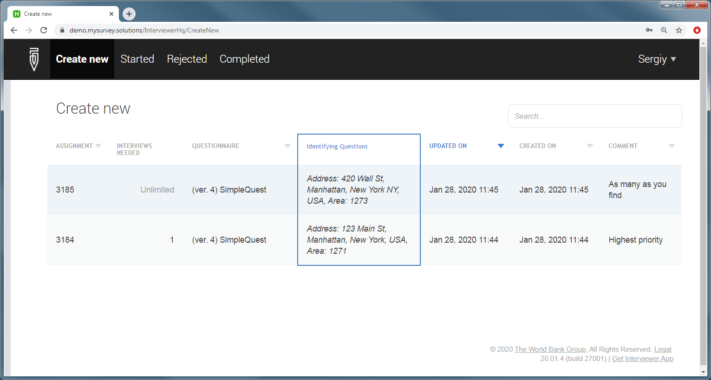
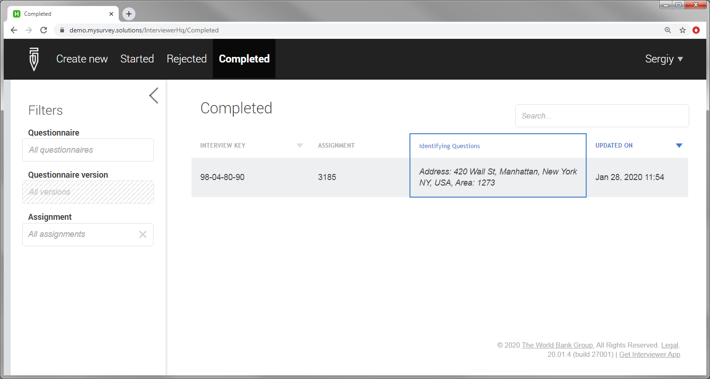
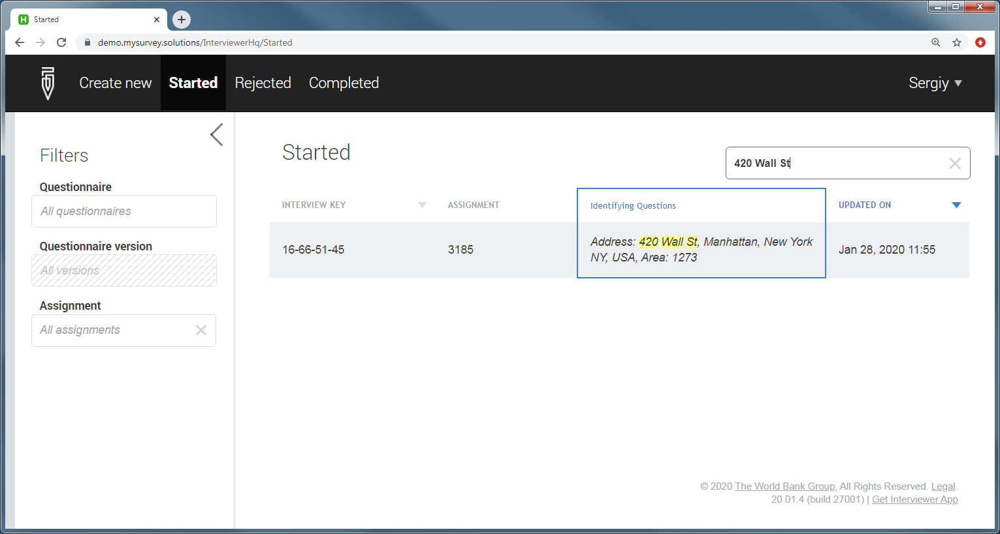
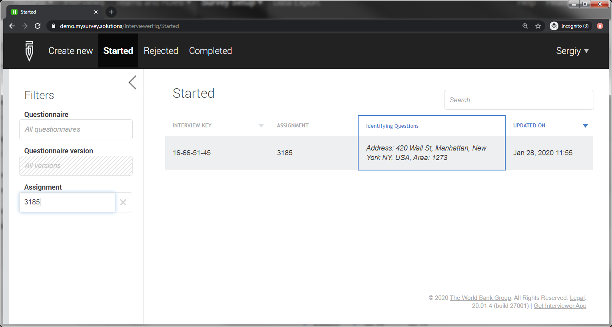

+++
title = "Web Interviewer Dashboard"
keywords = ["web interviewer"]
date = 2020-01-28T00:00:00Z
+++

Web interviewers have access to a dashboard equivalent in functionality to the dashboart of the tablet Interviewer App:

  

<H4>Dashboard tabs (pages)</H4>

The dashboard contains the following tabs (pages):

<TABLE class="table table-striped" >
<TR>
<TH>Tab
<TH>Shows

<TR>
<TD>start new
<TD>assignments, on which new interviews are possible to start.

<TR>
<TD>started
<TD>interviews, which have been started by this interviewer,
but not completed yet.

<TR>
<TD>rejected
<TD>interviews, which have been completed earlier, but then rejected by the supervisor/HQ users to this interviewer.

<TR>
<TD> completed
<TD>interviews completed by this interviewer, but not yet approved or rejected by the supervisor.
</TABLE>

  

<H4>Search</H4>

Interviewers may utilize the search box located above the table to find
an interview with known interview key or value of an identifying question:

  

At the left side of the screen the interviewer may apply filters, to display only the interviews
from a particular survey, particular version, or assignment:

  

Note that the time in the 'Updated on' column is displayed 
in the timezone of the interviewer (as reported by the 
device used to access the dashboard). So, in general the 
supervisor and interviewer may see different 'Last updated'
values for the same interview if they are in different time
zones.

