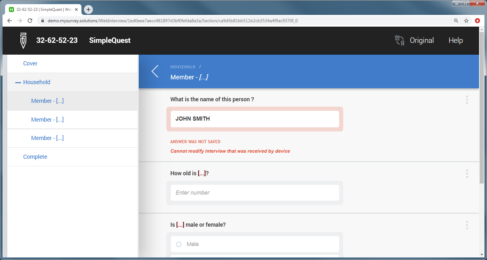

+++
title = "Web Interviewer Important Notes"
keywords = ["web interviewer"]
date = 2020-01-28T00:00:00Z
+++

To prevent collisions of multiple versions of the same interview, the interviewer 
is expected to utilize only one tool for each interview - either a tablet 
interviewer app or a web interviewer.

An interview may be started with the web interviewer, and then continued on the 
tablet after the interviewer initializes and synchronizes it. In this case all the
started interviews are marked as received by the tablet, and are still visible on 
the server (in web interviewer, as well as for the supervisor and HQ users). But 
the interviewer should not and may not make any changes to the interview since it
was already received on the tablet. If he/she tries to do such a change, an error
message will be indicated and the software will refuse the change:

  

The continuation of an interview started on the tablet on the server through web
interviewer is only possible throgh completion and rejection by the supervisor,
since the server receives only those interviews from the Interviewer App that are
marked as *'Completed'* by the interviewer. Once the interview is rejected by the
supervisor it will be available in the web interviewer until the next
synchronization of the tablet.

It is totally fine for some interviewers to be using the Interviewer App on
tablets, and other interviewers using the web interviewer facility even within
the same survey. But the discipline described above is to be observed if any 
interviewer uses both tools.

To simplify the workflow, the coordinator of the survey should decide on a single
tool to be used by every interviewer/account and all interviewers should stick to
it. Any deviation from this rule should be rehearsed during the planning of the
survey to determine suitability for a particular scenario.
