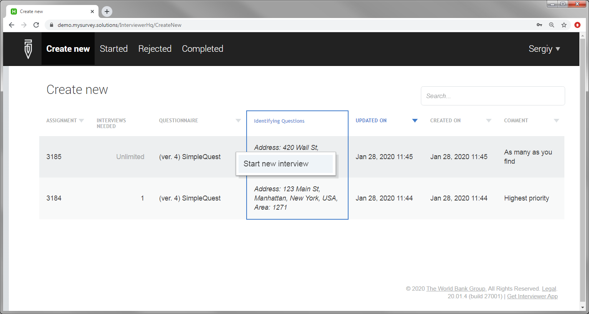
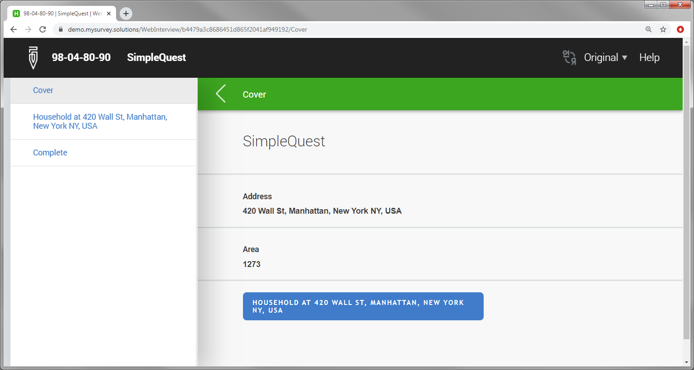
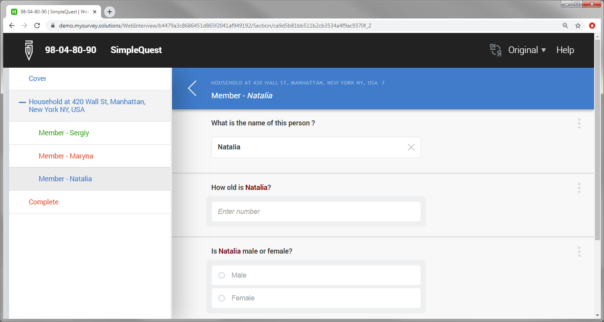
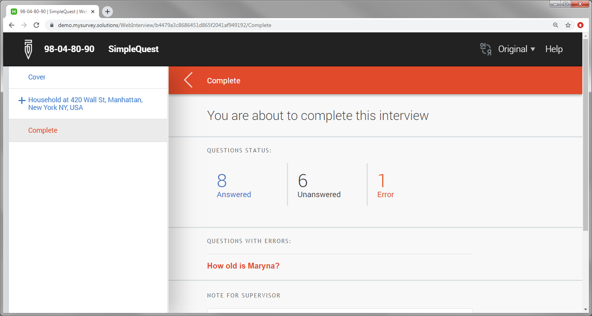

+++
title = "Web Interviewer Interviewing"
keywords = ["web interviewer"]
date = 2020-01-29T00:00:00Z
+++

Web interviewers can conduct interviews as per their effective assignments.
To start a new interview, the interviewer switches to the ***'Create new'***
tab and decides which interview to start by inspecting the identifying questions
visible in the assignments table, as well as any comments by the supervisor/HQ, 
which may be left by them (last column). Once the interviewer is ready to start 
the interview he/she clicks on it and confirms by selecting the corresponding 
item in the menu that appears:

  

From that point on the interview goes on similarly to how it is happening on
a tablet, but the interviewer must remain online during the whole process. The
cover page will show where to locate the respondent

  

The navigation panel (table of contents) is visible by default, to take 
advantage of the wider monitors, but can be closed by clicking the back
arrow button: 

  

At the end of the interview, as on the tablet the counters are presented for 

- number of answered questions;
- number of unanswered questions;
- number of answered questions with errors.

  

No synchronization is necessary after completing the interview. The supervisor
of the responsible interviewer will immediately see it in the list of the
interviews with the status *'Completed'* (awaiting supervisor's decision).