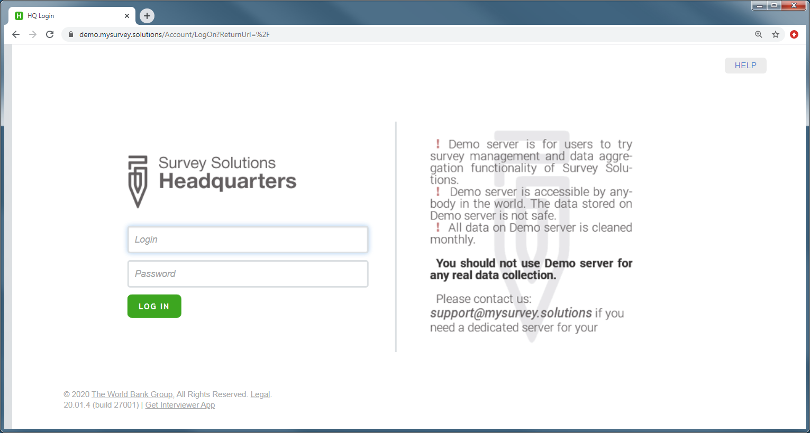
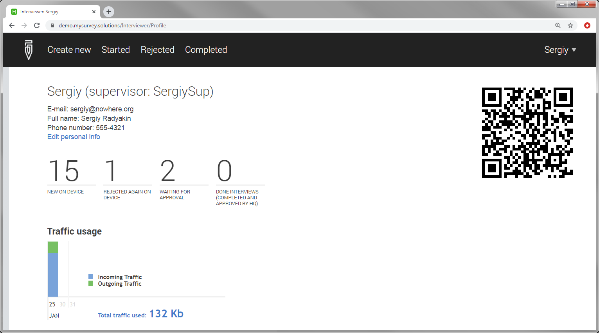

+++
title = "Web Interviewer Login"
keywords = ["web interviewer"]
date = 2020-01-28T00:00:00Z
+++

Headquarters and administrator users may create new interviewer accounts. There is no separate web interviewer account. Every interviewer can login to the data server (synchronization point) with their assigned interviewer credentials.

Logging in to the server is usually not required in face-to-face CAPI surveys conducted with tablets.
After successfully logging in, the interviewer can review his/her interviewer profile:

The link to edit personal information (full name, contact phone, and email) is available if permitted by the corresponding setting specified by the server administrator.

In the profile the interviewer will see (among the other counts) the count of interviews done by this interviewer all together (even if already approved by supervisor/headquarters). On the tablet there is no equivalent of this, as tablet counts only reflect the interviews stored on the tablet.

The interviewer may not change his/her own password. Any interviewer wishing to change the password, or remove the locked status must contact his/her supervisor.

The qrcode shown on the interviewer profile page helps set up the Survey Solutions interviewer App on the tablet faster: it can be scanned during the first login to enter the data synchronization point address and interviewer name into the login form. The qrcode does not contain the interviewer's password.

The interviewer profile may list other statistics as applicable to tablet device if it was ever used by this account. This information will be missing if no device was used by this interviewer.

