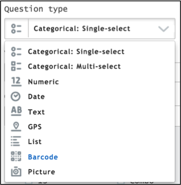
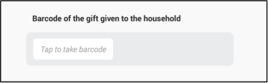
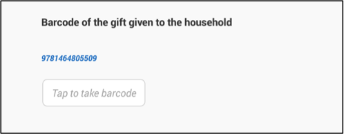
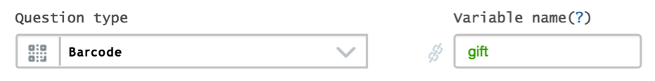
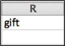
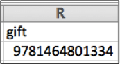

+++
title = "Barcode Question"
keywords = ["QR","barcode","export"]
date = 2016-06-18T23:56:37Z
lastmod = 2016-06-18T23:56:37Z
aliases = ["/customer/portal/articles/2469108-barcode-question"]

+++

Description
-----------

  
A **Barcode** question expects an optical machine-readable
representation of data relating to an object.  
  
  
  
  
  
 

Creating a barcode question
---------------------------

  
In Questionnaire Designer,

1.  Click on the Question Type text box.
2.  Select Barcode from the list displayed.  
      
    

  
  
 

How a barcode question appears on a tablet
------------------------------------------

  
To answer the question the enumerator has to:

1.  Tap on the text box.  
      
    
2.  A red cross will display. Focus the cross on the barcode and without
    moving the tablet wait until the camera automatically takes a
    picture.  
      
    
3.  Once the camera reads the barcode the corresponding numbers are
    displayed.  
      
    

  
  
 

Export
------

  
The answer is exported in a numeric variable in a tab-delimited file.
The name of this variable is the question’s variable name that was
defined in the Questionnaire Designer.  
  
**Barcode question**  
  
  
  
Unanswered question exported in tab-delimited file  
  
  
  
Answered question exported in tab-delimited file  
  

