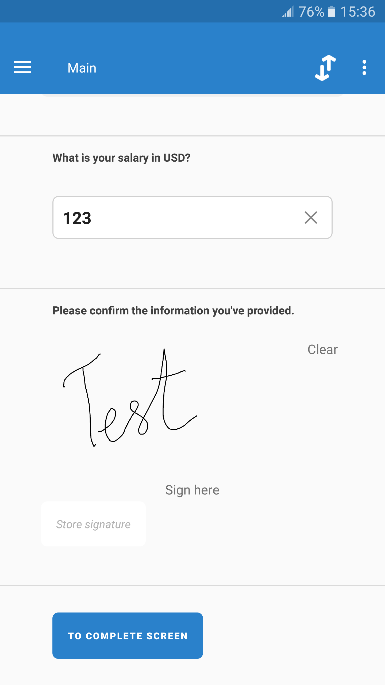

+++
title = "Capturing signatures with a picture question"
keywords = ["Signature picture image"]
date = 2018-04-02T19:40:36Z
lastmod = 2018-04-02T19:40:36Z
aliases = ["/customer/portal/articles/2931992-capturing-signatures-with-a-picture-question"]

+++

A picture type question can be used to capture signatures on a tablet.
For this, the flag "***use signature pad***" should be set in the
questionnaire Designer.  
  
On the tablet, a person will be able to leave a signature by writing
directly on the screen:  
  
  
To store the signature, click the "***Store signature***" button.  
  
In the web mode interviews an image of the signature (picture file) can
be uploaded as a file. Signatures are exported as images. For more
information about picture questions, see the [Picture
question](http://support.mysurvey.solutions/customer/en/portal/articles/2469927)
article.
