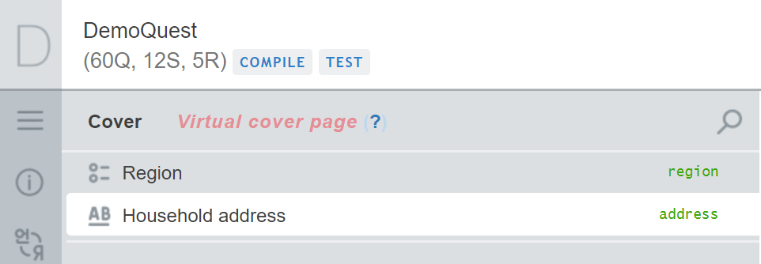

+++
title = "Special Section: Cover Page"
keywords = ["cover","cover page"]
date = 2020-07-20T00:00:00Z
lastmod = 2020-07-20T00:00:00Z
+++

Every questionnaire in Survey Solutions shall have a special section called **'Cover'** or it's equivalent in the translation. The cover page may contain some of the information that is present on an actual cover page of a paper prototype (if it exists) and may also contain other information.

The objective of the cover page is to include identifying information that
helps distinguish one interview from another;
helps the field staff reach the respondent.

It is possible that at the beginning of the survey the head office has absolutely no information about the respondents or their whereabouts. It is unlikely, though, that there is absolutely nothing distinguishable between the respondents. This information is provided for the convenience of the field staff. The Survey Solutions program uses a different set of identifiers internally, and it will not get confused even if there are full duplicates based on all the defined identifying fields. (Survey Solutions utilizes 32-alphanumeric digits IDs which preclude the duplicates in practice).

Here are some examples of the questions that can be included into the cover section:

- name of the state or district, 
- street address, 
- phone number, 
- email, 
- respondent name, 
- week when the interview is to be conducted, etc.

Here are some examples of the questions that should not be included into the cover section: 

- name of the interviewer,
- number of males/females/total among the residents of the household, 
- interview status.

 
Not all the questions may be placed into the cover section, but only those that are listed as ***identifying*** at the following page: [Design limitations by question type](/questionnaire-designer/limits/design-limitations-by-question-type/).


Identifying questions may not have enabling conditions. If a question with an enabling condition is copied and pasted into the cover section it loses the attached enabling condition.

  

Special behavior is provided for the questionnaires created in earlier versions of Survey Solutions (prior to July 20, 2020), continue reading below.


Questionnaires created in older versions of Survey Solutions will display the identifying questions in two places: in the spot where they were added by the author and in a virtual cover page section.

It is virtual in the sense that it didn't exist when the questionnaire author was creating/editing the questionnaire before, but it manifests more obviously what the Survey Solutions will do, when interviews are created from this questionnaire during the data collection - a cover page section will be created automatically and all identifying questions are brought there in the same order as they are placed in the questionnaire.

Questions appearing in the virtual section are readonly, and to edit them one shall edit them in the section where they were originally placed. To simplify locating them in the questionnaire the ***'Jump to edit'*** button is provided for each of them (in place of the ***'Save'*** button).

Questionnaires created in the new version will have an editable cover page section, and the identifying questions can be edited on the spot.

