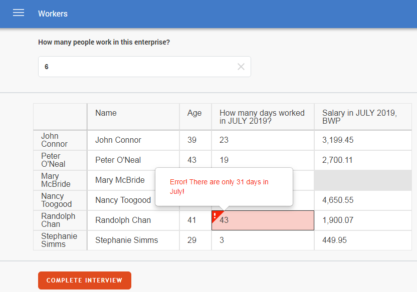

+++
title = "Tabular presentation of rosters"
keywords = ["roster", "tabular presentation", "table"]
date = 2019-06-03T03:03:03Z
lastmod = 2019-06-03T03:03:03Z

+++

Questionnaires of surveys administered in CAWI mode (web interviews) may include rosters that will be presented in table mode for compact overview of the information being collected, so that the questions become columns in the table and persons (or other roster items) form the rows of the table.

Here is an example:

Rosters can be presented in tabular view only in CAWI mode and not on the tablet, must satisfy some design requirements and will have some functionality limitations. If the design requirements are not satisfied, a compilation error is issued by the Survey Solutions Designer.

**Design requirements:**

- number of questions in the roster is no more than 10 [or else compilation error *WB0283*];
- may not contain questions of scope: supervisor [or else compilation error *WB0284*];
- may not include questions of any type other than specifically: <I>text</I>, <I>numeric</I> [or else compilation error *WB0285*];
- may not include: static texts, sub-sections, other rosters of any kind [or else compilation error *WB0282*];
- may not include any text substitution in the questions' text [or else compilation error *WB0287*].

**Functionality limitations in tabular rosters:**

- question instructions are not shown for questions;
- comments can't be left for questions by respondents/interviewers and are not shown in case they are left by the supervisors;
- when errors are shown, warnings are not shown;
- any roster items that are switched off by a condition on the roster are still shown in the table, though with all questions disabled;
- flag 'hide-if-disabled' is disregarded for questions and the roster itself.
- the roster columns (including the titles column) may be resized manually by the respondent for convenience of working with content of various widths; these widths are not stored and are reset if the user leaves the page where the roster is shown in a tabular form.

**Setting up**

To indicate that the roster must be shown in tabular form the author of the questionnaire should set the '**Display mode**' parameter to '*Table*' in the properties of that roster. If the designed questionnaire is administered as a web interview, the roster will appear in tabular presentation. If it is administered on a tablet, it will fall back to the '*Sub-Section*' mode and presented as a set of sub-sections with questions about the roster items found behind the buttons [as reflected by warning *WB0286*].

We plan to expand the functionality and remove some of the current limitations of the tabular presentation of the rosters in future releases.