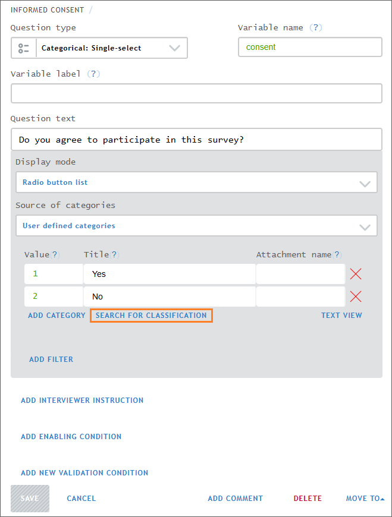
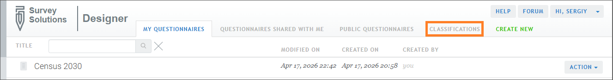
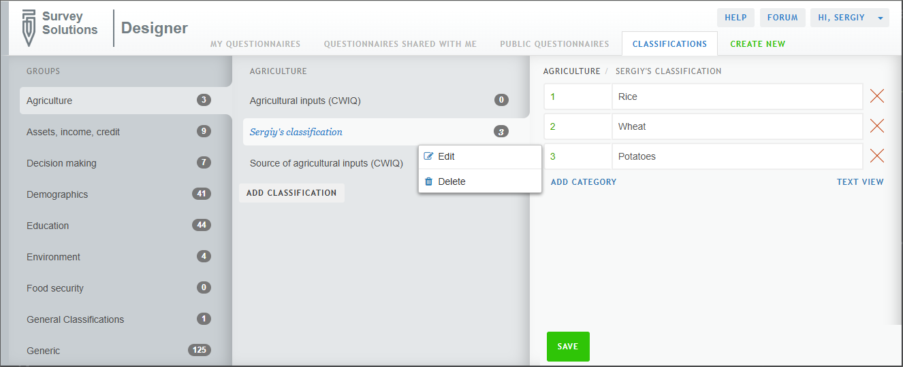

+++
title = "Classifications library"
keywords = ["classification bank", "classification library", "bank", "library", "answer options", "answer bank"]
draft = false
aliases = ["/content/questionnaire-designer/components/classification-library"]
date=2026-04-17T00:00:00Z
+++

#### Description

The classification library allows users to draw from a library of public and/or private classifications (answer options). More than a convenience feature, the classification library aids with standardization of classifications--that is, alignment with international best practices and/or consistency with internal practices.

#### How to search classifications

**From within the question design pane**

  

- Click on `SEARCH FOR CLASSIFICATION` to open the classification library window
- Search classifications using the group filter, search field, and/or classification preview

    - The group filter restricts search to the thematic group of interest.
    - The search field returns classifications that contain the entered search term.
- Clicking on `Show categories` displays a preview of the first 200 answer categories in the classification.

**From the `Classifications` tab**

  

- Click on the `Classifications` tab
- Search classifications by group
	- Click on the thematic group of interest in the left-most pane
	- Click on the classification of interest in the middle pane
	- Review the content of the classification to determine fit for purpose

#### How to copy classifications from the library to a questionnaire

**From within the question design pane**

After opening, the classification library window, as described in the previous section, simply:

- Hover over the desired classification card
- Click on `ADD`
- If prompted, agree to replace existing answer categories

**From the Classifications tab**

- Find the desired classification in the classification tab, as described in the previous section
- Select and copy the answer categories from the classification
- Click `TEXT VIEW` for the target (categorical) question
- Paste the answer categories
- Save changes to the target question

#### How to edit classifications

**Edit answer categories after copying/adding classifications**

The classification library simply copies classifications from the library to the target questionnaire. Once copied from the library, the categories in the can be edited in the target questionnaire, in the same way any answer categories can be edited. For example, answer categories can be added, deleted, or otherwise changed. Note changes in the target questionnaire do not affect the classification in the library.

**How to create private classifications**

To create own private classification the user follows these steps:

- Navigate to the questionnaire list in Designer
- Click on the `CLASSIFICATIONS` tab
- Click on the group, in the left-hand pane, in which the private classification should be saved
- Click on `ADD CLASSIFICATIONS` in the middle pane
- Give the new classification a title
- Click on `SAVE` to create the classification
- Define the classification's categories in the right-hand pane, either by clicking on `ADD CATEGORY` to add categories one-by-one or by clicking on `TEXT VIEW` to paste a properly formatted set of answer options
- Click `SAVE` to save the classification's categories

Once the private classification is created, it is immediately usable
(selectable) in any questionnaire of this user.

Within this interface:
- classifications available to all users appear in black font.
- private classifications appear in blue font.

Right-clicking the classification in this interface allows renaming it or deleting it if no longer needed.

  

#### Current limitations

Currently, users cannot:

- Create private groups of classifications
- Share private classifications with specific other users
- Publish private classifications for all users to access
- Upload "large" classifications via copy-paste. This is
a browser limitation rather than a limitation of Designer.
- Upload classifications, large or small, via file upload
