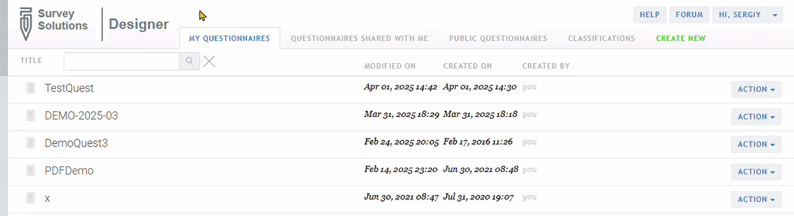

+++
title = "Copy questionnaire"
keywords = ["copy", "clone"]
lastmod=2026-08-28T00:00:00Z
+++

#### Description

A user can create a copy of a questionnaire by selecting `Copy` command in its
`ACTION` menu:

  

When copying a questionnaire specify the name of the copy (the new
questionnaire that will be created) and whether scenarios should be copied too.

After the copy is created it will be open for editing automatically. The user
creating a copy is automatically designated its owner. The copy is not
automatically re-shared with the same persons that the original was, but the
new owner can add collaborators later, see
[sharing a questionnaire](/questionnaire-designer/interface/share-questionnaire/).
