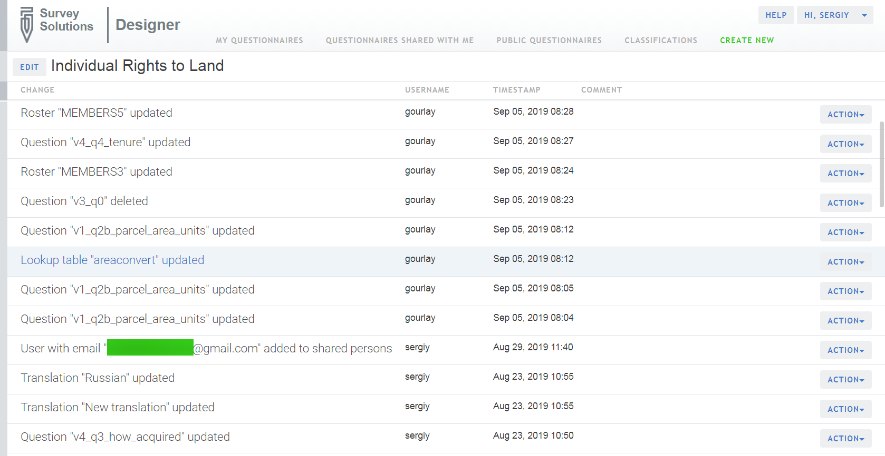

+++
title = "Recent Changes to the Questionnaire"
keywords = ["history","questionnaire","edit"]
date = 2016-06-15T20:40:11Z
lastmod = 2019-11-19T00:00:00Z
aliases = ["/customer/portal/articles/2466057-recent-changes-to-the-questionnaire","/customer/en/portal/articles/2466057-recent-changes-to-the-questionnaire","/customer/portal/articles/2466057","/customer/en/portal/articles/2466057","/questionnaire-designer/recent-changes-to-the-questionnaire"]

+++

To see the record of all recent changes made to the questionnaire, click
on the ***History*** button located on the top right of the page. This
page will list the question that was changed along with the username of
the person who made the change, and the timestamp for when the change
was done.

The Action button allows access to the menu with the following choices:

- **View** - open the questionnaire in the state corresponding to this 
revision. You can inspect the design of the questionnaire and even test 
it if necessary to verify what was the appearance and behavior at this
specific revision. When you view an earlier revision, it shows you the
questionnaire in the read-only mode. With that you can verify the structure
and syntax used in an earlier version, but can't do any changes. Yet,
there is a 'SAVE AS' button in the view mode that allows creating a
copy of the questionnare if you need it for edits (with the same result 
as 'extract at revision' below).
- **Revert to this version** - revert all the changes (made by all the
collaborators) after this questionnaire revision.
- **Extract at revision** - create a copy of the questionnaire corresponding
to a specific revision (current questionnaire is not affected).
- **Leave a comment** - leave a descriptive comment to the specific revision
indicating useful information either about a particular edit event, or
cumulatively for multiple edits.

Some of the items may be missing in the menu, depending on your access 
level to the questionnaire and recency of the recorded change event.

Notice that when a questionnaire is imported from the Designer to a 
Survey Solutions data server (Headquarters) an import event is logged in 
the history with the comment as specified at Headquarters during the
import. This comment may be modified only by the owner of the questionnaire.