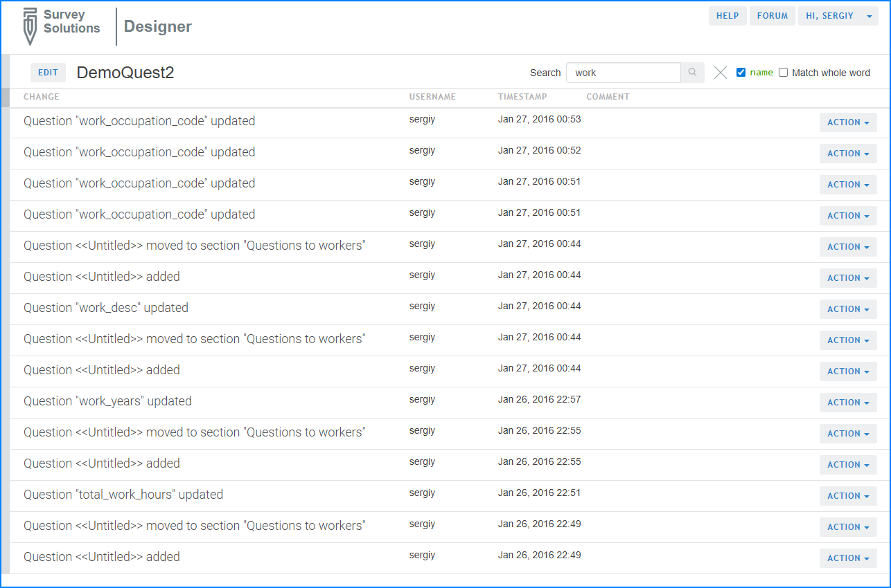

+++
title = "Recent Changes to the Questionnaire"
keywords = ["history","questionnaire","edit"]
date = 2016-06-15T20:40:11Z
lastmod = 2026-09-15T00:00:00Z
aliases = ["/customer/portal/articles/2466057-recent-changes-to-the-questionnaire","/customer/en/portal/articles/2466057-recent-changes-to-the-questionnaire","/customer/portal/articles/2466057","/customer/en/portal/articles/2466057","/questionnaire-designer/recent-changes-to-the-questionnaire"]

+++

To see the record of all recent changes made to the questionnaire, click the `History` button located at the top right of the page. This page lists each question, roster, calculated variable, and other elements that were changed, along with the username of the person who made the change and the timestamp when the change was made.

  

The list of the changes can be shortened to show only the records relevant to
a particular question, roster, or section. This can be done using the filter at the top of the page. In the example above, only changes related to
questions sections with *"work"* in the variable name are shown.

The `ACTION` button allows accessing the menu with the following choices:

- **View** - open the questionnaire in the state corresponding to this
revision in read-only mode. You can verify the structure
and syntax used in an earlier version, but can not make changes. However,
the `SAVE AS` button in the view mode allows you to create a copy of the questionnaire if you need it for editing or testing (equivalent to 'Extract at revision' below).
- **Revert to this version** - revert all the changes (made by all
collaborators) after this questionnaire revision.
- **Extract at revision** - create a copy of the questionnaire corresponding
to a specific revision. The current questionnaire is not affected.
- **Leave a comment** - adds a descriptive comment to the specific revision,
indicating useful information about a particular edit or about multiple edits
cumulatively.

Some items may be missing from the menu depending on your access
level to the questionnaire and the recency of the recorded change event.

When a questionnaire is imported from the Designer to a Survey Solutions data server (Headquarters), an import event is logged in the history with the comment as specified at Headquarters during the import. This comment may be modified only by the owner of the questionnaire.
