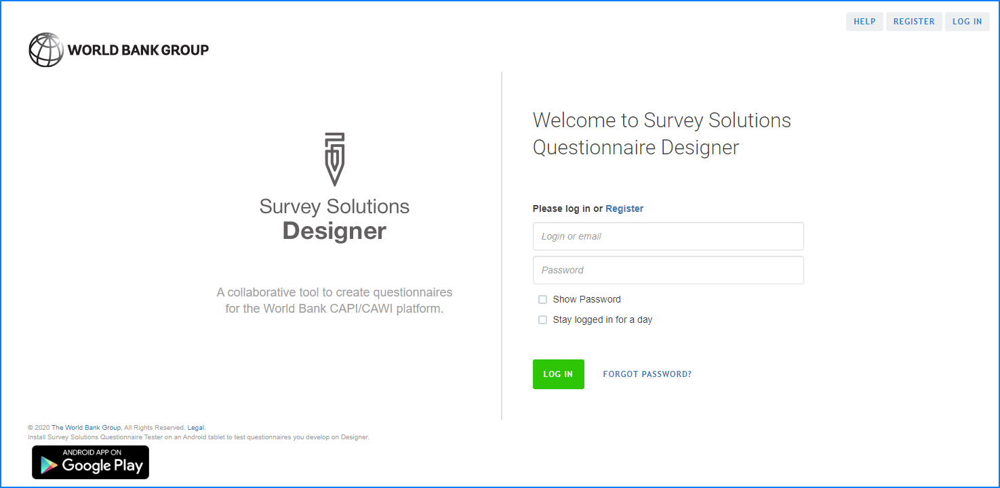

+++
title = "Registration and Signing In "
keywords = ["designer","register","login "]
date = 2016-06-14T17:51:18Z
lastmod = 2020-06-19T00:00:01Z
aliases = ["/customer/portal/articles/2464651-registration-and-signing-in-","/customer/en/portal/articles/2464651-registration-and-signing-in-","/customer/portal/articles/2464651","/customer/en/portal/articles/2464651","/questionnaire-designer/registration-and-signing-in-","/questionnaire-designer/interface/registration-and-signing-in-"]
+++

You do not need to install anything on your computer to start creating
questionnaires in Survey Solutions. Questionnaire Designer is an online
tool, which can be reached
at [https://designer.mysurvey.solutions/](https://designer.mysurvey.solutions/).

  
To log in for the first time, you need to create an account.   

**To create an account:**  

1.  Click on the *Register* link and complete the form displayed.
2.  Check the email account that you used for registration. Open the
    confirmation email from *admin@mysurvey.solutions*, and click on the
    *complete registration* link.

  
After signing in with your Questionnaire Designer credentials, you will
be directed to the *My Questionnaires* tab, which lists all the
questionnaires created by you.
  
Questionnaire Designer login policy is affected by the checkbox at
sign-in page:

-   If checkmark is set: once the user has logged in, she can return
    with the same browser within 24 hours without having to re-enter
    credentials;
-   If checkmark is not set: once the user has logged in, and closed
    browser, she will have to enter the credentials again.

### Did not receive a confirmation email?
As with any other online system which sends notifications to your email:

1. check your spam folder.
2. check that you've typed the email address correctly when filling out the form.
3. check that your organization doesn't have a corporate filter on emails, if so, contact that system's administrator to see if it filters out our emails.
4. Retry registration by re-entering the same information.

If none of the above has solved the issue, then there is something else that prevents you from receiving emails from us to that address. To continue, register with a different email account, which is not having this problem, since being able to receive emails is a vital functionality to recover lost passwords and other critical tasks.
