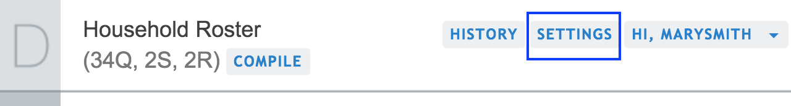
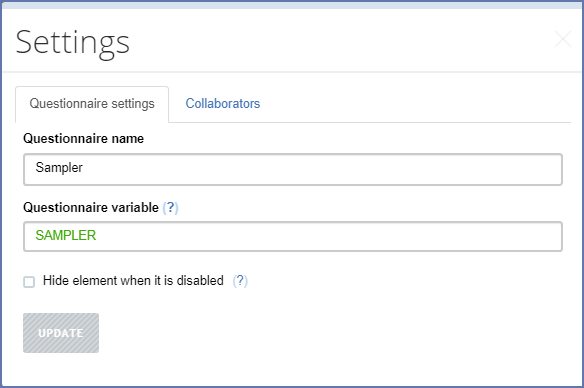

+++
title = "Questionnaire Settings"
keywords = ["settings","share","name","questionnaire"]
date = 2016-06-15T19:30:05Z
lastmod = 2016-06-15T19:30:05Z
aliases = ["/customer/portal/articles/2465929-settings","/customer/en/portal/articles/2465929-settings","/customer/portal/articles/2465929","/customer/en/portal/articles/2465929","/questionnaire-designer/settings"]

+++

To update the settings of the questionnaire, click on the *Settings*
button located at the top right of the page.

The settings of a questionnaire contain these parameters:

- **Questionnaire name** - a visible (human-readable) name of the questionnaire, and
- **Questionnaire variable** - a name that will be assigned to the
main data file when this questionnaire is exported.
- **Hide element when it is disabled** - a flag that enforces all
disabled elements in the questionnaire to be hidden when disabled
regardless of their individual visibility settings (*hide-if-disabled*
flag).

The *questionnaire name* may be in any language and contain multiple
words, though it is still a good idea to keep it short.

The *questionnaire variable* must satisfy the [requirements for variable
names](/questionnaire-designer/components/variable-names/) applicable 
throughout the questionnaire.

Click *Update* button if you want any of your changes to questionnaire 
settings preserved.

Through the questionnaire settings one can also control the collaboration,
this is discussed in the 
[sharing a questionnaire](/questionnaire-designer/interface/share-questionnaire/)
article.