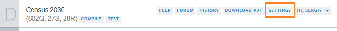
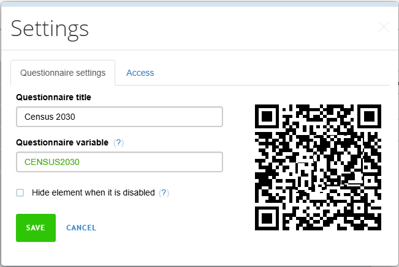

+++
title = "Questionnaire Settings"
keywords = ["settings","share","name","questionnaire"]
date = 2016-06-15T19:30:05Z
lastmod = 2026-04-17T00:00:00Z
aliases = ["/customer/portal/articles/2465929-settings","/customer/en/portal/articles/2465929-settings","/customer/portal/articles/2465929","/customer/en/portal/articles/2465929","/questionnaire-designer/settings"]

+++

To update the settings of the questionnaire, click on the `Settings`
button located at the top right of the page.

  

The settings of a questionnaire contain these parameters:

- **Questionnaire name** - a visible (human-readable) name of the questionnaire,
which may be in any language and contain multiple words, though it is still a
good idea to keep it short.
- **Questionnaire variable** - a name that will be assigned to the
main data file when this questionnaire is exported. It must satisfy the
[requirements for variable names](/questionnaire-designer/components/variable-names/)
applicable throughout the questionnaire.
- **Hide element when it is disabled** - a flag that enforces all
disabled elements in the questionnaire to be hidden when disabled
regardless of their individual visibility settings (*hide-if-disabled*
flag).
- a machine-readable (QR-code) questionnaire address at the Designer site. Scan
this QR-code in the Tester application to download and test the questionnaire
on a mobile device. This address is automatic (not changeable).

Click `SAVE` button if you want any of your changes to questionnaire
settings preserved or `CANCEL` to exit back to questionnaire editing.

One can also control the collaboration through the `Access` tab present in this
dialog. This is described in
[sharing a questionnaire](/questionnaire-designer/interface/share-questionnaire/).
