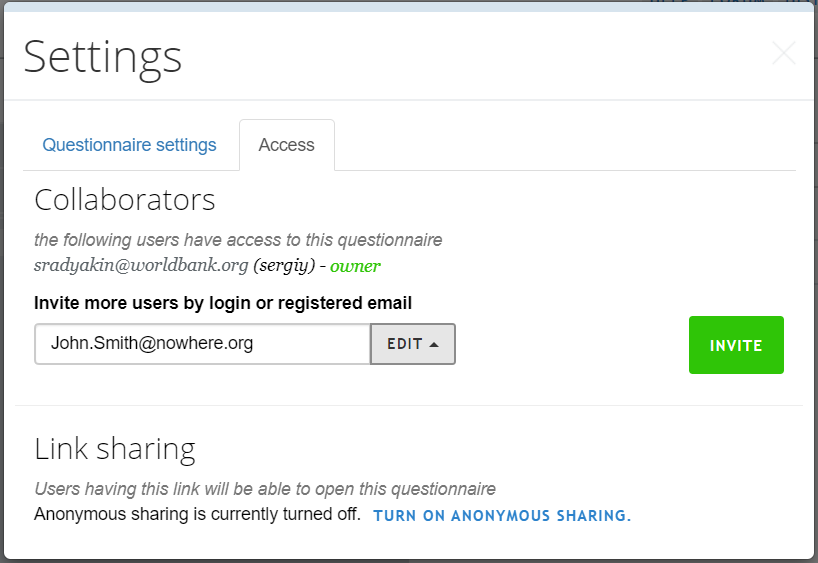

+++
title = "Sharing a questionnaire"
keywords = ["share","name","questionnaire"]
lastmod = 2024-01-15T00:00:00Z
+++

Survey Solutions [Designer](/questionnaire-designer/) tool allows collaborative
use of a questionnaire document by multiple users.

**The modes of sharing:**

- `Edit` means that the collaborator will be able to make changes to the
      questionnaire: add or remove questions, sections, options, revise logic and
      any other changes to the questionnaire. Any user that have `edit` mode
      access to a questionnaire may share a questionnaire further with another user.

- `View` means that the collaborator will be able to view the questionnaire
      contents, but not be able to modify it. They also don't see and may not
      leave Designer comments.

A collaborator in any of the above modes will be able to:

- [Test the questionnaire in the Tester App](/questionnaire-designer/testing/testing-your-questionnaires-using-the-tester-application/) or in the WebTester;
- [Import the questionnaire to the Headquarters](/headquarters/svymanage/import-the-questionnaire/) to start a survey based on that questionnaire.
- Generate HTML/[PDF preview](/questionnaire-designer/interface/pdf-export-/) of the questionnaire;
- View the [history](/questionnaire-designer/interface/recent-changes-to-the-questionnaire/) of the questionnaire edits;
- Copy/clone a questionnaire.

Making changes to a questionnaire or leaving comments to a questionnaire
requires `edit` sharing mode.

**To share a questionnaire:**

1. Open the questionnaire you want to share;
2. Select `Settings` and switch to the `Access` tab: 
       
3. Type the email or login of a person you want to share the questionnaire with.
4. Select mode of sharing `Edit` or `View`.
5. Click `Invite` button.

The collaborator account must already exist. If your new collaborator doesn't
have an account at the Survey Solutions Designer ask it to be created first.

*The invitation can't be sent to an arbitrary email address.* The email address
that can be typed here must be exactly the email address that the user has
registered herself in the Designer tool. Since a person may have multiple email
addresses, inquire with the collaborator what is the exact email address or
login name, which she uses to sign in to the Designer.

After a user account has been added to the list allowing access to the
questionnaire, the access may be revoked. To do this, select the action
`Revoke access` next to that account.

The owner of the questionnaire can't revoke his or her own access to the
questionnaire, but can delete the questionnaire, or transfer the ownership
of the questionnaire.

**NB: The owner of the questionnaire is the only account that can actually
delete that questionnaire.**

To change a `view` mode to `edit` mode for an account, revoke the access first,
then re-share the questionnaire again in the edit mode.

It is possible to also share the questionnaire by allowing ***anonymous***
questionnaire access. This doesn't involve listing the accounts that should be
permitted accessing the questionnaire, but rather creates a link, with which
the questionnaire may be accessed. This is described further in [Anonymous
questionnaire sharing](/questionnaire-designer/interface/anonymous-sharing/).

### Transfer the ownership of the questionnaire
Each questionnaire is owned by one and only one account at the Designer site.
The owner of the questionnaire may transfer the ownership to another user.

1. First, share the questionnaire in any mode with the account of the new owner.
2. Once the account is added to the list of collaborators, select `Make owner`
      action for that account.

After the transfer of ownership the original owner will still have access to
the questionnaire in the `Edit` mode. This sharing can be subsequently
changed by the new questionnaire owner.
