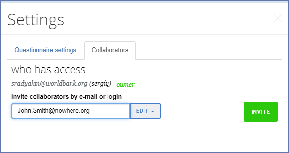

+++
title = "Sharing a questionnaire"
keywords = ["share","name","questionnaire"]
date = 2019-08-05T00:00:00Z
+++

Survey Solutions Designer tool allows collaborative use of a questionnaire
by multiple users.

To share a questionnaire:

<OL>
  <LI>Open the questionnaire you want to share;
  <LI>Select 'Settings' and switch to the collaborators tab: 
       
  <LI>Type the email or login of a person you want to share the questionnaire with.
  <LI>Select mode of sharing 'Edit' or 'View'.
  <LI>Click 'Invite' button.
</OL>

The collaborator account must already exist. If your new collaborator doesn't
have an account at the Survey Solutions Designer ask it to be created first.

The modes of sharing:

<UL>
  <LI>*Edit* means that the collaborator will be able to make changes to the
      questionnaire: add or remove questions, sections, options, revise logic and
      any other changes to the questionnaire. Any user that have *edit* mode 
      access to a questionnaire may share a questionnaire further with another user.

  <LI>*View* means that the collaborator will be able to view the questionnaire
      contents, but not be able to modify it. They also don't see and may not
      leave Designer comments.
</UL>

Collaborator in any of the above modes will be able to:

<UL>
  <LI>[Test the questionnaire in the Tester App](/questionnaire-designer/testing/testing-your-questionnaires-using-the-tester-application/) or in WebTester;
  <LI>[Import the questionnaire to the Headquarters](/headquarters/svymanage/import-the-questionnaire/) to start a survey based on that questionnaire.
  <LI>Generate HTML/[PDF preview](/questionnaire-designer/interface/pdf-export-/) of the questionnaire;
  <LI>View the [history](/questionnaire-designer/interface/recent-changes-to-the-questionnaire/) of the questionnaire edits;
  <LI>Copy/clone a questionnaire.
</UL>

Once an account has been added to the list of collaborators, it may be removed
by selecting the action '*Revoke access*' next to that account.

To change a *view* mode to *edit* mode for an account, revoke the access first,
then re-share the questionnaire again in the edit mode.

**The owner of the questionnaire is the only account that can actually delete a
questionnaire.**

<H2>Transfer the ownership of the questionnaire</H2>

Each questionnaire is owned by one and only one account at the Designer site. 
The owner of the questionnaire may transfer the ownership to another user.

<OL>
  <LI>Share the questionnaire in any mode with the account of the new owner.
  <LI>Once the account is added to the list of collaborators, select 'Make owner'
      action for that account.
</OL>

After the transfer of ownership the original owner will still have access to
the questionnaire in the '*Edit*' mode. This sharing can be subseqently
changed by the new questionnaire owner.
