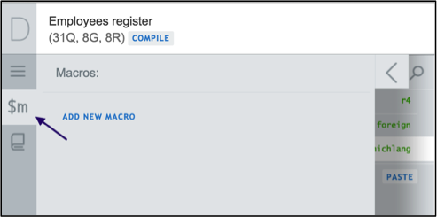
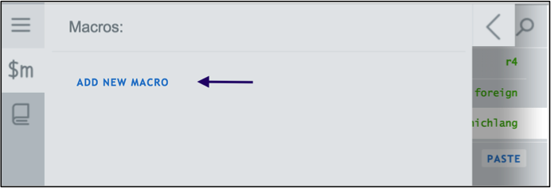
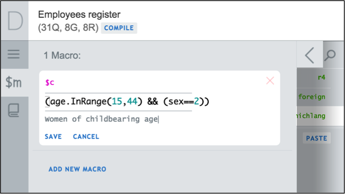
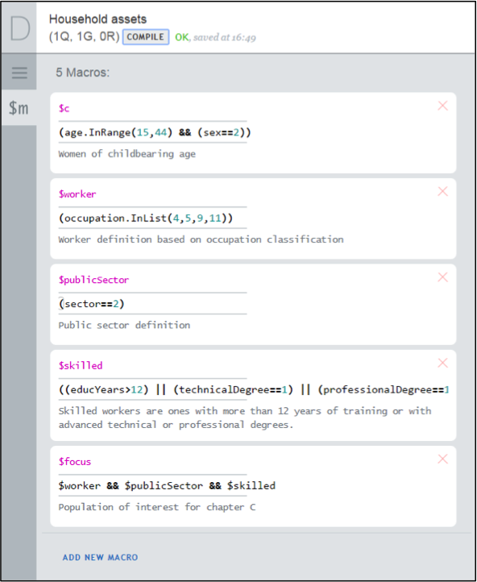

+++
title = "Macros"
keywords = ["macros","syntax","conditions"]
date = 2016-06-15T22:22:18Z
lastmod = 2016-06-15T22:22:18Z
aliases = ["/customer/portal/articles/2466213-macros"]

+++

*Macros* simplify writing complicated expressions with repetitive
sub-expressions. Consider for example, that several questions in the
questionnaire are applicable to one group of persons, such as women of
child-bearing age (let’s say 15-44 years old, exact numbers are of no
particular importance here). Suppose the variable for age is *age*, and
for gender is *sex* with values 1 corresponding to males, and 2 to
females. Then the following macro can be defined:  
 

    $c=(age.InRange(15,44) && (sex==2)

  
  
It can be subsequently used in the enabling conditions for each question
directed at the women of childbearing age simply as $c, which will be
substituted with the content of the macro as defined above. Note that
macro definitions may not refer to other macros. 

  To create a macro
------------------

1.  Click on the "$m" tab on the left hand menu.**   
    **
2.  Click on the *ADD NEW Macros*link.  
    
3.  Define the macro name, content, and (optionally) a description for
    the macro.  
    
4.  Click save. 
5.  To refer to the macro created previously in a chosen section,
    sub-section, question, or roster, type “$” followed by the macro
    name in the enabling condition field. In this example, type “$c”.  
    

 

 To modify a syntax in a Macro
------------------------------

1.  Click on the “$m” tab on the left hand menu.
2.  Locate the macro and click on any field in the macro specification
    to make all the necessary revisions.   
    
