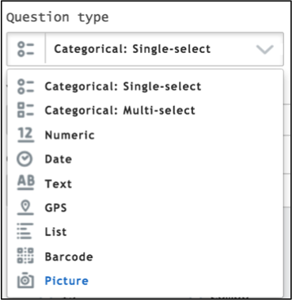
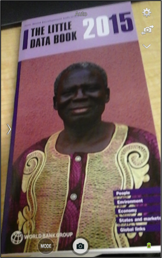
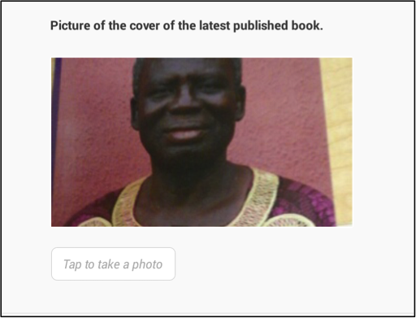
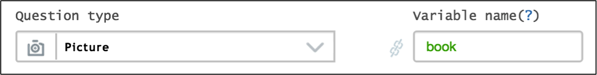
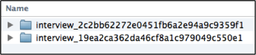
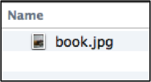
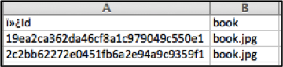
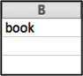

+++
title = "Picture Question"
keywords = ["picture","photo","export"]
date = 2016-06-20T17:01:20Z
lastmod = 2016-06-20T17:01:20Z
aliases = ["/customer/portal/articles/2469927-picture-question"]

+++

Description
-----------

  
The **Picture** question captures binary files. You can use this
question type to take a photo of any object (e.g. national id cards or
other objects for a survey collecting prices) and person (e.g. pictures
of interviewees like employees or household members).

  
  
  
  
  
  
A picture question may also be used to [capture
signatures](/questionnaire-designer/capturing-signatures-with-a-picture-question).  
  
  
 

Creating a picture question
---------------------------

 

In Questionnaire Designer

 

1.  Click on the Question Type text box.
2.  Select Picture from the drop down menu displayed.  
    

  
  
 

How it appears on a tablet
--------------------------

  
To answer a picture question an enumerator must:

1.  Tap on the text box for a camera to display.  
      
    
2.  Focus the camera on the object and take the photo by clicking on the
    icon, which appears at the bottom of the tablet.  
      
    
3.  Save or delete the photo taken.

  
  
You can zoom on the picture to check the photo more closely. After
taking the picture and saving it, you can remove it by clicking on
the text box to retake the photo.  
  
  
  
  
  
 

Export
------

  
The binary files are exported as .jpg files in folders where each folder
represents an interview. The folder names are automatically created
interview ids.  
Picture question in Questionnaire Designer  
  
  
  
  
  
  
The .jpg file name is the question’s variable name as defined in the
Questionnaire Designer.  
  
  
  
An answered question is exported in a tab-delimited file. The.jpg file
name appears as a text under the question’s variable name.  
  
  
  
An unanswered question exported in a .tab-delimited file.  
  

