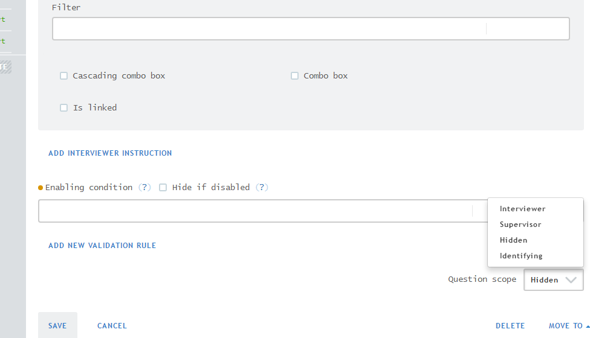
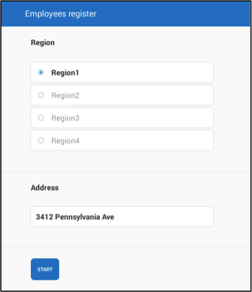
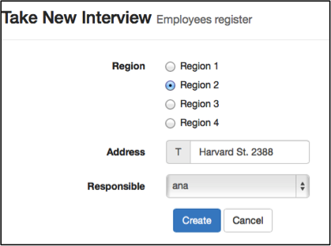
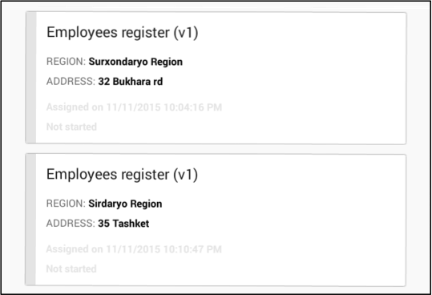
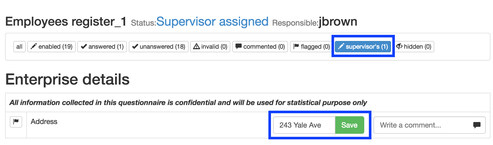

+++
title = "Question Scope "
keywords = ["scope","interviewer","supervisor","prefilled","hidden","question properties"]
date = 2016-06-17T18:26:26Z
lastmod = 2016-06-17T18:26:26Z
aliases = ["/customer/portal/articles/2468340-question-scope-"]

+++

The scope of a question defines who will be responsible for answering
it. The scopes are: [interviewer](#interviewer),
[identifying](#prefilled), [hidden](#hidden), and
[supervisor](#supervisor). 

  
 

**To change the question scope from the default, **

1.  Click on the *Question scope* dropdown box on the bottom right hand
    corner of the question edit screen. 
2.  Select the appropriate question scope. 

  

 Interviewer
------------------------------------------

When the scope *interviewer* is selected, enumerators ask the questions
from the interviewee and enter their responses on the tablet. The
default question scope is *interviewer*.

 Identifying
----------------------------------------

The role of the questions defined as identifying includes the definition
of uniqueness for the interviews and supplies ‘driving directions’ for
the enumerators. Different types of information can be provided through
these questions. Some examples are: province, household id, household
address, national identification number and name of the household
head.  
  
Identifying questions can only be *text, numeric, date* and
*categorical: single-select* questions.

The behavior of questions defined as identifying and who is responsible
for answering them depends on whether or not headquarters provides the
information when creating the assignment. If not filled in during
assignment creation, enumerators answer the identifying questions within
questionnaires and the answers can be modified before completing the
interview.  
  
The picture below shows how an enumerator will answer identifying
questions on a tablet.   
  
  
  
  
  
When answers are provided by headquarters during assignment creation,
the answers cannot be modified once the interview is created.  
  
  
The picture below shows how a headquarters user will answer identifying
questions when creating an assignment.  
  
  

  
On the tablet, the enumerator sees the answers to the identifying
questions on the d*ashboard* screen within the Interviewer application. 

  
  
  
  
 

Hidden
-------------------------------

  
When the scope *HIDDEN* is selected, the question is destined to be
hidden and store the prefilled values to be used in validations and
enabling conditions. For example, one may create a validation that the
highest educational attainment of a person now is no lower than it was
during the last visit. At the same time, because they are hidden, they
do not reveal their value to the interviewer, thus eliminating the
possibility for a simple carry-over of the values from the previous wave
of the survey without asking the respondent for the updated
information.  
   
Note that *Picture* and *linked questions* cannot be hidden.

 Supervisor
----------------------------------------

  
Supervisors and/or headquarters answer the questions defined as
*supervisor* once the enumerator completes the interview and sends it
back to the supervisor. For this reason, these questions are not
displayed on the tablet.  
  
Filled by supervisor questions can only be *text, numeric, categorical:
Single-select* and *categorical: multi-select* questions*.*  
  
Supervisors should follow the following steps to answer these questions:

1.  Find the supervisor question by selecting the *supervisor's* filter
    at the top of the page. 
2.  Enter the answer within the empty field.
3.  Save the answer by clicking on the green *Save* button.

  
​
