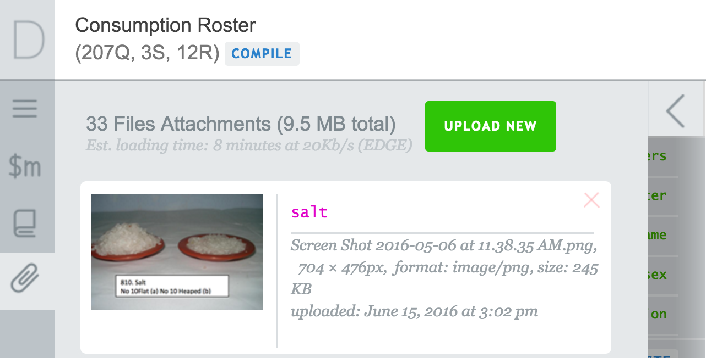
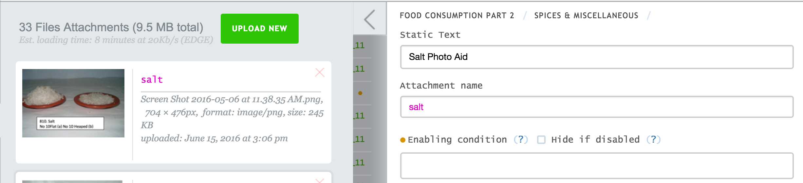

+++
title = "Questionnaire Attachments"
keywords = ["attach","pictures","static text"]
date = 2016-06-15T21:56:14Z
lastmod = 2016-06-15T21:56:14Z
aliases = ["/customer/portal/articles/2466173-questionnaire-attachments"]

+++

In some situations pictures become an indispensable tool to establish
the true meaning of e.g. categories: small, medium, large. Pictures can
be added to the questionnaire wherever a static text element is possible
(including inside rosters and subsections). The same attachment can be
displayed in multiple places in the questionnaire. Check the supported
formats in [Multimedia
Reference](/questionnaire-designer/multimedia-reference).  
  
  
To add an attachment (image) to your questionnaire:  
 

1.  Click on the paper clip icon on the toolbar on the left hand side.
2.  Click on the green *upload new* button to add an image from your
    disk.
3.  Define a name for the image.  
      
    
4.  To add attachment (image) to static text element, type in the name
    of the specified attachment in the *Attachment name *box. 

  
  
  
  
Three large images are scaled to fit width to tablet screen when the
questionnaire is displayed on the tablet. The Interviewer application
knows how to render images of different dimensions on different devices
taking into account differences in screen resolutions.
