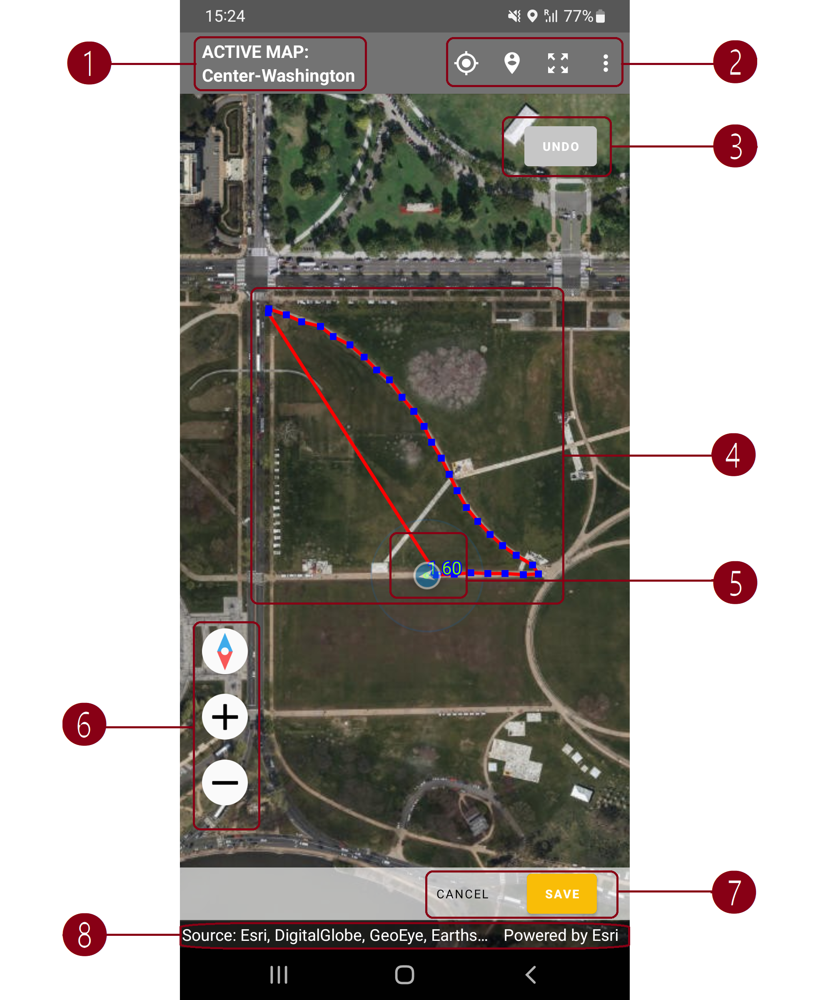
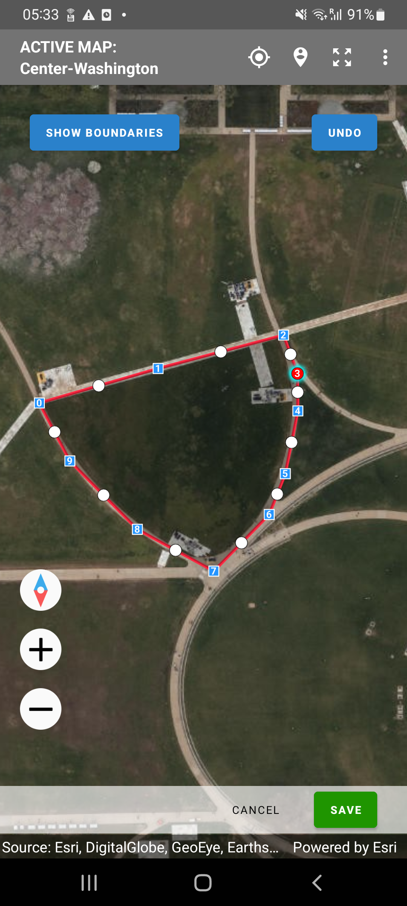
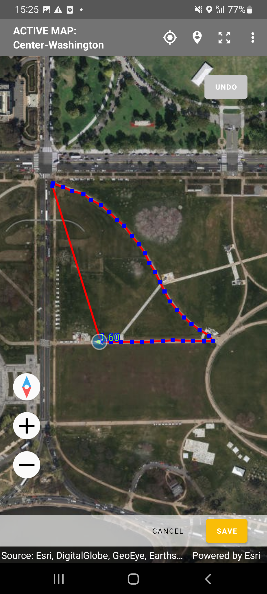
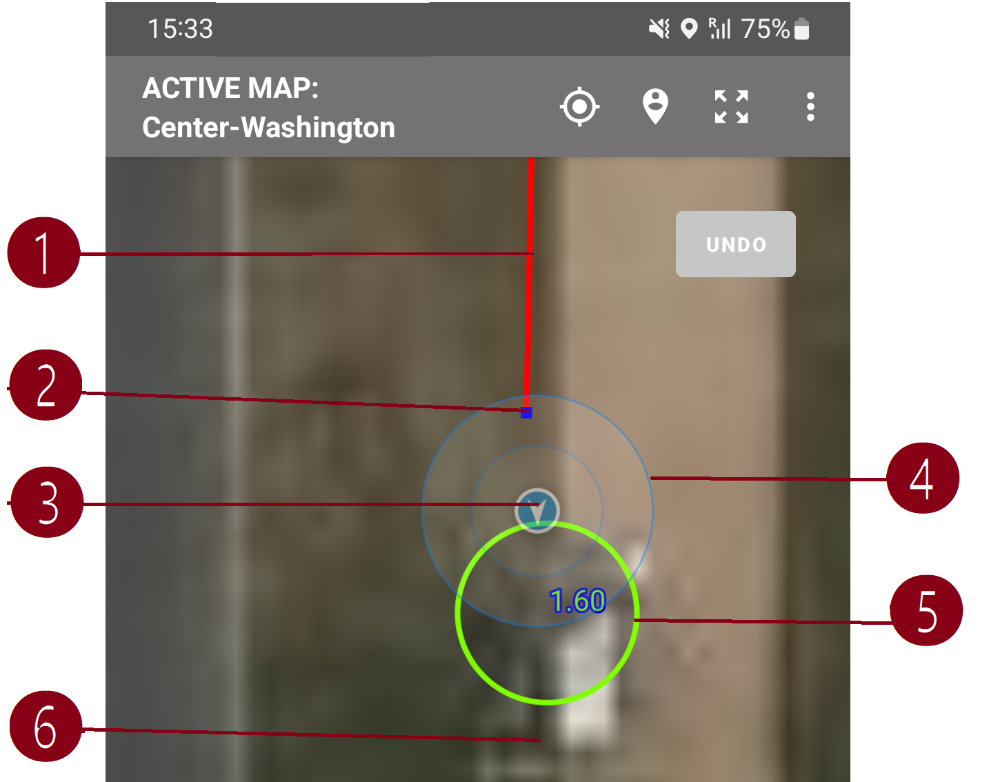
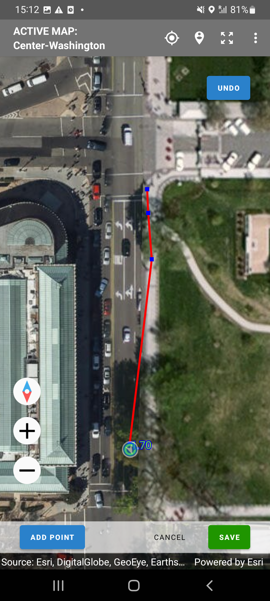
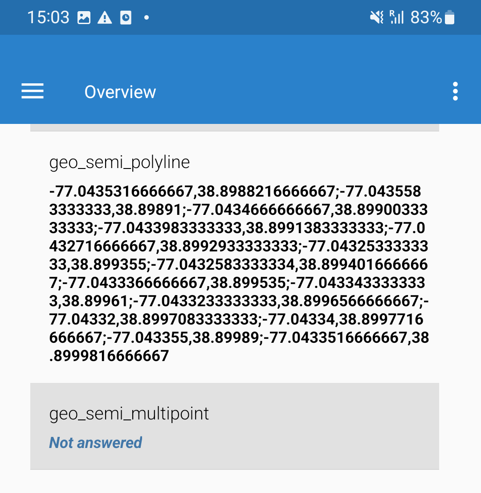
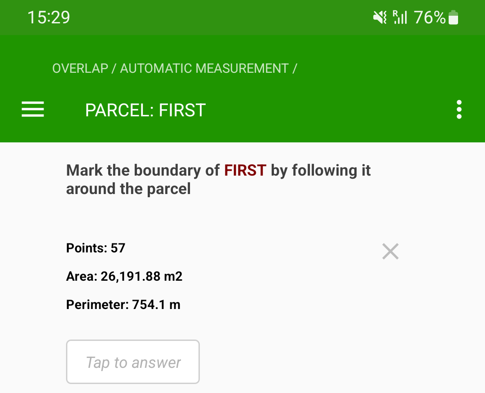
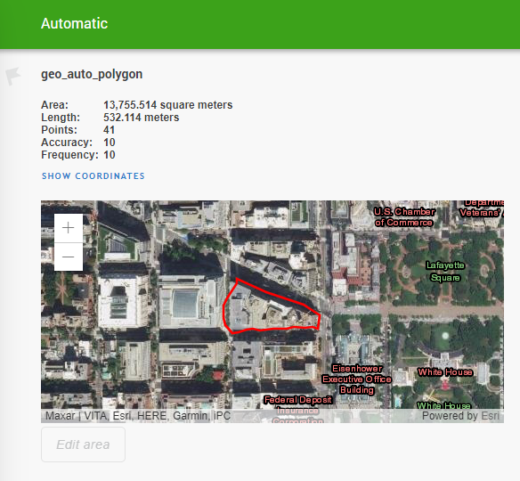

+++
title = "Geography Question"
keywords = [""]
date = 2017-10-12T18:32:01Z
lastmod = 2017-10-12T18:32:01Z
aliases = ["/customer/portal/articles/2888303-geography-question","/customer/en/portal/articles/2888303-geography-question","/customer/portal/articles/2888303","/customer/en/portal/articles/2888303","/questionnaire-designer/geography-question"]

+++

Description 
------------

 

A question of geography-type can capture various geographical information. For
example, it can be used to define the exact location of the dwelling and the
area of a land plot.

Geography-type questions are available only on mobile devices. In web
interviews the question will appear as
[unsupported](/questionnaire-designer/questions/unsupported-question-type/).

Geography-type questions are available only in the version of the Interviewer
App with ESRI map support.

While it may be possible to answer the geography questions without using the
base layer imagery, for example, with the automatic mode, the work is
considerably more convenient for the interviewers when a base layer is provided.
The map should be uploaded to the server first (see maps management), assigned
to the interviewer, and the interviewer must synchronize the maps on the mobile
device with the server.

 
### Design

This question type has three specific parameters that can be set up in the
Designer:

1. `Geometry type`: determines what answers this question will record and can
be either of the:

    - `polygons` - to capture areas, such as land plots;
    - `polyline` - to capture paths, such as path to travel from a dwelling to
the source of water;
    - `multipoint` - to capture multiple points, such as pharmacies or markets
present in the vicinity of the dwelling;
    - `point` - to capture a single location.

2. `Input mode`: determines how the answer is recorded, and can be one of the
following values:

    * `manual` - the points are captured manually, by drawing on the mobile
device's screen with a finger or a stylus;
    * `automatic` - the points are captured from the location sensor automatically,
with some [pre-defined frequency and
accuracy](/headquarters/config/admin-settings/#interviewersupervisor-application-settings);
    * `semiautomatic` - each point is captured from the location sensor when the
user determines it is needed.

3. `Overlap detection` - checks for overlaps and automatically signals about
overlaps of the answer of this question with the answers to the same question
in other roster items.

Other properties of the geography-type questions are same as for all other
question types: variable name, variable label, question text, instruction text,
etc. Note, however, that the name of the variable for a geography type question
is limited to 26 characters.

Note also that the Tester App does not provide a possibility to set the
requested frequency and accuracy parameters, but values 10 seconds and 20 meters
are hardcoded into the App.

### Use in syntax

The geography-type question may be referred in syntax expressions, for example,
for the purpose of validation of the answer or for enabling/disabling other
questions in the questionnaire.

If the variable name for the geography-type question is *Q*, then the following
are defined:

- *Q.Area* - area (in square meters) of the polygon recorded in *Q*. It is `null`
if the geometry type is anything different from *polygon*.

- *Q.Length* - length (in meters) of the perimeter of the polygon or length of
the polyline recorded in *Q*. It is `null` if the geometry type is anything
different from *polygon* or *polyline*.

- *Q.PointsCount* - number of points recorded in *Q*.

- *Q.RequestedAccuracy* - requested minimal accuracy (in meters) as set up
in the workspace settings;

- *Q.RequestedFrequency* - number of seconds between the location measurements
as set up in the workspace settings;

Note that if *Q* has been answered, then the number of points in *Q* is always:

- one, if *Q* 's geometry is set as `point`;
- more than one, if *Q* 's geometry is set as `polyline`;
- more than two, if *Q* 's geometry is set as `polygon`.

For example, to decide whether a particular plot is large or small (more or less than a threshold stored in T), one could:
write `Q.Area > T`.

### Appearance on a mobile device

  

1. Selector of the background map layer, indicating which map has been selected (*Center-Washington* in the illustration). If there are any shapefiles received by the interviewer, an optional button `Show boundaries` will appear immediately underneath.
2. Buttons to navigate to current location, to data extent, to map extent, and the menu (contains the `Clear all` menu item).
3. `Undo` button (this button has no effect in the automatic mode).
4. Polygon being marked as the answer to the question in the automatic mode.
5. Marker showing the position of the interviewer and the direction of movement, as well as the accuracy of the last measurement of the coordinates, in meters (*1.60* in the illustration).
6. Buttons for zooming the map in and out, and rotate towards the North.
7. Buttons for cancelling and saving of the answer to the question. In semi-automatic mode the button to capture the next point `Add point` appears to the left.
8. Reference to the source/copyright note for the map imagery.

### Interviewer actions to answer a geography-type question

The actions that the interviewer needs to do to answer a geography-type
question vary by mode.

#### Manual mode

In the manual mode the interviewer marks the answer to the geography question
by tapping on the screen with a finger or a special stylus. This allows adding
the points at precise locations according to satellite or aerial photography.

  

This illustration shows a polygon being marked as an answer to the geography
question. Blue squares denote the points, the coordinates of which will be
recorded as the answer to the question. The white circles between them allow
adding more points (inserting them between the existing, if necessary).

#### Automatic mode

In the automatic mode the points are captured from the mobile device's location
sensor (typically GPS) with certain frequency and accuracy as set up by the
administrator. The interviewer needs to:

1. Select a proper map in the maps selector.
2. Go to the boundary of the plot.
3. Start the capturing process by clicking the blue `Start` button.
4. Walk steadily around the area being measured and observe the waypoints being
recorded.
5. As the interviewer completes the loop and approaches the starting point the
yellow `Save` button will turn green, indicating that the interviewer has
arrived sufficiently close to the starting point. 'Sufficiently close' is
understood here as "*The length of the last segment (that is always automatically
added) is smaller than the requested accuracy parameter.*" If the interviewer
attempts to click the `Save` button when it is yellow a corresponding message
will be issued, prompting the interviewer to continue traversing the land plot.

Note that the `Undo` button is not active in the automatic mode!

  

At a large zoom level one can notice that there is an additional marker - a
green circle, which also appears on the map.

    

1. trajectory of earlier movement;
2. last recorded data point;
3. animated marker of current position;
4. attention circles around the marker;
5. last measured location that is usable (accuracy is in line
with requested accuracy for automatic measurements) and the corresponding
accuracy value (in meters, 1.6 in the illustration);
6. possible current real position of the interviewer if continued movement in
the same direction (no marker depicted).

Interviewers paying attention to these fine details would notice that it
appears as if the green circle shows the future location of the interviewer.
This, however, is not the case. The green circle (5) shows the last successfully
(accurately enough) measured location. During the period between the points (2)
recording the device may have multiple candidate locations determined and
depicted updating the position of the green circle marker (5).

  

  Example
  

For example, if the points are recorded
every 10 seconds, but it only takes half a second to determine the current
location, then there will be 20 location points determined in between. While
not all of them will be accurate enough, some will and the interviewer will
see that the markers follow him/her on the map. If the accuracy of the new
measurement is not acceptable, that measurement will be disregarded and the
green circle will not change it's position. In the case where the very first
acquisition is unsuccessful the circle will be yellow. This signals that the
program is actively attempting to record the location, but the location
information is just not accurate enough to be acceptable. The blue filled
marker (3) doesn't immediately jump to the new (just determined) location, but
rather moves there smoothly. This animation lag creates an illusion that the
mobile device knew where the interviewer was going to. In fact by the time
the animation completes the interviewer may have moved further in the direction
of the movement, of which there is no information yet, until that location is
determined by the location sensor.

#### Semi-automatic

Semi-automatic mode of recording data provides more control to the interviewer.
Rather than recording all locations with certain frequency, it records only the
points that were specifically acquired by decision of the interviewer.

    

1. Select a proper map in the maps selector.
2. Go to the boundary of the plot.
3. Start the capturing process by clicking the blue `Start` button.
4. Walk steadily around the area being measured when needed, add waypoints
by clicking the blue `Add Point` button.
5. If a point was added by mistake, one can remove it by clicking the `Undo`
button, which is enabled in the semi-automatic mode.
6. As the interviewer completes the loop and approaches the starting point the
yellow `Save` button will turn green, indicating that the interviewer has
arrived sufficiently close to the starting point. 'Sufficiently close' is
understood here as "*The length of the last segment (that is always automatically
added) is smaller than the requested accuracy parameter.*" If the interviewer
attempts to click the `Save` button when it is yellow a corresponding message
will be issued, prompting the interviewer to continue traversing the land plot.

### Appearance in the interview overview.

When the interviewer switches to the `Overview` page of the interview that
contains a geography question, the interviewer will find the coordinates of
points recorded as answers to the questions there (or a message "*Not answered*"
if no answer was recorded for that question.

  

### Appearance of the answered geography question

#### On a Mobile Device

  

#### In the Headquarters

When supervisor or headquarters users are reviewing the data submitted by the
interviewers they can see the marked shape on a map layer and can pan and zoom
the map as needed.

  

The reviewer also can see the area, length, number of points and values of
accuracy and frequency. It is also possible to see individual waypoints by
clicking the `SHOW COORDINATES` link.

### EXPORT

Data recorded in the geography-type question *Q* is exported in the data file
into multiple columns:

- `Q` - sequence of coordinates of each recorded point in the string format
"*lg,lt;lg,lt;....;lg,lt*", where *lg* is the longitude and *lt* is the
latitude of each point, a decimal dot is always used for fractional values;
- `Q__area` - calculated area (in square meters) of the selected polygon or a
missing value if the geometry type is anything different from `polygon`;
- `Q__len` - length (in meters) of the selected polygon or polyline, or a
missing value if the geometry type is anything different from `polygon` or
`polyline`;
- `Q__num` - number of recorded points;
- `Q__racc` - requested accuracy (in meters) effective at the time when the
question was answered if the input method for Q was `automatic` or a missing
value;
- `Q__rfrq` - requested frequency (in seconds) effective at the time when the question was answered.
