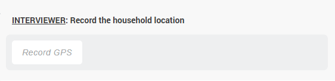
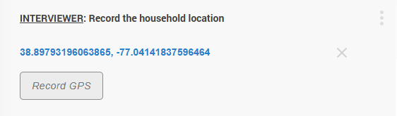
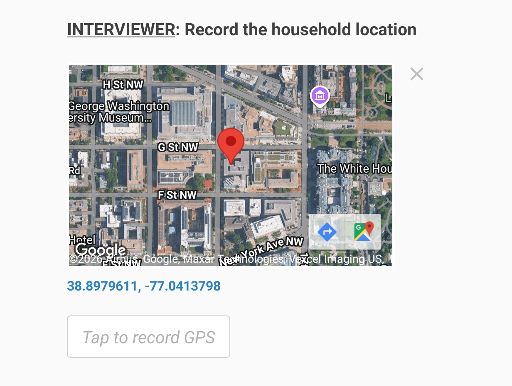
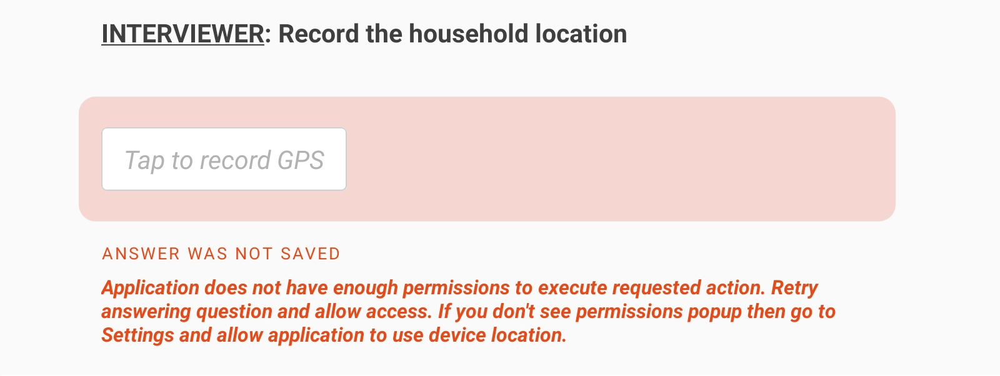

+++
title = "GPS Question"
keywords = ["GPS","latitude","longitude","accuracy","altitude","export"]
date = 2016-06-18T23:29:15Z
lastmod = 2026-06-04T00:00:00Z
aliases = ["/customer/portal/articles/2469100-gps-question","/customer/en/portal/articles/2469100-gps-question","/customer/portal/articles/2469100","/customer/en/portal/articles/2469100","/questionnaire-designer/gps-question"]

+++

Description
-----------



The purpose of a GPS question is to acquire the current location of the device
used for data collection from its location sensor. It can also store a location
as a preloaded value (for example, last known location or destination). A GPS
location question placed on a cover page has an important role for the
[Map Dashboard](/interviewer/app/map-dashboard/).

When the location of the device is acquired, it contains the following
components: _latitude_, _longitude_, _accuracy_, _altitude_, _timestamp_.

This type of question may occur in interviews administered using mobile devices
or in web-based interviews.

* For device-based interviews it can be answered using a GPS-equipped mobile
device. If the mobile device (tablet or smartphone) doesn't have a location
sensor an error message will be issued when attempting to capture the location:
"*There is no GPS provider in this device*".

* For web-interviews there is no such requirement and the location will be
determined using the location available to the client's browser. This location
may be relying on different instrumentation, which varies in its accuracy,
responsiveness, and availability.

Note: use [Geography question](/questionnaire-designer/questions/geography-question/)
for measuring an area of a land parcel and other similar tasks.

Creating a GPS question
-----------------------

In the Designer:

1. Add a new question.
2. Click on the `Question type` selection box and select `GPS` from the list
that appears.
3. Configure other [question's properties](/questionnaire-designer/components/question-properties/): `question text`, `variable name`, etc.
4. Click `SAVE`.

Note that the [cover page](/questionnaire-designer/components/special-section-cover/)
may contain no more than one GPS location question. Other sections and
sub-sections may contain multiple GPS location questions.

How a GPS question appears on a tablet
--------------------------------------

A GPS location question appears in the interview as a button, which needs to be
pressed by the interviewer (or respondent in self-enumeration):

  

When this button is pressed, the location is captured and the coordinates are
displayed as a confirmation (in the web interviewing mode):

  

On a mobile device a miniature map will also be rendered for the interviewer
to quickly assess the captured location in relation to the surrounding roads,
rivers, landmarks:

  

Rendering of this map requires internet connectivity and consumes data traffic.
In the absence of internet connectivity the location may still be captured, but
the map will not appear, or will appear in a generalized form (map of the
World). To save the data traffic, this functionality may be disabled in the
[Interviewer App settings dialog](/interviewer/troubleshooting/interviewer-app-settings/).

Please note that capturing the location may take some time (which depends on
numerous factors, such as location, equipment being used, atmospheric
conditions, last detection, etc). The application will generally allow the
interviewer to scroll to the next question during this time, but will not
allow answering any other questions (this is done intentionally, since
questions may become enabled or disabled depending on the result of the
location capture). In some cases the location acquisition may end up with an
error, a common case is lack of permissions, as shown here:

  

Among the errors that the interviewer may encounter while answering a GPS
question are:

<TABLE class="table table-striped table-hover">

<TR>
  <TH>Message</TH>
  <TH>Situation</TH>
</TR>

<TR>
  <TD><I>There is no GPS provider in this device</I></TD>
  <TD>No location sensor</TD>
</TR>

<TR>
  <TD><I>Application does not have enough permissions to execute requested action. Retry answering question and allow access. If you don't see permissions popup then go to Settings and allow application to use device location.</I></TD>
  <TD>Lack of <A href="/faq/android-permissions/">permissions</A></TD>
</TR>

<TR>
  <TD><I>GPS was unable to determine your location. To troubleshoot, please try
the following: ensure that you are outdoors, confirm that your GPS is enabled,
or change your GPS's timeout setting</I></TD>
  <TD>Cannot achieve desired accuracy within allotted time. Check the
<A href="/interviewer/troubleshooting/interviewer-app-settings/">Interviewer App
settings</A> and verify they match the device's capabilities.</TD>
</TR>

</TABLE>

Export
------

**Export of answered GPS question:**

A GPS location question with variable name `Q` (defined in the questionnaire
Designer) is exported in 5 variables:

* `Q__Latitude` - numeric value of latitude (in degrees),

* `Q__Longitude` - numeric value of longitude (in degrees),

* `Q__Accuracy` - numeric value of accuracy (in meters),

* `Q__Altitude` - numeric value of altitude (in meters)

* `Q_Timestamp` - string value for timestamp (date and time) in the format
`YYYY-MM-DDThh:mm:ss`, where:

  - `YYYY` is a 4-digit year,
  - `MM` is a 2-digit month,
  - `DD` is a 2-digit day,
  - `T` is literally letter "*T*" used as a delimiter between the date and the time components,
  - `hh` is a 2-digit hour,
  - `mm` is a 2-digit minute,
  - `ss` is a 2-digit second.

**Export of not answered GPS question:**

If the question is not applicable (closed by an enabling condition) all of the
above mentioned components will have a system missing value.

If the question applies, but is left not answered then all the components will
have an alternative missing value: the numeric components `Q__Latitude`,
`Q__Longitude`, `Q__Accuracy`, and `Q__Altitude` will have a value
`-999,999,999`, while the string `Q_Timestamp` will have a value `"##N/A##"`.

See also:
------------

- [Map Dashboard](/interviewer/app/map-dashboard/)
- [Interviewer App Settings Dialog](/interviewer/troubleshooting/interviewer-app-settings/)
- [Android permissions](/faq/android-permissions/)
- [Cover page](/questionnaire-designer/components/special-section-cover/)
- [Missing values](/headquarters/export/missing-values/)
