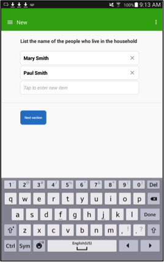
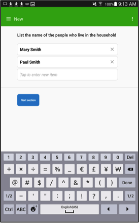
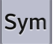
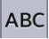

+++
title = "List Question"
keywords = ["list","max","maximum","elements","export"]
date = 2016-06-18T22:27:46Z
lastmod = 2016-06-18T22:27:46Z
aliases = ["/customer/portal/articles/2469082-list-question","/customer/en/portal/articles/2469082-list-question","/customer/portal/articles/2469082","/customer/en/portal/articles/2469082","/questionnaire-designer/list-question"]

+++

Description
-----------

  
A list question expects an open list of answers.
Each answer can contain alphanumeric characters (A-Z, a-z,0-9) and basic
punctuation symbols. By default the enumerator can add up to 40 items;
however you can limit the number of items that can be listed by defining
the maximum number of answers.  
  
For example, very frequently national household surveys ask the
enumerator to list all the household members, instead of first asking
for the total number of people living in the household and then for
their names. Therefore, because the household size is unknown it can be
any number. You would define the question in the following manner: “List
the names of the people who live in the household” without limiting the
household size.  
  
On the other hand, there are some questions where you would like the
answer list to be limited to a certain number. For example, in a survey
measuring household food security vulnerability, one of the questions
asked may be “List up to four threats that make your household at risk
of being food insecure”. For this question you would assign a maximum
number of answers to equal four.  
  
An open list without a maximum number of answers.  
  


  
An open list with a maximum number of answers.  
  


 

Creating a list question
------------------------

  
  
In Questionnaire Designer,

1.  Click on the Question Type text box.
2.  Select List from the drop down menu.  
    

  
  
  
 

How a list question appears on a tablet
---------------------------------------

  
To answer the question the enumerator has to:

 

1.  Tap on the text box.  
      
    
2.  An empty row will display and the keyboard automatically shows alpha
    characters. The enumerator can navigate through the keyboard to
    select the numeric characters, basic punctuation symbols and the
    space.

<table>
<tbody>
<tr class="odd">
<td style="text-align: center;"></td>
<td style="text-align: center;"></td>
</tr>
<tr class="even">
<td style="text-align: center;">The enumerator clicks on   to change the display of the keyboard.</td>
<td style="text-align: center;">The enumerator clicks on  to change the display of the keyboard.</td>
</tr>
</tbody>
</table>

 

  
  
Once the enumerator finishes listing the answers, the answer box will
display the complete list.

  
  
  
  
  
 

Options
-------

 

### Maximum number of elements

  
By default the field of *Maximum number of list elements* is blank. This
means that the default maximum number of listed answers assigned by the
system is 40. You may want to limit the number of answers that can be
submitted. For example, consider the case of a marketing survey where
you are only interested in the interviewee’s two most favorite colors.  
  
In order to assign a maximum number of answers lower than the default
number, you need to type the corresponding number in the *Maximum number
of list elements* field.  
  
  
  
On a tablet, a text field is shown until the maximum number of answers
is listed.   
  
  
  
  
A text field is no longer shown once the maximum number of answers has
been listed.  
  
  
  
  
 

Export
------

  
The listed answers are exported in text variables in a tab-delimited
file. The system creates as many variables (columns in tab-delimited
file) as the total number of possible answers. For example, if the
maximum number of answers has been defined as 5, then there will be 5
variables in the tab-delimited file. If the maximum number of answers
has not been defined, the system will automatically create 40 variables
for the question. The exported variable names are built by linking the
question’s variable name and an index number (starting from 0).  
 

### List question

  
  
  
Unanswered question exported in tab-delimited file  
  
  
  
Answered question exported in tab-delimited file  

