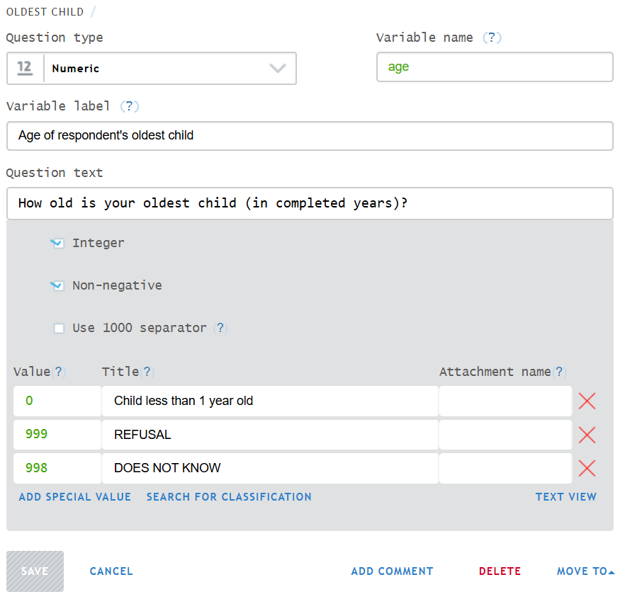

+++
title = "Numeric Question"
keywords = ["numeric","integer","real","separator","export","delimiter","decimal","digit"]
date = 2016-06-17T23:22:09Z
lastmod = 2026-09-14T01:01:01Z
aliases = ["/customer/portal/articles/2468719-numeric-question","/customer/en/portal/articles/2468719-numeric-question","/customer/portal/articles/2468719","/customer/en/portal/articles/2468719","/questionnaire-designer/numeric-question"]

+++

## Description

A **numeric** question accepts integer or real numbers as answers. 

Numeric questions allow configuring all of the
[common question properties](/questionnaire-designer/components/question-properties/),
as well as several properties that are specific to this type:

- `Integer` - if checked, requires the answer to be an integer value and does
not permit entering any fractional values.
- `Number of decimal places` (available only if `integer` is not checked;
optional) - limits the fractional part to be no more than the specified number
of digits, for example `2`. The value may still be displayed with fewer
decimals if the last digit(s) are zero.
- `Non-negative` - if checked, the negative values will not be allowed as
answers to this question.
- `Use 1000 separator` - if checked, the answer will be formatted with a
thousands separator in the integer part.
- `Special values` - optionally,
[special values](/questionnaire-designer/special-values-for-numeric-questions)
may be specified for user's convenience. They will be shown as categorical
selections and can be entered by selecting them (eliminating the need for
typing).

  

  

## Examples
  

<TABLE class="table">
  <TR>
    <TH>Examples of allowed values</TH>
    <TH>Setup</TH>
  </TR>
  <TR>
    <TD>0; 1; 2</TD>
    <TD> Default settings.</TD>
  </TR>
  <TR>
    <TD>-1; 0; 1</TD>
    <TD>Un-select <I>non-negative</I>.</TD>
  <TR>
    <TD>0.23; 97.8732</TD>
    <TD>Un-select <I>integer</I>.</TD>
  </TR>
  <TR>
    <TD>0.23; 97.87; 100.12</TD>
    <TD>Un-select <I>integer</I> and specify <B>2</B> for <I>number of decimal
    places</I>.<TD>
  </TR>
  <TR>
    <TD>-0.38; 0; 0.9734</TD>
    <TD>Un-select <I>non-negative</I> and un-select <I>integer</I>.<TD>
  </TR>
  <TR>
    <TD>-0.38; 0; 0.97</TD>
    <TD>Un-select <I>non-negative</I>, un-select <I>integer</I>, and specify
    <B>2</B> for <I>number of decimal places</I>.</TD>
  </TR>
  <TR>
  <TD>123,456,789; 987,654</TD><TD>Select <I>Use 1000 separator</I>.</TD>
  </TR>
</TABLE>

  

## Export

The answer given to a numeric question is exported in a numeric
variable. The name of this variable is the question's *variable name*
defined in the [Questionnaire Designer](/questionnaire-designer/).  
   
If fractional values are permitted, they are exported with a dot as a decimal
delimiter.

Be mindful of the [missing values](/headquarters/export/missing-values/).

  

## Please note:

1. All numeric answers are bound by the applicable minimum and maximum value
limits. For example, a value `9,876,543,210` cannot be entered as an answer to a numeric integer question.

2. Fractional values have finite precision. One cannot enter values
smaller than that precision. For example, a value
`0.00000000000000000000000000000000000000000000000000000000125` cannot be
entered as an answer to a numeric question.

3. Numeric answers do not store leading zeroes or trailing zeroes in the
fractional parts. (For example, when `007` is entered, `7` is saved; when
`3.1400` is entered, `3.14` is saved).
