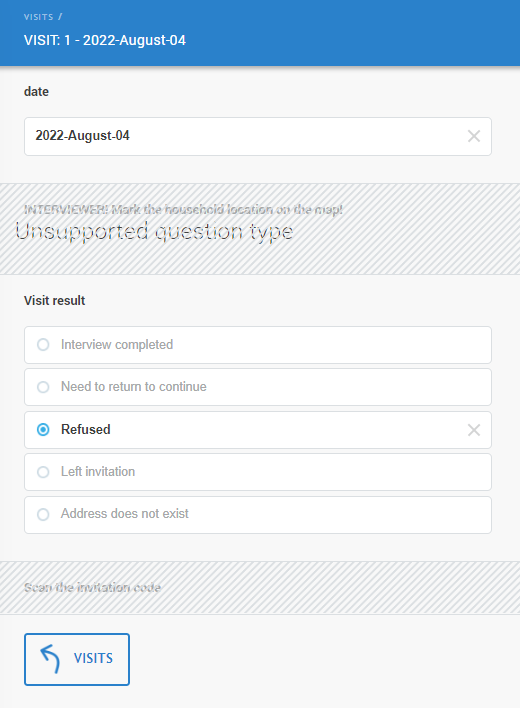

+++
title = "Unsupported question type"
keywords = ["question types","unsupported"]
date = 2022-08-04T19:30:38Z
lastmod = 2022-08-04T19:30:38Z

+++

Description
-----------

If a question is of a type that is not compatible with the current interviewing
mode (CAPI or CAWI), then the user will see the message "*Unsupported question type*"
and will not be able to interact with that question (enter, clear, or modify
the answer). This may appear on the screen like the following:

  

Any value that has been entered earlier is retained (for example, if a
geography question was answered during a CAPI session, and then interviewing
was switched to CAWI mode) and the question is considered answered or not
answered accordingly.

***Unsupported questions*** should not be confused with ***disabled questions***.
Disabled questions are disabled because of the logic of the interview, not
because of the interview mode, and this is controlled by the designer (author)
of the questionnaire. If the question is disabled, it doesn't have any value (a
missing value will be exported).

Disabled questions do not carry the "*Unsupported question type*" message on
them.
