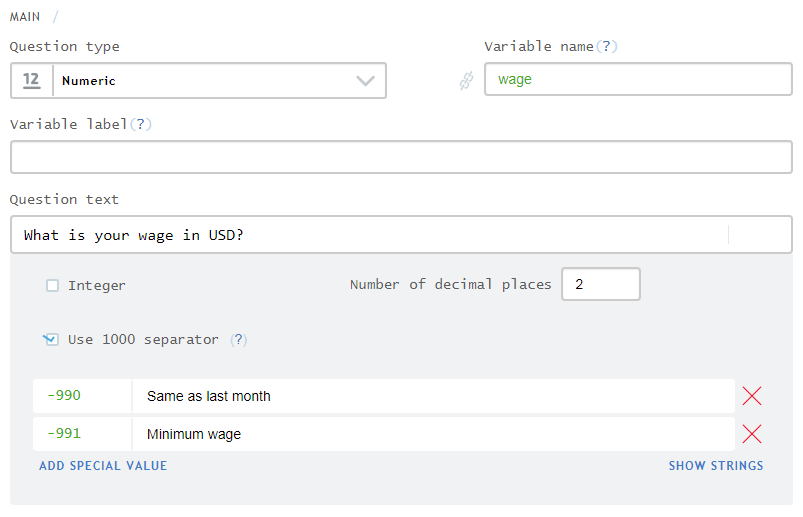

+++
title = "Special values for numeric questions"
keywords = [""]
date = 2018-04-02T20:03:03Z
lastmod = 2018-04-02T20:03:03Z
aliases = ["/customer/portal/articles/2931999-special-values-for-numeric-questions"]

+++

[Numeric
questions](http://support.mysurvey.solutions/customer/en/portal/articles/2468719)
may be enhanced with special values. For example, a numeric wage
question may contain in addition to a numeric input, a selection of
"*minimum wage*" and "*last month's wage*" categories. They can be set
up in the Designer by entering integer numeric codes and corresponding
value labels:  
  
  
  
On a tablet, either a value should be entered, or one of the provided
options may be selected (but not both):  
  
  
If the user enters a numeric value that happens to be a special value
code, the corresponding special value option will be selected
automatically on entry.  
  
Special values are stored as codes and are exported in the same numeric
variable, with labels defined in file formats that support value
labels.  
  
Note: the special values feature may be
used to accommodate the common situations with capturing "*Refusal*",
"*Don't know*", and similar. However, when such a special value is
selected the question will be counted as answered, and the answer to the
question will be treated as non-missing during the expressions
evaluation.
