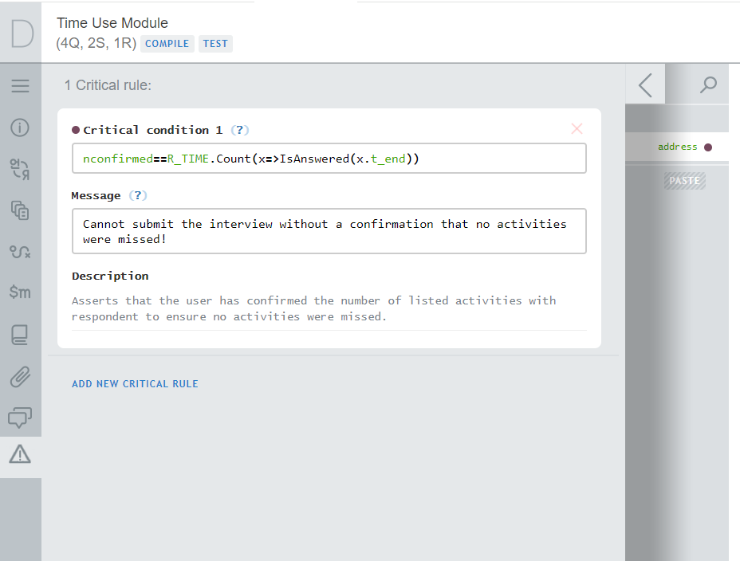
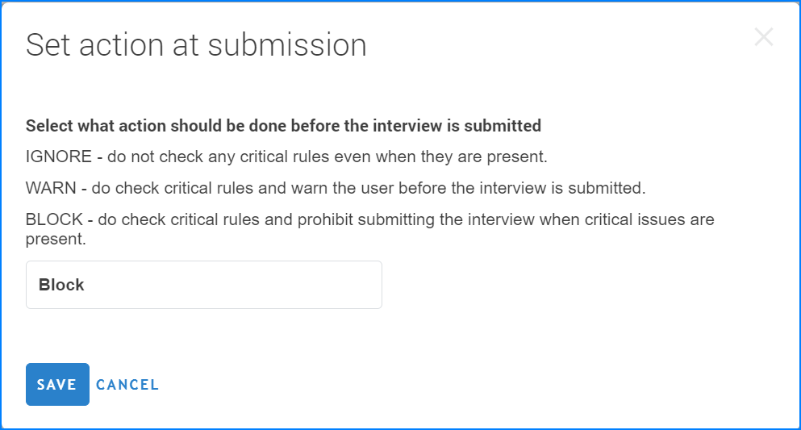

+++
title = "Critical rules and questions"
keywords = ["mandatory", "required", "validation"]
date = 2024-06-05T22:22:22Z
lastmod = 2024-06-05T22:22:22Z

+++

Critical rules and questions designate conditions under which an interview may
be completed. The questionnaire author declares such conditions in the Designer
tool, and subsequently the headquarters user decides on what action Survey
Solutions will undertake with these conditions before the interview can be
completed (see types of actions below).

Most users will find the critical questions feature straightforward to use: if
a question is declared critical in the Designer, then it must have an answer at
the time of completion.

Critical rules are a more versatile tool, which allow formulating more complex
conditions that must be satisfied (such as: "*either of the questions `Q1` and
`Q2` must be answered, but not necessarily both*").

The critical questions and critical rules are not mutually exclusive.
Questionnaire authors may prefer whichever they feel more comfortable with, or
both within any questionnaire.

Critical rules should not be confused with validation rules because they serve
a different purpose. Validation rules decide which answers are indicated as
valid or invalid, but are inconsequential for the submission of the interview
data. On the other hand, the critical rules regulate whether the whole
interview is acceptable or not, but do not necessarily implicate a particular
question. Both validation and critical rules may be present in a questionnaire
and complement each other.

  
Use this feature with caution: incorrect application may cause complete
blocking of submissions of all interviews!



Critical questions
---------------------

A critical question is designated in the Designer by the questionnaire author
by setting the `Critical question` attribute. Questions of scopes `hidden` and
`supervisor` may not be designated as critical (because the
interviewers/respondents do not see them and can't provide an answer).

Critical questions are marked with a purple dot (⬤)
in the list of the questions in the Designer view.

Critical questions are shown with their own filter during the interview review
(for supervisors, headquarters, and administrator users). This filter may be
combined with other existing filters, for example, a supervisor may opt to
look at:

- all the critical questions, or
- all the critical questions without an answer, or
- all the critical questions with the answers deemed invalid, or
- all the critical questions with a comment, etc.

In case a critical question is left without an answer, a message is
automatically generated for it and is shown on the interview completion screen.
The message is clickable, and when clicked leads the interviewer (respondent)
to that question in the interview.

If the critical question is contained in a roster (or a nested roster) then
each instance of the question is treated separately (for example, if the
question of age has been designated critical and answers are not specified for
persons 2 and 4 in the roster, then 2 messages will be shown on the completion
screen and will function as hyperlinks to the age questions for persons 2 and 4
correspondingly).

Critical rules
-----------------

Critical rules consist of a logical condition and a message. The rule is
satisfied if the logical condition evaluates to the logical value `true`. The
rule is not satisfied if the logical condition evaluates to the logical value
`false` or if an exception occurs during the evaluation.

The messages corresponding to the unsatisfied rules are shown in the
completion section. For the messages to be most useful it is recommended to
include hyperlinks to the question (or questions) that are engaged in the check.

Critical rules are defined by the questionnaire designer using the
[Panel of Advanced Instruments](/questionnaire-designer/toolbar/panel-of-advanced-instruments/)

When defining a critical rule, one can also write an optional description.

  

The rules are evaluated when the interviewer (or respondent in a CAWI survey)
reaches the completion screen.  Importantly, when the supervisor reviews the
interview, his or her changes (modifications to the supervisor questions) will
not affect the status of the critical rules (they will not be re-evaluated).

Types of actions
----------------------

There are three types of actions that the software may do at completion:

* **`Block`** - means that the interviews, which do not satisfy critical
conditions (or have not answered critical questions) will not be possible to
complete (the complete button will simply not be accessible to the interviewer
or the web-respondent).

* **`Warn`** - means that the software will demand a comment and request an
acknowledgement from the person completing the interview, when it contains
unsatisfied critical conditions (or has any not answered critical questions).

* **`Ignore`** - means that the software will not check for observance of the
critical conditions and answers to critical questions.

For older questionnaires that do no make use of the critical rules or questions
there is no change in the behavior, but for new questionnaires that do - the
corresponding type of action must be selected during the questionnaire import
(and can be subsequently revised in the web interface by the users in the roles:
`headquarters`, `administrator`).

It is also possible to revise the currently applicable action type
programmatically by accessing the corresponding API endpoint for the
questionnaire (identified by its GUID and version number).

Questionnaire details view shows:
* whether the questionnaire contains any critical rules/questions (property
`Critical verifications` - immutable), and
* what action should be made by Survey Solutions at the completion screen
(property `Action at submission` - mutable).

Note that for the questionnaires cloned at the headquarters the type of action
is copied from the original questionnaire at the time of the cloning, and
subsequently can be changed independently from the origin.

  

The API functionality of Survey Solutions has been extended with new endpoints
for getting and setting the action at submission for questionnaires (surveys).
See their syntax and parameters in the
[API Interactive Description](/headquarters/api/api-interactive-description/).
