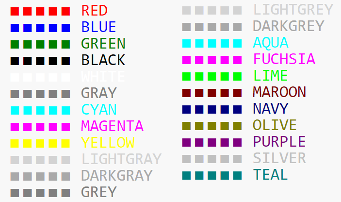

+++
title = "Formatting Text"
keywords = ["html","bold","italics","underline","color","text","format"]
date = 2016-06-22T21:38:27Z
lastmod = 2016-06-22T21:38:27Z
aliases = ["/customer/portal/articles/2473782-formatting-text","/customer/en/portal/articles/2473782-formatting-text","/customer/portal/articles/2473782","/customer/en/portal/articles/2473782","/questionnaire-designer/formatting-text"]

+++

Question texts and static-texts can be formatted with a series of html
tags. The html tags that can currently be used in Survey Solutions are
described in this article.    

**Line break**  
Use &lt;br&gt; to insert a line break. Use &lt;br&gt;&lt;br&gt;...&lt;br&gt; 
to insert multiple empty lines.   
   
**Italic**  
Use  &lt;i&gt; to begin the use of italics. Then, use &lt;/i&gt; when
you want to discontinue the use of italics.   
   
**Underline**  
Use &lt;u&gt; to begin the use of underline. Then, use &lt;/u&gt; when
you want to discontinue the use of underline.   
   
**Teletype**  
Use&lt;tt&gt; to begin the use of Teletype. Then, use &lt;/tt&gt; when
you want to discontinue the use of Teletype.  
   
**Size**  
- Big. Use &lt;big&gt; to begin the larger text. Then, use &lt;/big&gt; to
discontinue the larger text.  
   
- Small. Use &lt;small&gt;to begin the smaller text. Then, use
&lt;/small&gt; to discontinue the smaller text.  

- Size. Use &lt;font
size=SIZE&gt;&lt;/font&gt;. For example, use &lt;font
size=6&gt; and type in the text. Then,
use &lt;/font&gt; to discontinue the size change. NB: font size may be working differently between the tablet and web-version of the instrument!

**Script**  
- Subscript. Use &lt;sub&gt; to begin subscript. Then, use
&lt;/sub&gt; to discontinue subscript style.   
   
- Superscript. Use &lt;sup&gt; to begin superscript. Then, use &lt;/sup&gt; to
discontinue superscript style.

**Font color**  
To change the color of the text use &lt;font
color="colorname"&gt;&lt;/font&gt;. For example, use &lt;font
color="red"&gt; and type in the text. Then,
use &lt;/font&gt; to discontinue the color change.  

Standard (case-insensitive) color names as per HTML 4.01 specification
are available:  

In addition to the above mentioned named colors any other color may be
applied by directly specifying its
<A href="https://www.w3schools.com/colors/colors_picker.asp" target="_blank">RGB value</A>.

**Other supported tags are:**

- [&lt;blockquote&gt;](http://www.w3schools.com/tags/tag_blockquote.asp),
- [&lt;cite&gt;](http://www.w3schools.com/tags/tag_cite.asp),
- [&lt;dfn&gt;](http://www.w3schools.com/tags/tag_dfn.asp),
- [&lt;em&gt;](http://www.w3schools.com/tags/tag_em.asp),
- [&lt;p&gt;](http://www.w3schools.com/tags/tag_p.asp),
- [&lt;s&gt;](https://www.w3schools.com/tags/tag_s.asp), and
- [&lt;strong&gt;](http://www.w3schools.com/tags/tag_strong.asp).   

**Unsupported HTML tags**

Any other HTML tags will be automatically removed from the texts already in
the Designer.

### Other elements you can include

- for inserting images, videos, or PDF documents to the questionnaire, see:
[Attachments](/questionnaire-designer/toolbar/questionnaire-attachments/)

- for inserting hyperlinks, see:
[Questionnaire hyperlinks](/questionnaire-designer/components/questionnaire-hyperlinks/)

- for inserting emoji: 🏠 🧍 🐴 - these may or may not be supported by a
particular tablet or browser. They almost certainly will appear differently
depending on the version. See examples in [Emojipedia](https://emojipedia.org/house/).

### Example

[Public example questionnaire](https://designer.mysurvey.solutions/questionnaire/details/953faa24e13144ac984e1ad62593aab5)
