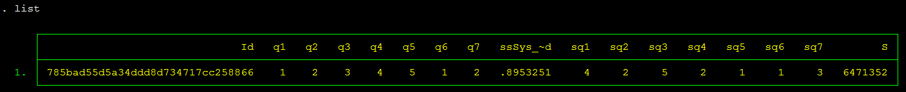

+++
title = "Randomizing order of questions"
keywords = [""]
date = 2017-07-17T16:30:51Z
lastmod = 2017-07-17T16:30:51Z
aliases = ["/customer/portal/articles/2842561-randomizing-order-of-questions","/customer/en/portal/articles/2842561-randomizing-order-of-questions","/customer/portal/articles/2842561","/customer/en/portal/articles/2842561","/questionnaire-designer/randomizing-order-of-questions"]

+++

This article is motivated by [this user
question](http://support.mysurvey.solutions/customer/portal/questions/17104444).  
  
In this example we will consider similar questions (all of them
categorical single-select) rating different aspects of the stay in a
resort hotel. Our objective is to present the questions in different
order for different respondents. Our other objective is to avoid
pre-programming sequences of questions, as this is tedious and creates
questionnaires with just a few sequences of questions.  
  
We will rely on the following Survey Solutions elements:

-   text substitution (text-piping) with the whole question text being
    substituted;
-   random value to make the sequences of questions differ for different
    respondents;
-   shuffling algorithm, we will use D. Knuth's version of the
    Fisher-Yates algorithm, but many others will do just as well;
-   and a few other tricks.  

In Survey Solutions Designer tool, we will compose a questionnaire like
the following:  
  
  
This questionnaire is available as [Public example: Randomizing order of
questions](https://solutions.worldbank.org/questionnaire/details/fee4777ff17c4791a86c55ce9d96a6ee)  
  
Note that questions q1..q7 contain identical set of options (the
feedback scale in this example) and have their texts computed by
respective calculated variables t1..t7.  
  
Each of the variables in turn is computed based on selecting the
corresponding item from a shuffled array of questions, which is
delivered by a macro:  
  
  
  
Note also that we are using only one random number even though we have N
steps of shuffling, we do this by looking at different digits of that
number, which for our purposes may be assumed random as well. This of
course imposes some limitations on this example realization, which will
be limited by 10 items.  
  
We specifically avoid following the pseudorandom sequence of numbers in
Survey Solutions, since we will need to reshuffle the answers back to
match the original sequence of questions (non-randomized) after the data
is exported from Survey Solutions. This could be trivial if the
processing is done in the same language (C\#), but is not possible if
other packages are used (Stata, SPSS), since they are utilizing their
own random number generators.  
  
Two other tricks that we do here is rounding the random number to a
smaller number of digits to avoid precision problems during export and
re-import to another system, and taking a logarithm from a random number
to obtain a sufficiently long sequence of random digits.  
  
The questions will be presented in a random order for the interviewer:  
  
  
And the final step to do is to reorder the answers back to the proper
order after the data is exported. This can be done by replicating the
same shuffle with a script and restoring back the order of the items
based on the shuffled sequence.  
  
For example, [this is how we can do this in
Stata](http://www.radyakin.org/suso/rndquest/decode_data.do)  
In order to generate some example data use [this
script](http://www.radyakin.org/suso/rndquest/gen_example.do).  
  
Based on replicated sequence of pseudorandom numbers, the answers are
easily placed in the proper order:  

